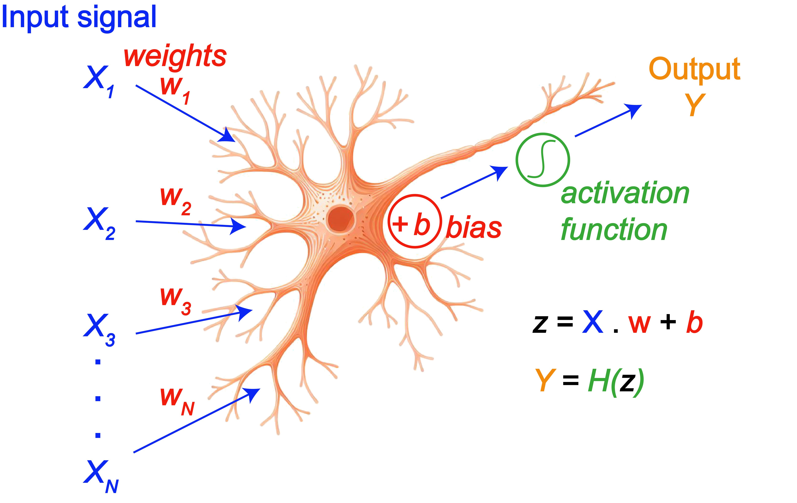

# Day 2: Deep Learning for Molecular Systems

**Machine Learning for Molecular Systems - Advanced Course**

*Course Module : Neural Networks and Deep Learning Applications*


## 1. Deep Learning Fundamentals

### 1.1 Why Deep Learning for Molecules?

Deep learning has transformed molecular property prediction by enabling models to learn complex representations from raw 
molecular data automatically. Unlike traditional machine learning methods, which rely heavily on hand-crafted descriptors, 
deep learning models can learn directly from molecular representations such as SMILES strings, molecular graphs, and 3D atomic 
coordinates.

**Key Advantages**

* **Automatic Feature Learning:** Neural networks learn hierarchical representations directly from molecular structures 
without the need for manual feature engineering.
* **Complex Pattern Recognition:** Deep learning models can capture highly non-linear relationships and subtle structural 
patterns that influence molecular properties.
* **Transfer Learning:** Models pre-trained on large chemical datasets can be fine-tuned for specialized tasks, even when 
only limited labeled data are available.
* **End-to-End Learning:** These models can directly map molecular representations to predicted properties within a single 
unified framework.
* **Multi-Task Learning:** A single model can simultaneously predict multiple molecular properties while sharing learned 
representations across related tasks.


### Examples

#### Example 1: Solubility Prediction

Traditional machine learning approaches typically require calculating molecular descriptors such as LogP, molecular weight, 
and hydrogen-bond donor/acceptor counts. In contrast, deep learning models can learn these relationships directly from SMILES strings.

```text
Input: "CC(=O)OC1=CC=CC=C1C(=O)O" (aspirin)

The model learns associations such as:

- Aromatic rings → hydrophobic regions
- Carboxyl groups → polar regions
- Overall polarity balance → solubility behavior

Output: Predicted LogS = -1.5 (moderate solubility)
```

#### Example 2: Toxicity Prediction

Deep learning models are particularly effective at identifying toxic substructures (toxicophores) without requiring explicitly 
programmed rules.

```text
The model automatically learns patterns such as:

- Aromatic amines → potential carcinogenicity
- Epoxide groups → DNA reactivity
- Nitro groups → mutagenicity risk
- Combinations of substructures → synergistic toxic effects
```


#### Example 3: Drug-Likeness Prediction

Instead of relying solely on heuristic rules such as Lipinski’s Rule of Five, neural networks can learn implicit patterns associated 
with drug-like molecules.

```text
By training on FDA-approved drugs, the model learns:

- Favorable molecular weight ranges
- Hydrogen-bonding patterns
- Lipophilicity balance
- Indicators of metabolic stability
- Features related to blood-brain barrier permeability
```

### 1.2 Neural Network Basics

A neural network is a computational model composed of interconnected layers of artificial neurons that learn to 
transform input data into meaningful predictions through adjustable weights and biases.

A **feedforward neural network** processes information sequentially from the input layer to the output layer 
without feedback connections or recurrent cycles.

{: style="width: 600px;"}

## Architecture Components

### Input Layer

The input layer receives molecular representations such as fingerprints, molecular descriptors, embeddings, 
or graph-based features.

* Its size is determined by the dimensionality of the input features.
* No activation function is typically applied at this stage.

### Hidden Layers

Hidden layers perform non-linear transformations that enable the network to learn complex patterns and 
hierarchical representations.

Each neuron computes:

$$
z = \sum_{i=1}^{n} w_i x_i + b
$$

where:

* $x_i$ are the input features,
* $w_i$ are the learnable weights,
* $b$ is the bias term.

The neuron output is then obtained through an activation function:

$$
a = f(z)
$$

Using multiple hidden layers allows the network to progressively learn higher-level abstractions from molecular data.

### Output Layer

The output layer generates the final prediction.

* **Regression tasks:** typically use a single neuron with a linear activation function.
* **Binary classification:** commonly uses a sigmoid activation function.
* **Multi-class classification:** generally uses a softmax activation function.


## Mathematical Foundation

### Single Neuron

Given an input vector:

$$
\mathbf{x} = [x_1, x_2, \dots, x_n]
$$

a weight vector:

$$
\mathbf{w} = [w_1, w_2, \dots, w_n]
$$

and a bias term (b), the neuron computes the linear transformation:

$$
z = w_1x_1 + w_2x_2 + \cdots + w_nx_n + b
$$

which can be written compactly as:

$$
z = \mathbf{w}^T \mathbf{x} + b
$$

The activation value is then:

$$
a = f(z)
$$

where (f) is a non-linear activation function.


### Neural Network Layer

For layer (l), the computations are:

$$
\mathbf{Z}^{[l]} = \mathbf{W}^{[l]} \mathbf{A}^{[l-1]} + \mathbf{b}^{[l]}
$$

$$
\mathbf{A}^{[l]} = f\left(\mathbf{Z}^{[l]}\right)
$$

where:

* $l$ is the layer index,
* $\mathbf{W}^{[l]}$ is the weight matrix for layer (l),
* $\mathbf{A}^{[l-1]}$ represents the activations from the previous layer,
* $\mathbf{b}^{[l]}$ is the bias vector,
* $f$ is the activation function applied element-wise.


**Forward Propagation Example:**

```python
# Simple 3-layer network
import numpy as np

def forward_propagation(X, parameters):
    """
    X: input features (n_features, m_samples)
    parameters: dictionary containing W1, b1, W2, b2, W3, b3
    """
    # Layer 1: Input → Hidden (128 neurons)
    Z1 = np.dot(parameters['W1'], X) + parameters['b1']
    A1 = relu(Z1)
    
    # Layer 2: Hidden → Hidden (64 neurons)
    Z2 = np.dot(parameters['W2'], A1) + parameters['b2']
    A2 = relu(Z2)
    
    # Layer 3: Hidden → Output (1 neuron for regression)
    Z3 = np.dot(parameters['W3'], A2) + parameters['b3']
    A3 = Z3  # Linear activation for regression
    
    cache = {'Z1': Z1, 'A1': A1, 'Z2': Z2, 'A2': A2, 'Z3': Z3, 'A3': A3}
    return A3, cache
```

### 1.3 Activation Functions

Activation functions introduce non-linearity into neural networks, allowing them to learn complex and highly non-linear 
relationships in data. Without activation functions, a deep neural network would behave like a linear model regardless of its depth.


#### ReLU (Rectified Linear Unit)

The ReLU activation function is defined as:

$$
f(x) = \max(0, x)
$$

Its derivative is:

$$
f'(x) =
\begin{cases}
1, & x > 0 \\
0, & x \leq 0
\end{cases}
$$

##### Advantages

* Computationally efficient and easy to implement
* Helps reduce the vanishing gradient problem
* Encourages sparse activations since negative inputs produce zero output
* Common default choice for hidden layers in deep networks

##### Disadvantages

* Can suffer from the **dead ReLU problem**, where neurons permanently output zero
* Outputs are not zero-centered

```python
def relu(x):
    return np.maximum(0, x)

def relu_derivative(x):
    return (x > 0).astype(float)
```


#### Leaky ReLU

Leaky ReLU introduces a small slope for negative inputs:

$$
f(x) = 
\begin{cases}
x, & x > 0 \\
\alpha x, & x \leq 0
\end{cases} 
$$


where $\alpha$ is typically 0.01.

##### Advantages

* Reduces the risk of dead neurons
* Maintains a small gradient for negative values

```python
def leaky_relu(x, alpha=0.01):
    return np.where(x > 0, x, alpha * x)
```

#### Sigmoid

The sigmoid activation function maps inputs to values between 0 and 1:

$$
f(x) = \frac{1}{1 + e^{-x}}
$$

Its derivative is:

$$
f'(x) = f(x)\left(1 - f(x)\right)
$$

##### Common Use Cases

* Output layer for binary classification
* Gate functions in recurrent architectures such as LSTMs and GRUs

##### Disadvantages

* Suffers from the vanishing gradient problem for large positive or negative inputs
* Outputs are not zero-centered
* More computationally expensive than ReLU

```python
def sigmoid(x):
    return 1 / (1 + np.exp(-x))

def sigmoid_derivative(x):
    s = sigmoid(x)
    return s * (1 - s)
```


#### Tanh (Hyperbolic Tangent)

The hyperbolic tangent function is defined as:

$$
f(x) = \tanh(x)
$$

which can also be written as:

$$
f(x) = \frac{e^x - e^{-x}}{e^x + e^{-x}}
$$

Its derivative is:

$$
f'(x) = 1 - \tanh^2(x)
$$

##### Advantages

* Zero-centered outputs improve optimization compared to sigmoid
* Produces stronger gradients near zero

##### Disadvantages

* Still affected by vanishing gradients for large input magnitudes

```python
def tanh(x):
    return np.tanh(x)

def tanh_derivative(x):
    return 1 - np.tanh(x)**2
```

#### Softmax (Multi-Class Output)

Softmax converts raw outputs into a probability distribution over multiple classes:

$$
f(x_i) = \frac{e^{x_i}}{\sum_j e^{x_j}}
$$

##### Properties

* Output probabilities sum to 1
* Commonly used in the output layer for multi-class classification

```python
def softmax(x):
    exp_x = np.exp(x - np.max(x, axis=0, keepdims=True))  # Numerical stability
    return exp_x / np.sum(exp_x, axis=0, keepdims=True)
```


#### Activation Function Selection Guide

| Layer Type                                  | Recommended Activation | Reason                                                  |
| ------------------------------------------- | ---------------------- | ------------------------------------------------------- |
| Hidden layers (general)                     | ReLU                   | Fast, simple, and effective for deep networks           |
| Hidden layers (negative features important) | Leaky ReLU / ELU       | Preserves gradients for negative inputs                 |
| Output (regression)                         | Linear                 | Allows unrestricted output values                       |
| Output (binary classification)              | Sigmoid                | Produces probabilities in the range ([0,1])             |
| Output (multi-class classification)         | Softmax                | Generates a probability distribution across classes     |
| Recurrent neural networks                   | Tanh                   | Zero-centered and bounded activations improve stability |

### 1.4 Loss Functions and Backpropagation

Loss functions measure how well a neural network's predictions match the true target values. During training, 
the model adjusts its parameters to minimize the loss, thereby improving prediction accuracy.

The choice of loss function depends on the type of problem being solved, such as regression or classification.


#### Mean Squared Error (MSE) — Regression

Mean Squared Error is one of the most common loss functions for regression tasks. It computes the average squared 
difference between predicted and true values:

$$
L(y, \hat{y}) =
\frac{1}{n}
\sum_{i=1}^{n}
(y_i - \hat{y}_i)^2
$$

where:

* $y_i$ is the true value,
* $\hat{y}_i$ is the predicted value,
* $n$ is the number of samples.

##### Characteristics

* Penalizes large prediction errors more strongly because of the squared term
* Produces smooth and differentiable gradients
* Sensitive to outliers

##### Typical Use Cases

* Molecular property prediction
* Solubility estimation
* Binding affinity prediction

```python
def mse_loss(y_true, y_pred):
    return np.mean((y_true - y_pred) ** 2)

def mse_derivative(y_true, y_pred):
    return 2 * (y_pred - y_true) / y_true.size
```

#### Mean Absolute Error (MAE) — Robust Regression

Mean Absolute Error computes the average absolute difference between predictions and targets:

$$
L(y, \hat{y}) =
\frac{1}{n}
\sum_{i=1}^{n}
|y_i - \hat{y}_i|
$$

##### Advantages

* Less sensitive to outliers than MSE
* Treats all prediction errors equally

##### Disadvantages

* Non-smooth derivative near zero can slow optimization
* Gradients do not increase for large errors

##### Typical Use Cases

* Noisy experimental datasets
* Robust molecular property prediction

```python 
def mae_loss(y_true, y_pred):
    return np.mean(np.abs(y_true - y_pred))
```


#### Binary Cross-Entropy — Binary Classification

Binary Cross-Entropy (BCE) is commonly used for binary classification problems where the model 
predicts the probability of belonging to a single class.

$$
L(y, \hat{y}) =
-\frac{1}{n}
\sum_{i=1}^{n}
\left[
y_i \log(\hat{y}_i)
+
(1-y_i)\log(1-\hat{y}_i)
\right]
$$

##### Typical Use Cases

* Toxic vs. non-toxic prediction
* Active vs. inactive compounds
* Disease classification

##### Common Output Activation

* Sigmoid activation function

```python
def binary_crossentropy(y_true, y_pred):
    epsilon = 1e-15  # Prevent log(0)
    y_pred = np.clip(y_pred, epsilon, 1 - epsilon)

    return -np.mean(
        y_true * np.log(y_pred) +
        (1 - y_true) * np.log(1 - y_pred)
    )
```

#### Categorical Cross-Entropy — Multi-Class Classification

Categorical Cross-Entropy is used when predicting one class among several mutually exclusive categories.

$$
L(y, \hat{y}) =
-\frac{1}{n}
\sum_{i=1}^{n}
\sum_{j=1}^{C}
y_{ij}\log(\hat{y}_{ij})
$$

where:

* $C$ is the number of classes,
* $y_{ij}$ is the true label indicator,
* $\hat{y}_{ij}$ is the predicted probability for class $j$.

##### Typical Use Cases

* Molecular functional group classification
* Protein family prediction
* Multi-class toxicity prediction

##### Common Output Activation

* Softmax activation function

```python
def categorical_crossentropy(y_true, y_pred):
    epsilon = 1e-15
    y_pred = np.clip(y_pred, epsilon, 1 - epsilon)

    return -np.sum(y_true * np.log(y_pred)) / y_true.shape[0]
```

### Backpropagation

Backpropagation is the algorithm used to train neural networks by computing the gradients of the loss 
function with respect to all model parameters.

The algorithm relies on the **chain rule of calculus** to efficiently propagate errors backward through 
the network.


#### Main Steps of Backpropagation

#### 1. **Forward Pass**

   * Compute activations layer by layer
   * Generate predictions
   * Evaluate the loss function

#### 2. **Loss Gradient Computation**

   * Compute the gradient of the loss with respect to the output activations

#### 3. **Backward Pass**

   * Propagate gradients backward through each layer
   * Compute gradients for weights and biases

#### 4. **Parameter Update**

   * Update parameters using gradient descent or an optimization algorithm such as Adam


#### Mathematical Formulation

For layer $l$:

$$
\mathbf{Z}^{[l]}
=
\mathbf{W}^{[l]}
\mathbf{A}^{[l-1]}
+
\mathbf{b}^{[l]}
$$

$$
\mathbf{A}^{[l]}
=
f\left(\mathbf{Z}^{[l]}\right)
$$

where:

* $\mathbf{W}^{[l]}$ is the weight matrix,
* $\mathbf{b}^{[l]}$ is the bias vector,
* $\mathbf{A}^{[l-1]}$ are the activations from the previous layer,
* $f$ is the activation function.


##### Error Term

$$
d\mathbf{Z}^{[l]}
=
d\mathbf{A}^{[l]}
\odot
f'\left(\mathbf{Z}^{[l]}\right)
$$

where $\odot$ denotes element-wise multiplication.


##### Weight Gradient

$$
d\mathbf{W}^{[l]}
=
\frac{1}{m}
d\mathbf{Z}^{[l]}
\left(\mathbf{A}^{[l-1]}\right)^T
$$

##### Bias Gradient

$$
d\mathbf{b}^{[l]}
=
\frac{1}{m}
\sum_{i=1}^{m}
d\mathbf{Z}^{[l](i)}
$$

##### Propagated Gradient

$$
d\mathbf{A}^{[l-1]}
=
\left(\mathbf{W}^{[l]}\right)^T
d\mathbf{Z}^{[l]}
$$

where:

* $m$ is the number of training samples,
* $f'$ is the derivative of the activation function,
* $\mathbf{W}^{[l]}$ and $\mathbf{b}^{[l]}$ are the weights and biases of layer $l$.


#### Example: Backpropagation for a Three-Layer Network

The following implementation computes gradients for a neural network with two hidden ReLU layers 
and a linear output layer.

```python 
def backward_propagation(X, Y, cache, parameters):
    """
    Backpropagation for a 3-layer neural network.

    Architecture:
        Input -> ReLU -> ReLU -> Linear Output

    Args:
        X: input features
        Y: true target values
        cache: stored activations and pre-activations
        parameters: dictionary containing weights and biases

    Returns:
        gradients: dictionary of parameter gradients
    """

    m = X.shape[1]

    # Retrieve cached values
    A1, A2, A3 = cache['A1'], cache['A2'], cache['A3']
    Z1, Z2 = cache['Z1'], cache['Z2']

    # Output layer gradient
    # Linear output with MSE loss
    dZ3 = A3 - Y

    dW3 = (1 / m) * np.dot(dZ3, A2.T)
    db3 = (1 / m) * np.sum(dZ3, axis=1, keepdims=True)

    # Hidden layer 2
    dA2 = np.dot(parameters['W3'].T, dZ3)
    dZ2 = dA2 * relu_derivative(Z2)

    dW2 = (1 / m) * np.dot(dZ2, A1.T)
    db2 = (1 / m) * np.sum(dZ2, axis=1, keepdims=True)

    # Hidden layer 1
    dA1 = np.dot(parameters['W2'].T, dZ2)
    dZ1 = dA1 * relu_derivative(Z1)

    dW1 = (1 / m) * np.dot(dZ1, X.T)
    db1 = (1 / m) * np.sum(dZ1, axis=1, keepdims=True)

    gradients = {
        'dW1': dW1, 'db1': db1,
        'dW2': dW2, 'db2': db2,
        'dW3': dW3, 'db3': db3
    }

    return gradients
```

### 1.5 Optimization Algorithms

Optimization algorithms are responsible for updating the parameters of a neural network in order to 
minimize the loss function. During training, the optimizer uses gradients computed through backpropagation 
to determine how the weights and biases should change to improve model performance.

Efficient optimization is essential in deep learning because neural networks often contain millions of 
parameters and highly non-convex loss surfaces.


#### Gradient Descent

Gradient descent is the foundational optimization method used in machine learning. The main idea is to 
update parameters in the direction opposite to the gradient of the loss function.

For a parameter matrix $\mathbf{W}$ and bias vector $\mathbf{b}$:

$$
\mathbf{W}
\leftarrow
\mathbf{W}
-\alpha
\frac{\partial L}{\partial \mathbf{W}}
$$

$$
\mathbf{b}
\leftarrow
\mathbf{b}
-\alpha
\frac{\partial L}{\partial \mathbf{b}}
$$

where:

* $L$ is the loss function,
* $\alpha$ is the learning rate,
* $\frac{\partial L}{\partial \mathbf{W}}$ and $\frac{\partial L}{\partial \mathbf{b}}$ are 
gradients computed through backpropagation.

The learning rate controls the step size of each parameter update:

* Large learning rates may cause unstable training or divergence.
* Small learning rates can lead to very slow convergence.

#### Batch Gradient Descent

Batch gradient descent computes gradients using the **entire training dataset** before updating the parameters.

##### Advantages

* Produces stable and accurate gradient estimates
* Converges smoothly for convex optimization problems

##### Disadvantages

* Computationally expensive for large datasets
* Requires loading the full dataset into memory
* Updates occur infrequently

```python 
def gradient_descent(parameters, gradients, learning_rate):
    """
    Update parameters using batch gradient descent.
    """

    for key in parameters.keys():
        parameters[key] -= learning_rate * gradients['d' + key]

    return parameters
```


#### Stochastic Gradient Descent (SGD)

Stochastic Gradient Descent updates parameters using a **single training example** at a time.

For sample $i$:

$$
\mathbf{W}
\leftarrow
\mathbf{W}
-\alpha
\frac{\partial L_i}{\partial \mathbf{W}}
$$

##### Advantages

* Fast parameter updates
* Requires less memory
* Noise in the updates may help escape shallow local minima or saddle points

##### Disadvantages

* Highly noisy optimization trajectory
* Less stable convergence
* Training loss fluctuates significantly

SGD is commonly combined with momentum and learning rate scheduling to improve convergence.


#### Mini-Batch Gradient Descent

Mini-batch gradient descent is the most widely used training strategy in deep learning. Instead of using 
the full dataset or a single sample, the optimizer updates parameters using small batches of training examples.

Typical batch sizes range from (32) to (256).

##### Benefits

* More computationally efficient on GPUs
* More stable than pure SGD
* Faster than full batch gradient descent
* Provides a good balance between convergence quality and computational cost

```python
def mini_batch_gradient_descent(
    X,
    Y,
    parameters,
    batch_size=32,
    learning_rate=0.01
):
    """
    Mini-batch gradient descent implementation.
    """

    m = X.shape[1]
    num_batches = m // batch_size

    for i in range(num_batches):

        # Create mini-batch
        start = i * batch_size
        end = start + batch_size

        X_batch = X[:, start:end]
        Y_batch = Y[:, start:end]

        # Forward propagation
        predictions, cache = forward_propagation(X_batch, parameters)

        # Backpropagation
        gradients = backward_propagation(
            X_batch,
            Y_batch,
            cache,
            parameters
        )

        # Parameter update
        parameters = gradient_descent(
            parameters,
            gradients,
            learning_rate
        )

    return parameters
```


#### Momentum

Momentum improves SGD by accumulating a running average of previous gradients. This helps accelerate 
optimization in consistent directions while reducing oscillations.

The velocity update is:

$$
\mathbf{v}
\leftarrow
\beta \mathbf{v}
+
(1-\beta)
\frac{\partial L}{\partial \mathbf{W}}
$$

The parameters are then updated using the velocity term:

$$
\mathbf{W}
\leftarrow
\mathbf{W}
-\alpha \mathbf{v}
$$

where:

* $\mathbf{v}$ is the velocity term,
* $\beta$ is the momentum coefficient, typically (0.9) or (0.99).

##### Benefits

* Faster convergence
* Reduced oscillations
* Improved optimization in narrow valleys of the loss surface

```python
def momentum_optimizer(
    parameters,
    gradients,
    velocity,
    beta=0.9,
    learning_rate=0.01
):
    """
    Parameter update with momentum.
    """

    for key in parameters.keys():

        # Update velocity
        velocity['v' + key] = (
            beta * velocity['v' + key]
            + (1 - beta) * gradients['d' + key]
        )

        # Update parameters
        parameters[key] -= (
            learning_rate * velocity['v' + key]
        )

    return parameters, velocity
```


#### RMSprop (Root Mean Square Propagation)

RMSprop adapts the learning rate individually for each parameter based on the recent magnitude of gradients.

The moving average of squared gradients is computed as:

$$
\mathbf{s}
\leftarrow
\beta \mathbf{s}
+
(1-\beta)
\left(
\frac{\partial L}{\partial \mathbf{W}}
\right)^2
$$

The parameter update becomes:

$$
\mathbf{W}
\leftarrow
\mathbf{W}
-\alpha
\frac{
\frac{\partial L}{\partial \mathbf{W}}
}{
\sqrt{\mathbf{s} + \epsilon}
}
$$

where:

* $\epsilon$ is a small constant for numerical stability, typically $10^{-8}$.

##### Benefits

* Automatically adjusts learning rates
* Works well for non-stationary objectives
* Particularly useful for recurrent neural networks

```python
def rmsprop_optimizer(
    parameters,
    gradients,
    cache,
    beta=0.9,
    learning_rate=0.001,
    epsilon=1e-8
):
    """
    RMSprop optimization.
    """

    for key in parameters.keys():

        # Update squared gradient cache
        cache['s' + key] = (
            beta * cache['s' + key]
            + (1 - beta) * gradients['d' + key] ** 2
        )

        # Update parameters
        parameters[key] -= (
            learning_rate
            * gradients['d' + key]
            / (np.sqrt(cache['s' + key]) + epsilon)
        )

    return parameters, cache
```


#### Adam (Adaptive Moment Estimation)

Adam combines the ideas of momentum and RMSprop. It maintains:

* A moving average of gradients (first moment)
* A moving average of squared gradients (second moment)

### First Moment Estimate

$$
\mathbf{m}
\leftarrow
\beta_1 \mathbf{m}
+
(1-\beta_1)
\frac{\partial L}{\partial \mathbf{W}}
$$

##### Second Moment Estimate

$$
\mathbf{v}
\leftarrow
\beta_2 \mathbf{v}
+
(1-\beta_2)
\left(
\frac{\partial L}{\partial \mathbf{W}}
\right)^2
$$

##### Bias Correction

$$
\hat{\mathbf{m}}
=
\frac{\mathbf{m}}{1-\beta_1^t}
$$

$$
\hat{\mathbf{v}}
=
\frac{\mathbf{v}}{1-\beta_2^t}
$$

##### Parameter Update

$$
\mathbf{W}
\leftarrow
\mathbf{W}
-\alpha
\frac{
\hat{\mathbf{m}}
}{
\sqrt{\hat{\mathbf{v}}} + \epsilon
}
$$

Typical hyperparameter values are:

$$
\beta_1 = 0.9,
\quad
\beta_2 = 0.999,
\quad
\epsilon = 10^{-8}
$$

##### Benefits

* Fast and robust convergence
* Works well with sparse gradients
* Excellent default optimizer for many deep learning applications

```python
def adam_optimizer(
    parameters,
    gradients,
    adam_cache,
    t,
    beta1=0.9,
    beta2=0.999,
    learning_rate=0.001,
    epsilon=1e-8
):
    """
    Adam optimization with bias correction.
    """

    for key in parameters.keys():

        # First moment
        adam_cache['m' + key] = (
            beta1 * adam_cache['m' + key]
            + (1 - beta1) * gradients['d' + key]
        )

        # Second moment
        adam_cache['v' + key] = (
            beta2 * adam_cache['v' + key]
            + (1 - beta2) * gradients['d' + key] ** 2
        )

        # Bias correction
        m_corrected = (
            adam_cache['m' + key]
            / (1 - beta1 ** t)
        )

        v_corrected = (
            adam_cache['v' + key]
            / (1 - beta2 ** t)
        )

        # Parameter update
        parameters[key] -= (
            learning_rate
            * m_corrected
            / (np.sqrt(v_corrected) + epsilon)
        )

    return parameters, adam_cache
```


#### AdamW (Adam with Weight Decay)

AdamW improves Adam by decoupling weight decay regularization from the gradient update.

The parameter update becomes:

$$
\mathbf{W}
\leftarrow
\mathbf{W}
-
\alpha
\left(
\frac{
\hat{\mathbf{m}}
}{
\sqrt{\hat{\mathbf{v}}} + \epsilon
}
+
\lambda \mathbf{W}
\right)
$$

where:

* $\lambda$ is the weight decay coefficient.

##### Benefits

* Better generalization performance
* More effective regularization
* Commonly used in transformer architectures and modern deep learning models

```python
import torch.optim as optim

optimizer = optim.AdamW(
    model.parameters(),
    lr=0.001,
    weight_decay=0.01
)
```


#### Optimizer Selection Guide

| Scenario                      | Recommended Optimizer | Typical Learning Rate  |
| ----------------------------- | --------------------- | ---------------------- |
| General-purpose training      | Adam                  | $10^{-3}$              |
| Very large datasets           | SGD with momentum     | $10^{-2}$ with decay   |
| Recurrent neural networks     | Adam or RMSprop       | $10^{-3}$ to $10^{-4}$ |
| Fine-tuning pretrained models | AdamW                 | $10^{-5}$ to $10^{-4}$ |
| Sparse gradients              | Adam                  | $10^{-3}$              |
| Strong regularization needed  | AdamW or SGD          | Lower learning rates   |


#### Learning Rate Scheduling

Learning rate scheduling gradually changes the learning rate during training to improve convergence and generalization.


#### Exponential Decay

$$
\alpha_t
=\alpha_0
\gamma^t
$$

where:

* $\alpha_0$ is the initial learning rate,
* $\gamma$ is the decay factor.

```python 
def lr_decay(initial_lr, epoch, decay_rate=0.95):
    return initial_lr * (decay_rate ** epoch)
```


#### Step Decay

The learning rate is reduced at fixed intervals.

```python
def step_decay(
    initial_lr,
    epoch,
    drop=0.5,
    epochs_drop=10
):
    return initial_lr * (
        drop ** np.floor(epoch / epochs_drop)
    )
```

#### Cosine Annealing

Cosine annealing gradually decreases the learning rate following a cosine curve:

$$
\alpha_t
=
\frac{\alpha_0}{2}
\left(
1 +
\cos\left(
\frac{\pi t}{T}
\right)
\right)
$$

where:

* $t$ is the current epoch,
* $T$ is the total number of epochs.

```python
def cosine_annealing(
    initial_lr,
    epoch,
    total_epochs
):
    return (
        initial_lr
        * 0.5
        * (1 + np.cos(np.pi * epoch / total_epochs))
    )
```


## 2. Feedforward Neural Networks

### 2.1 Feedforward Neural Network Architecture Design

A **feedforward neural network (FNN)** is one of the most fundamental neural network architectures in deep learning. In 
an FNN, information flows sequentially from the input layer through one or more hidden layers to the output layer, 
without recurrent or feedback connections.

Mathematically, the transformation at layer $l$ is:

$$
\mathbf{A}^{[l]}
=
f\left(
\mathbf{W}^{[l]}\mathbf{A}^{[l-1]}
+
\mathbf{b}^{[l]}
\right)
$$

where:

* $\mathbf{A}^{[l-1]}$ are the activations from the previous layer,
* $\mathbf{W}^{[l]}$ is the weight matrix,
* $\mathbf{b}^{[l]}$ is the bias vector,
* $f(\cdot)$ is the activation function.

For molecular machine learning, feedforward networks are commonly applied to molecular fingerprints, 
physicochemical descriptors, or learned molecular embeddings.


### Design Principles

Designing an effective neural network architecture requires balancing:

* model complexity,
* computational cost,
* generalization ability,
* and training stability.

A network that is too small may underfit the data, while an excessively large network may overfit and memorize the training set.


#### Layer Size Guidelines

##### Input Layer

The input dimension corresponds to the number of molecular features.

Examples:

* Morgan fingerprints: (1024)–(4096) bits
* Molecular descriptors: tens to hundreds of features
* Learned embeddings: variable dimensionality

Example:

$$
\text{Input dimension} = 2048
$$

for a (2048)-bit Morgan fingerprint.


##### Hidden Layers

Hidden layers learn increasingly abstract representations of molecular structure-property relationships.

General recommendations:

* Start with (128)–(512) neurons per layer
* Gradually reduce dimensionality in deeper layers
* Use ReLU-family activations for stable optimization

A common strategy is:

$$
512 \rightarrow 256 \rightarrow 128
$$

which progressively compresses the learned representation.

##### Output Layer

The output layer depends on the prediction task.

| Task                       | Output Neurons    | Activation |
| -------------------------- | ----------------- | ---------- |
| Regression                 | 1                 | Linear     |
| Binary classification      | 1                 | Sigmoid    |
| Multi-class classification | Number of classes | Softmax    |

Examples:

* Solubility prediction → single linear neuron
* Toxic/non-toxic classification → sigmoid output
* Protein family classification → softmax output


### Common Architecture Patterns


#### Pattern 1: Pyramid Architecture

Recommended for many molecular property prediction tasks.

```text
Input (2048)
    ↓
Hidden Layer (512)
    ↓
Hidden Layer (256)
    ↓
Hidden Layer (128)
    ↓
Output (1)
```

##### Characteristics

* Gradually compresses information
* Encourages hierarchical feature learning
* Reduces parameter count in deeper layers
* Often improves generalization

This architecture works well when the input space is high-dimensional, such as molecular fingerprints.

#### Pattern 2: Bottleneck (Hourglass) Architecture

```text
Input (2048)
    ↓
Hidden Layer (256)
    ↓
Bottleneck Layer (128)
    ↓
Hidden Layer (256)
    ↓
Output (1)
```

##### Characteristics

* Forces the network to learn compact latent representations
* Useful for feature extraction and dimensionality reduction
* Often used in autoencoders and representation learning

The bottleneck layer acts as a compressed representation of the molecule.


#### Pattern 3: Constant-Width Architecture

```text
Input (2048)
    ↓
Hidden Layer (256)
    ↓
Hidden Layer (256)
    ↓
Hidden Layer (256)
    ↓
Output (1)
```

##### Characteristics

* Maintains representational capacity across layers
* Useful for highly non-linear mappings
* Easier to tune than aggressively shrinking architectures

This design is often effective when the dataset is large and the target function is complex.


### Depth vs. Width Trade-Off

The architecture depth and width strongly affect learning behavior.

| Architecture Type      | Advantages                                           | Disadvantages                                         | Best Use Cases                                  |
| ---------------------- | ---------------------------------------------------- | ----------------------------------------------------- | ----------------------------------------------- |
| Deep and narrow        | Learns hierarchical features with fewer parameters   | Harder to optimize, more prone to vanishing gradients | Large datasets, complex molecular relationships |
| Shallow and wide       | Easier optimization and faster convergence           | Larger parameter count, weaker hierarchy learning     | Smaller datasets, simpler problems              |
| Balanced architectures | Good compromise between expressiveness and stability | May not fully optimize extreme cases                  | Recommended starting point                      |

A practical starting architecture for molecular property prediction is:

$$
2048 \rightarrow 512 \rightarrow 256 \rightarrow 128 \rightarrow 1
$$


### Regularization Strategies

Deep neural networks can easily overfit molecular datasets, especially when training data are limited.

Common regularization methods include:

* Dropout
* Weight decay
* Early stopping
* Batch normalization

#### Dropout

Dropout randomly disables neurons during training to reduce co-adaptation.

If the dropout probability is (p), each neuron is retained with probability:

$$
1 - p
$$

Typical values:

$$
p = 0.2 \text{ to } 0.5
$$


#### Batch Normalization

Batch normalization standardizes activations within a mini-batch:

$$
\hat{x}
=\frac{x - \mu_B}{\sqrt{\sigma_B^2 + \epsilon}}
$$

This often:

* stabilizes training,
* improves gradient flow,
* and enables larger learning rates.


### 2.2 Full Training Example

**Complete Training Pipeline:**

```python
import copy
import numpy as np
import matplotlib.pyplot as plt

import torch
import torch.nn as nn
import torch.optim as optim
from torch.utils.data import Dataset, DataLoader

from sklearn.model_selection import train_test_split
from sklearn.metrics import mean_squared_error, r2_score, mean_absolute_error

from rdkit import Chem
from rdkit.Chem import AllChem, Descriptors


class MolecularFNN(nn.Module):
    """Feedforward neural network for molecular property prediction."""

    def __init__(self, input_dim=2048, hidden_dims=(512, 256, 128),
                 output_dim=1, dropout_rate=0.3):
        super().__init__()

        layers = []
        prev_dim = input_dim

        for hidden_dim in hidden_dims:
            layers.append(nn.Linear(prev_dim, hidden_dim))
            layers.append(nn.BatchNorm1d(hidden_dim))
            layers.append(nn.ReLU())
            layers.append(nn.Dropout(dropout_rate))
            prev_dim = hidden_dim

        layers.append(nn.Linear(prev_dim, output_dim))
        self.network = nn.Sequential(*layers)

        self._initialize_weights()

    def _initialize_weights(self):
        for module in self.modules():
            if isinstance(module, nn.Linear):
                nn.init.kaiming_normal_(
                    module.weight,
                    mode="fan_in",
                    nonlinearity="relu"
                )
                if module.bias is not None:
                    nn.init.zeros_(module.bias)

    def forward(self, x):
        return self.network(x)


class MolecularDataset(Dataset):
    """Dataset that converts SMILES strings into Morgan fingerprints."""

    def __init__(self, smiles_list, labels, radius=2, n_bits=2048):
        fingerprints = []
        valid_labels = []

        for smiles, label in zip(smiles_list, labels):
            mol = Chem.MolFromSmiles(str(smiles))

            if mol is None:
                continue

            fp = AllChem.GetMorganFingerprintAsBitVect(
                mol,
                radius,
                nBits=n_bits
            )

            fingerprints.append(np.asarray(fp, dtype=np.float32))
            valid_labels.append(label)

        if len(fingerprints) == 0:
            raise ValueError("No valid molecules were found in the dataset.")

        self.fingerprints = torch.tensor(
            np.asarray(fingerprints),
            dtype=torch.float32
        )

        self.labels = torch.tensor(
            np.asarray(valid_labels),
            dtype=torch.float32
        ).view(-1, 1)

    def __len__(self):
        return len(self.fingerprints)

    def __getitem__(self, idx):
        return self.fingerprints[idx], self.labels[idx]


def train_epoch(model, train_loader, criterion, optimizer, device):
    model.train()
    total_loss = 0.0

    for batch_x, batch_y in train_loader:
        batch_x = batch_x.to(device)
        batch_y = batch_y.to(device)

        optimizer.zero_grad()
        predictions = model(batch_x)
        loss = criterion(predictions, batch_y)

        loss.backward()
        optimizer.step()

        total_loss += loss.item() * batch_x.size(0)

    return total_loss / len(train_loader.dataset)


def validate(model, val_loader, criterion, device):
    model.eval()

    total_loss = 0.0
    all_predictions = []
    all_labels = []

    with torch.no_grad():
        for batch_x, batch_y in val_loader:
            batch_x = batch_x.to(device)
            batch_y = batch_y.to(device)

            predictions = model(batch_x)
            loss = criterion(predictions, batch_y)

            total_loss += loss.item() * batch_x.size(0)

            all_predictions.append(predictions.cpu().numpy())
            all_labels.append(batch_y.cpu().numpy())

    avg_loss = total_loss / len(val_loader.dataset)

    all_predictions = np.concatenate(all_predictions).ravel()
    all_labels = np.concatenate(all_labels).ravel()

    rmse = np.sqrt(mean_squared_error(all_labels, all_predictions))
    mae = mean_absolute_error(all_labels, all_predictions)
    r2 = r2_score(all_labels, all_predictions)

    return avg_loss, rmse, mae, r2


def train_molecular_model(smiles_train, y_train, smiles_val, y_val, config=None):
    if config is None:
        config = {
            "input_dim": 2048,
            "hidden_dims": (512, 256, 128),
            "output_dim": 1,
            "dropout_rate": 0.3,
            "learning_rate": 1e-3,
            "batch_size": 64,
            "epochs": 100,
            "patience": 15,
            "device": "cuda" if torch.cuda.is_available() else "cpu",
        }

    device = torch.device(config["device"])
    print(f"Using device: {device}")

    train_dataset = MolecularDataset(
        smiles_train,
        y_train,
        n_bits=config["input_dim"]
    )

    val_dataset = MolecularDataset(
        smiles_val,
        y_val,
        n_bits=config["input_dim"]
    )

    train_loader = DataLoader(
        train_dataset,
        batch_size=config["batch_size"],
        shuffle=True
    )

    val_loader = DataLoader(
        val_dataset,
        batch_size=config["batch_size"],
        shuffle=False
    )

    model = MolecularFNN(
        input_dim=config["input_dim"],
        hidden_dims=config["hidden_dims"],
        output_dim=config["output_dim"],
        dropout_rate=config["dropout_rate"]
    ).to(device)

    criterion = nn.MSELoss()
    optimizer = optim.Adam(model.parameters(), lr=config["learning_rate"])

    scheduler = optim.lr_scheduler.ReduceLROnPlateau(
        optimizer,
        mode="min",
        factor=0.5,
        patience=5
    )

    history = {
        "train_loss": [],
        "val_loss": [],
        "val_rmse": [],
        "val_mae": [],
        "val_r2": [],
    }

    best_val_loss = float("inf")
    best_model_state = copy.deepcopy(model.state_dict())
    patience_counter = 0

    print("\nStarting training...")

    for epoch in range(config["epochs"]):
        train_loss = train_epoch(
            model,
            train_loader,
            criterion,
            optimizer,
            device
        )

        val_loss, val_rmse, val_mae, val_r2 = validate(
            model,
            val_loader,
            criterion,
            device
        )

        scheduler.step(val_loss)

        history["train_loss"].append(train_loss)
        history["val_loss"].append(val_loss)
        history["val_rmse"].append(val_rmse)
        history["val_mae"].append(val_mae)
        history["val_r2"].append(val_r2)

        if val_loss < best_val_loss:
            best_val_loss = val_loss
            best_model_state = copy.deepcopy(model.state_dict())
            patience_counter = 0
        else:
            patience_counter += 1

        if (epoch + 1) % 10 == 0:
            current_lr = optimizer.param_groups[0]["lr"]
            print(f"Epoch {epoch + 1}/{config['epochs']}")
            print(f"  Train Loss: {train_loss:.4f}")
            print(
                f"  Val Loss: {val_loss:.4f}, "
                f"RMSE: {val_rmse:.4f}, "
                f"MAE: {val_mae:.4f}, "
                f"R²: {val_r2:.4f}, "
                f"LR: {current_lr:.2e}"
            )

        if patience_counter >= config["patience"]:
            print(f"\nEarly stopping at epoch {epoch + 1}")
            break

    model.load_state_dict(best_model_state)

    print("\nTraining complete!")
    print(f"Best validation loss: {best_val_loss:.4f}")

    return model, history


def generate_synthetic_data(n_samples=1000, random_state=42):
    """
    Generate synthetic molecular data with a learnable target.

    The target is molecular weight plus Gaussian noise.
    """

    rng = np.random.default_rng(random_state)

    base_smiles = np.array([
        "CCO",
        "CC(C)O",
        "CCCO",
        "CC(C)CO",
        "CCCCO",
        "c1ccccc1",
        "CC(=O)O",
        "CCN",
        "CCCl",
        "CCBr",
    ])

    smiles_list = rng.choice(base_smiles, size=n_samples)

    labels = []

    for smiles in smiles_list:
        mol = Chem.MolFromSmiles(smiles)
        mw = Descriptors.MolWt(mol)
        noisy_target = mw + rng.normal(0, 2.0)
        labels.append(noisy_target)

    return smiles_list, np.asarray(labels, dtype=np.float32)


smiles, labels = generate_synthetic_data(1000)

smiles_train, smiles_temp, y_train, y_temp = train_test_split(
    smiles,
    labels,
    test_size=0.3,
    random_state=42
)

smiles_val, smiles_test, y_val, y_test = train_test_split(
    smiles_temp,
    y_temp,
    test_size=0.5,
    random_state=42
)

model, history = train_molecular_model(
    smiles_train,
    y_train,
    smiles_val,
    y_val
)


plt.figure(figsize=(12, 4))

plt.subplot(1, 3, 1)
plt.plot(history["train_loss"], label="Train Loss")
plt.plot(history["val_loss"], label="Validation Loss")
plt.xlabel("Epoch")
plt.ylabel("MSE Loss")
plt.legend()
plt.title("Training and Validation Loss")

plt.subplot(1, 3, 2)
plt.plot(history["val_rmse"], label="RMSE")
plt.plot(history["val_mae"], label="MAE")
plt.xlabel("Epoch")
plt.ylabel("Error")
plt.legend()
plt.title("Validation Errors")

plt.subplot(1, 3, 3)
plt.plot(history["val_r2"])
plt.xlabel("Epoch")
plt.ylabel("R² Score")
plt.title("Validation R²")

plt.tight_layout()
plt.savefig("training_history.png", dpi=150, bbox_inches="tight")
plt.show()
```


### 2.3 Practical Recommendations and Training Guidelines

Training neural networks for molecular property prediction requires more than selecting a model architecture. 
Data quality, preprocessing, optimization settings, and regularization strategies strongly influence model 
performance and generalization.

The following guidelines summarize common best practices for building stable and reliable molecular deep learning models.


### 1. Data Preparation and Preprocessing

Careful preprocessing is essential because neural networks are highly sensitive to inconsistent or noisy inputs.


#### Feature Scaling

Many molecular descriptors have very different numerical ranges. For example:

* molecular weight may range from (10) to (1000),
* partial charges may lie between (-1) and (1),
* counts of functional groups are often small integers.

Large scale differences can make optimization unstable.

A common solution is **standardization**:

$$
x_{\text{scaled}}
=
\frac{x - \mu}{\sigma}
$$

where:

* $\mu$ is the mean,
* $\sigma$ is the standard deviation.

This transformation produces approximately zero-mean, unit-variance features.

```python
from sklearn.preprocessing import StandardScaler

scaler = StandardScaler()

X_train_scaled = scaler.fit_transform(X_train)

# Use the same statistics for validation/test data
X_val_scaled = scaler.transform(X_val)
X_test_scaled = scaler.transform(X_test)
```

### Important Note

Fingerprint vectors such as Morgan fingerprints are binary:

$$
x_i \in {0,1}
$$

and are often used directly without scaling. Feature normalization is more important for continuous descriptors.


#### Missing Values

Neural networks cannot process undefined numerical values such as:

```text
NaN
inf
None
```

Missing values should be:

* removed,
* imputed,
* or replaced using domain-specific rules.

Example:

```python
from sklearn.impute import SimpleImputer

imputer = SimpleImputer(strategy="median")

X_train = imputer.fit_transform(X_train)
X_val = imputer.transform(X_val)
```


#### Duplicate Removal and Data Leakage

Duplicate molecules appearing across training and validation sets can produce overly optimistic performance estimates.

Data leakage occurs when the model indirectly sees validation information during training.

Always ensure:

$$
\text{Train set} \cap \text{Validation set} = \emptyset
$$

and similarly for the test set.

For molecular datasets, scaffold-based splitting is often more reliable than random splitting because 
structurally similar molecules may otherwise appear in multiple sets.


### 2. Choosing an Appropriate Architecture

Model complexity should match dataset size and task difficulty.


#### Start with Simple Architectures

A practical starting point is:

```text
Input → 256 → 128 → Output
```

or:

```text
Input → 512 → 256 → 128 → Output
```

Simple models are:

* easier to debug,
* faster to train,
* less prone to overfitting.

#### Increase Complexity Gradually

If the model underfits, complexity can be increased by:

* adding more layers,
* increasing hidden dimensions,
* using richer molecular representations.

Increasing complexity too early often leads to unstable training.


#### Detecting Overfitting

Overfitting occurs when the model memorizes training data instead of learning generalizable patterns.

Typical behavior:

$$
L_{\text{train}} \ll L_{\text{validation}}
$$

Signs include:

* training loss continues decreasing,
* validation loss increases,
* validation metrics stagnate or worsen.

Possible solutions:

* increase dropout,
* add weight decay,
* reduce network size,
* collect more data.


### 3. Hyperparameter Tuning

Some hyperparameters affect training much more strongly than others.

| Priority | Hyperparameter      | Typical Values         | Effect                     |
| -------- | ------------------- | ---------------------- | -------------------------- |
| High     | Learning rate       | (10^{-4}) to (10^{-2}) | Optimization stability     |
| High     | Batch size          | 32–256                 | Speed and gradient noise   |
| Medium   | Hidden layers       | 2–5                    | Model capacity             |
| Medium   | Hidden dimension    | 64–512                 | Representation power       |
| Medium   | Dropout rate        | 0.1–0.5                | Regularization strength    |
| Low      | Optimizer           | Adam, AdamW            | Usually less critical      |
| Low      | Activation function | ReLU, Leaky ReLU       | Small effect in most cases |


#### Learning Rate

The learning rate is usually the most important hyperparameter.

Parameter updates follow:

$$
\theta
\leftarrow
\theta
-\alpha
\nabla_\theta L
$$

where:

* $\alpha$ is the learning rate.

Typical behavior:

| Learning Rate | Effect                      |
| ------------- | --------------------------- |
| Too large     | Divergence or unstable loss |
| Too small     | Very slow convergence       |
| Appropriate   | Stable optimization         |


### 4. Regularization Techniques

Regularization helps improve generalization and reduce overfitting.


#### Weight Decay (L2 Regularization)

Weight decay penalizes large parameter values:

$$
L_{\text{total}}
=
L_{\text{data}}
+
\lambda ||W||_2^2
$$

where:

* $\lambda$ controls regularization strength.

Example:

```python
optimizer = optim.Adam(
    model.parameters(),
    lr=1e-3,
    weight_decay=1e-5
)
```

#### Dropout

Dropout randomly disables neurons during training.

If the dropout probability is:

$$
p = 0.3
$$

then (30%) of neurons are randomly ignored during each iteration.

```python
nn.Dropout(p=0.3)
```

#### Batch Normalization

Batch normalization stabilizes intermediate activations:

```python 
nn.BatchNorm1d(hidden_dim)
```

Benefits include:

* faster convergence,
* improved gradient flow,
* reduced sensitivity to initialization.


#### Early Stopping

Early stopping terminates training when validation performance stops improving.

```python
if val_loss < best_val_loss:
    best_val_loss = val_loss
    patience_counter = 0
else:
    patience_counter += 1
```

Training stops when:

$$
\text{patience counter} \geq p
$$

where (p) is the patience threshold.


### 5. Troubleshooting Common Training Problems


#### Problem: Loss Becomes NaN

Possible causes:

* learning rate too large,
* exploding gradients,
* invalid numerical inputs,
* division by zero.

A common solution is gradient clipping:

```python 
torch.nn.utils.clip_grad_norm_(
    model.parameters(),
    max_norm=1.0
)
```

Gradient clipping constrains:

$$
||g|| \leq c
$$

where $c$ is the clipping threshold.


#### Problem: Loss Does Not Decrease

Possible causes:

* poor learning rate,
* incorrect labels,
* preprocessing issues,
* insufficient model capacity.

Potential fixes:

* adjust learning rate,
* verify labels,
* inspect feature distributions,
* simplify debugging with a smaller dataset.


#### Problem: Validation Loss Increases While Training Loss Decreases

This is a classic sign of overfitting.

Possible solutions:

* stronger dropout,
* larger weight decay,
* smaller architecture,
* earlier stopping.


#### Problem: Both Training and Validation Loss Remain High

This often indicates underfitting.

Possible solutions:

* increase model capacity,
* reduce regularization,
* train longer,
* improve molecular features.


### 6. Monitoring the Training Process

Monitoring training curves helps identify optimization problems early.

TensorBoard is commonly used for real-time visualization.

```python
from torch.utils.tensorboard import SummaryWriter

writer = SummaryWriter("runs/experiment_1")

writer.add_scalar("Loss/train", train_loss, epoch)
writer.add_scalar("Loss/validation", val_loss, epoch)

writer.add_scalar("Metrics/RMSE", val_rmse, epoch)
writer.add_scalar("Metrics/R2", val_r2, epoch)
```

Launch TensorBoard with:

```text
tensorboard --logdir=runs
```

Useful plots include:

* training vs. validation loss,
* learning rate schedules,
* gradient norms,
* evaluation metrics.


### 7. Saving and Reloading Models

Saving checkpoints allows training to resume later and preserves the best model.

```python
torch.save({
    "epoch": epoch,
    "model_state_dict": model.state_dict(),
    "optimizer_state_dict": optimizer.state_dict(),
    "loss": best_val_loss,
    "history": history
}, "best_model.pth")
```

Reloading:

```python
checkpoint = torch.load("best_model.pth")

model.load_state_dict(
    checkpoint["model_state_dict"]
)

optimizer.load_state_dict(
    checkpoint["optimizer_state_dict"]
)
```

This restores:

* model weights,
* optimizer state,
* training history,
* and training epoch.


### 8. Recommendations for Molecular Data

Molecular machine learning introduces additional considerations beyond standard deep learning workflows.


#### Molecular Representations

Different fingerprint types capture different chemical information.

Common choices include:

| Fingerprint         | Characteristics                |
| ------------------- | ------------------------------ |
| Morgan fingerprints | Circular substructure encoding |
| MACCS keys          | Predefined structural patterns |
| RDKit fingerprints  | Path-based features            |

Morgan fingerprints are often the best starting point for general molecular tasks.

#### Molecular Size Effects

Some molecular properties scale with molecule size.

In certain tasks, normalization by:

* molecular weight,
* heavy atom count,
* or molecular volume

may improve learning stability.


#### Invalid SMILES Strings

RDKit cannot parse malformed molecular representations.

Always validate molecules before training.

```python
mol = Chem.MolFromSmiles(smiles)

if mol is None:
    continue
```


#### SMILES Enumeration for Data Augmentation

A molecule can have multiple equivalent SMILES representations.

Example:

```text
CCO
OCC
```

represent the same molecule.

SMILES randomization can augment datasets and improve robustness.

```python
from rdkit import Chem

def enumerate_smiles(smiles, n_variants=5):
    """
    Generate randomized SMILES strings
    for the same molecule.
    """

    mol = Chem.MolFromSmiles(smiles)

    if mol is None:
        return [smiles]

    variants = set()

    for _ in range(n_variants):

        randomized = Chem.MolToSmiles(
            mol,
            doRandom=True
        )

        variants.add(randomized)

    return list(variants)
```

This strategy is especially useful for sequence-based models trained directly on SMILES strings.
 
## 3. Multi-Task Learning

### 3.1 Why and When to Use Multi-Task Learning

**Multi-task learning (MTL)** is a modeling strategy in which a single neural network learns several related prediction 
tasks at the same time. Instead of training one model for each molecular property, an MTL model shares part of its internal 
representation across tasks and then uses task-specific output layers.

In molecular machine learning, this is useful because many properties depend on overlapping chemical features. For 
example, polarity, molecular size, hydrogen bonding, and lipophilicity can influence solubility, permeability, and toxicity.

A multi-task model can be written as:

$$
\hat{y}*t = f_t(h*\theta(x))
$$

where:

* $x$ is the molecular input representation,
* $h_\theta(x)$ is the shared molecular representation,
* $f_t$ is the task-specific prediction head for task $t$,
* $\hat{y}_t$ is the prediction for task $t$.


#### Benefits of Multi-Task Learning

##### 1. **Better generalization**

   Shared layers act as a form of regularization. The model cannot specialize too strongly to one task because 
   it must learn features useful across several tasks.

##### 2. **Improved data efficiency**

   Tasks with many labeled examples can help improve representations for tasks with fewer labels.

##### 3. **Shared chemical structure-property patterns**

   Related endpoints may depend on similar molecular features, such as aromaticity, polarity, molecular weight, or hydrogen bonding.

##### 4. **Transferable molecular representations**

   The shared network can learn general molecular features that are useful for downstream prediction tasks.

##### 5. **Computational efficiency**

   One model can predict several properties in a single forward pass.


#### When Multi-Task Learning Works Well

MTL is most useful when the tasks are related.

##### Good Use Cases

```text
ADMET prediction:
├── Aqueous solubility
├── Lipophilicity
├── Caco-2 permeability
├── BBB permeability
├── CYP450 inhibition
├── hERG inhibition
└── Hepatotoxicity
```

These tasks are not identical, but they often depend on overlapping molecular features.

##### Less Suitable Cases

MTL may not help when tasks are unrelated or conflicting.

Examples:

* Predicting solubility and catalytic activity
* Predicting BBB permeability and an unrelated physical assay
* Combining tasks where one requires features that harm another task

This problem is sometimes called **negative transfer**, where learning one task reduces performance on another.


### 3.2 Multi-Task Model Architectures

#### Hard Parameter Sharing

The most common MTL architecture uses **hard parameter sharing**. The hidden layers are shared across 
all tasks, while each task has its own output head.

```text
                    Molecular Features
                           |
                    Shared Network
                           |
        ---------------------------------------
        |                  |                  |
 Solubility Head     BBB Head          Toxicity Head
        |                  |                  |
  Regression         Regression        Classification
```

The shared network learns general molecular representations, while each task-specific head learns how to use 
those representations for one endpoint.


#### Corrected PyTorch Implementation

```python
import torch
import torch.nn as nn


class MultiTaskMolecularModel(nn.Module):
    """
    Multi-task neural network for molecular property prediction.

    The model contains:
    1. Shared hidden layers
    2. One task-specific output head per task
    """

    def __init__(
        self,
        input_dim=2048,
        shared_dims=(512, 256),
        task_configs=None,
        dropout_rate=0.3
    ):
        super().__init__()

        if task_configs is None:
            task_configs = [
                {
                    "name": "solubility",
                    "output_dim": 1,
                    "task_type": "regression"
                },
                {
                    "name": "toxicity",
                    "output_dim": 1,
                    "task_type": "binary_classification"
                }
            ]

        self.task_configs = task_configs
        self.task_names = [task["name"] for task in task_configs]

        shared_layers = []
        prev_dim = input_dim

        for hidden_dim in shared_dims:
            shared_layers.extend([
                nn.Linear(prev_dim, hidden_dim),
                nn.BatchNorm1d(hidden_dim),
                nn.ReLU(),
                nn.Dropout(dropout_rate)
            ])
            prev_dim = hidden_dim

        self.shared_network = nn.Sequential(*shared_layers)

        self.task_heads = nn.ModuleDict()

        for task in task_configs:
            task_name = task["name"]
            output_dim = task["output_dim"]

            self.task_heads[task_name] = nn.Sequential(
                nn.Linear(prev_dim, 128),
                nn.ReLU(),
                nn.Dropout(dropout_rate),
                nn.Linear(128, output_dim)
            )

    def forward(self, x):
        shared_features = self.shared_network(x)

        outputs = {}

        for task_name in self.task_names:
            outputs[task_name] = self.task_heads[task_name](shared_features)

        return outputs

    def get_shared_features(self, x):
        return self.shared_network(x)
```

Example configuration:

```python
task_configs = [
    {
        "name": "solubility",
        "output_dim": 1,
        "task_type": "regression"
    },
    {
        "name": "bbb_permeability",
        "output_dim": 1,
        "task_type": "regression"
    },
    {
        "name": "toxicity",
        "output_dim": 1,
        "task_type": "binary_classification"
    },
    {
        "name": "cyp450_inhibition",
        "output_dim": 5,
        "task_type": "multiclass_classification"
    }
]

model = MultiTaskMolecularModel(
    input_dim=2048,
    shared_dims=(512, 256),
    task_configs=task_configs,
    dropout_rate=0.3
)

print(model)
```

Important correction: for binary classification, the model should output **raw logits**, not sigmoid 
probabilities. Use `BCEWithLogitsLoss`, which internally applies the sigmoid operation in a numerically stable way.


### 3.3 Multi-Task Loss Function

The total loss is usually a weighted sum of task-specific losses:

$$
L_{\text{total}}
=
\sum_{t=1}^{T}
\lambda_t L_t
$$

where:

* $T$ is the number of tasks,
* $L_t$ is the loss for task (t),
* $\lambda_t$ is the weight assigned to task (t).

Different tasks require different loss functions:

| Task Type                 |                Output Shape | Loss Function       |
| ------------------------- | --------------------------: | ------------------- |
| Regression                |           `(batch_size, 1)` | `MSELoss`           |
| Binary classification     |           `(batch_size, 1)` | `BCEWithLogitsLoss` |
| Multiclass classification | `(batch_size, num_classes)` | `CrossEntropyLoss`  |

Corrected loss function:

```python
def compute_multitask_loss(outputs, labels, task_configs, task_weights=None):
    """
    Compute a weighted multi-task loss.

    labels should be a dictionary:
        {
            "solubility": tensor of shape (batch_size, 1),
            "toxicity": tensor of shape (batch_size, 1),
            "cyp450_inhibition": tensor of shape (batch_size,)
        }

    Missing labels can be represented by None.
    """

    if task_weights is None:
        task_weights = {
            task["name"]: 1.0 for task in task_configs
        }

    total_loss = 0.0
    task_losses = {}

    for task in task_configs:
        task_name = task["name"]
        task_type = task["task_type"]

        if task_name not in labels or labels[task_name] is None:
            continue

        pred = outputs[task_name]
        true = labels[task_name]

        if task_type == "regression":
            true = true.float().view_as(pred)
            loss = nn.MSELoss()(pred, true)

        elif task_type == "binary_classification":
            true = true.float().view_as(pred)
            loss = nn.BCEWithLogitsLoss()(pred, true)

        elif task_type == "multiclass_classification":
            true = true.long().view(-1)
            loss = nn.CrossEntropyLoss()(pred, true)

        else:
            raise ValueError(f"Unknown task type: {task_type}")

        task_losses[task_name] = loss.item()
        total_loss = total_loss + task_weights[task_name] * loss

    return total_loss, task_losses
```


### 3.4 Corrected Multi-Task Training Loop

```python
import copy
import torch.optim as optim


def move_labels_to_device(batch_labels, device):
    moved_labels = {}

    for key, value in batch_labels.items():
        if value is None:
            moved_labels[key] = None
        else:
            moved_labels[key] = value.to(device)

    return moved_labels


def train_multitask_model(
    model,
    train_loader,
    val_loader,
    task_configs,
    num_epochs=100,
    device=None,
    learning_rate=1e-3,
    patience=15
):
    """
    Train a multi-task molecular prediction model.
    """

    if device is None:
        device = "cuda" if torch.cuda.is_available() else "cpu"

    device = torch.device(device)
    model = model.to(device)

    optimizer = optim.AdamW(
        model.parameters(),
        lr=learning_rate,
        weight_decay=1e-5
    )

    scheduler = optim.lr_scheduler.ReduceLROnPlateau(
        optimizer,
        mode="min",
        patience=5,
        factor=0.5
    )

    task_weights = {
        task["name"]: 1.0 for task in task_configs
    }

    history = {
        "train_loss": [],
        "val_loss": [],
        "task_losses": {
            task["name"]: [] for task in task_configs
        }
    }

    best_val_loss = float("inf")
    best_model_state = copy.deepcopy(model.state_dict())
    patience_counter = 0

    for epoch in range(num_epochs):
        model.train()
        train_loss = 0.0

        for batch_x, batch_labels in train_loader:
            batch_x = batch_x.to(device)
            batch_labels = move_labels_to_device(batch_labels, device)

            optimizer.zero_grad()

            outputs = model(batch_x)

            loss, task_losses = compute_multitask_loss(
                outputs,
                batch_labels,
                task_configs,
                task_weights
            )

            loss.backward()
            torch.nn.utils.clip_grad_norm_(model.parameters(), max_norm=1.0)
            optimizer.step()

            train_loss += loss.item() * batch_x.size(0)

        train_loss /= len(train_loader.dataset)

        model.eval()
        val_loss = 0.0
        val_task_loss_sums = {
            task["name"]: 0.0 for task in task_configs
        }
        val_task_counts = {
            task["name"]: 0 for task in task_configs
        }

        with torch.no_grad():
            for batch_x, batch_labels in val_loader:
                batch_x = batch_x.to(device)
                batch_labels = move_labels_to_device(batch_labels, device)

                outputs = model(batch_x)

                loss, task_losses = compute_multitask_loss(
                    outputs,
                    batch_labels,
                    task_configs,
                    task_weights
                )

                val_loss += loss.item() * batch_x.size(0)

                for task_name, task_loss in task_losses.items():
                    val_task_loss_sums[task_name] += task_loss
                    val_task_counts[task_name] += 1

        val_loss /= len(val_loader.dataset)

        scheduler.step(val_loss)

        history["train_loss"].append(train_loss)
        history["val_loss"].append(val_loss)

        for task in task_configs:
            task_name = task["name"]

            if val_task_counts[task_name] > 0:
                avg_task_loss = (
                    val_task_loss_sums[task_name]
                    / val_task_counts[task_name]
                )
            else:
                avg_task_loss = None

            history["task_losses"][task_name].append(avg_task_loss)

        if val_loss < best_val_loss:
            best_val_loss = val_loss
            best_model_state = copy.deepcopy(model.state_dict())
            patience_counter = 0
        else:
            patience_counter += 1

        if (epoch + 1) % 10 == 0:
            print(f"Epoch {epoch + 1}/{num_epochs}")
            print(f"  Train Loss: {train_loss:.4f}")
            print(f"  Val Loss:   {val_loss:.4f}")

            for task in task_configs:
                task_name = task["name"]
                task_loss = history["task_losses"][task_name][-1]

                if task_loss is not None:
                    print(f"  {task_name}: {task_loss:.4f}")

        if patience_counter >= patience:
            print(f"Early stopping at epoch {epoch + 1}")
            break

    model.load_state_dict(best_model_state)

    return model, history
```


### 3.5 Task Balancing

Task balancing is important because different losses may have different magnitudes. For example, a 
regression loss may be much larger than a classification loss, causing the model to focus too strongly 
on the regression task.

#### Manual Weighting

Manual task weighting is the simplest approach:

```python
task_weights = {
    "solubility": 1.0,
    "bbb_permeability": 2.0,
    "toxicity": 1.5,
    "cyp450_inhibition": 1.0
}
```

This changes the total loss:

$$
L_{\text{total}}
=
1.0L_{\text{solubility}}
+
2.0L_{\text{BBB}}
+
1.5L_{\text{toxicity}}
+
1.0L_{\text{CYP450}}
$$


#### Uncertainty-Based Weighting

Uncertainty weighting learns one weight per task. A simplified version is:

```python
class MultiTaskLossWithUncertainty(nn.Module):
    """
    Learn task weights using trainable log-variance parameters.
    """

    def __init__(self, task_names):
        super().__init__()
        self.task_names = task_names
        self.log_vars = nn.ParameterDict({
            task_name: nn.Parameter(torch.zeros(()))
            for task_name in task_names
        })

    def forward(self, task_losses):
        total_loss = 0.0

        for task_name, loss in task_losses.items():
            log_var = self.log_vars[task_name]
            precision = torch.exp(-log_var)

            total_loss = total_loss + precision * loss + log_var

        return total_loss
```

This method is useful when tasks have very different noise levels or loss scales.


### 3.6 Evaluating Multi-Task Models

Each task should be evaluated with metrics appropriate for its prediction type.

Corrected evaluation function:

```python
import numpy as np
from sklearn.metrics import (
    mean_squared_error,
    mean_absolute_error,
    r2_score,
    roc_auc_score,
    accuracy_score,
    f1_score
)


def evaluate_multitask_model(model, test_loader, task_configs, device=None):
    """
    Evaluate a multi-task model using task-specific metrics.
    """

    if device is None:
        device = "cuda" if torch.cuda.is_available() else "cpu"

    device = torch.device(device)
    model = model.to(device)
    model.eval()

    predictions = {
        task["name"]: [] for task in task_configs
    }

    true_labels = {
        task["name"]: [] for task in task_configs
    }

    with torch.no_grad():
        for batch_x, batch_labels in test_loader:
            batch_x = batch_x.to(device)
            outputs = model(batch_x)

            for task in task_configs:
                task_name = task["name"]

                if task_name not in batch_labels:
                    continue

                if batch_labels[task_name] is None:
                    continue

                pred = outputs[task_name].cpu().numpy()
                true = batch_labels[task_name].cpu().numpy()

                predictions[task_name].append(pred)
                true_labels[task_name].append(true)

    results = {}

    for task in task_configs:
        task_name = task["name"]
        task_type = task["task_type"]

        if len(predictions[task_name]) == 0:
            results[task_name] = None
            continue

        pred = np.concatenate(predictions[task_name])
        true = np.concatenate(true_labels[task_name])

        if task_type == "regression":
            pred = pred.ravel()
            true = true.ravel()

            results[task_name] = {
                "RMSE": np.sqrt(mean_squared_error(true, pred)),
                "MAE": mean_absolute_error(true, pred),
                "R2": r2_score(true, pred)
            }

        elif task_type == "binary_classification":
            logits = pred.ravel()
            probabilities = 1.0 / (1.0 + np.exp(-logits))
            pred_binary = (probabilities >= 0.5).astype(int)
            true = true.ravel().astype(int)

            results[task_name] = {
                "ROC_AUC": roc_auc_score(true, probabilities),
                "Accuracy": accuracy_score(true, pred_binary),
                "F1": f1_score(true, pred_binary)
            }

        elif task_type == "multiclass_classification":
            pred_class = np.argmax(pred, axis=1)
            true = true.ravel().astype(int)

            results[task_name] = {
                "Accuracy": accuracy_score(true, pred_class),
                "F1_macro": f1_score(true, pred_class, average="macro")
            }

    return results
```

Important correction: for binary classification, `BCEWithLogitsLoss` expects logits, so 
evaluation should convert logits to probabilities using sigmoid.

### 3.7 Summary

Multi-task learning is useful when molecular prediction tasks share chemical information. A good MTL model has:

* shared layers for common molecular representations,
* task-specific heads for individual endpoints,
* task-specific loss functions,
* appropriate balancing between tasks,
* and separate evaluation metrics for regression and classification tasks.

A practical starting point is hard parameter sharing with equal task weights. More advanced methods, 
such as uncertainty weighting or gradient balancing, can be added later if some tasks dominate training.


## 4. Convolutional Neural Networks

Convolutional Neural Networks (CNNs) are deep learning models designed to learn local patterns and hierarchical 
representations from structured data. In molecular machine learning, CNNs are especially useful when molecules are 
represented as sequences (such as SMILES strings) or images (such as 2D chemical diagrams).

CNNs apply convolutional filters that slide across the input to detect meaningful patterns:

$$
y_i = \sum_{k=1}^{K} w_k x_{i+k-1} + b
$$

where:

* $x$ is the input sequence or image,
* $w$ is a learnable filter (kernel),
* $b$ is a bias term,
* $K$ is the kernel size.

The same filter is reused across the input, allowing CNNs to efficiently detect repeated structural motifs.

### 4.1 1D CNNs for SMILES Strings

A SMILES string can be interpreted as a sequence of chemical tokens. Local token patterns often correspond to 
chemically meaningful substructures such as aromatic rings, carbonyl groups, or halogens.

For example:

```text
"CC(=O)O"
```

contains:

* `"C=O"` → carbonyl group
* `"CO"` → alcohol/ester connectivity

A 1D CNN learns filters that automatically detect these recurring molecular motifs.

#### Architecture Overview

```text
SMILES → Tokenization → Embedding → 1D Convolutions → Pooling → Dense Layers → Prediction
```

The model pipeline is:

1. Convert SMILES tokens into integer indices.
2. Learn dense token embeddings.
3. Apply multiple convolutional filters of different sizes.
4. Use pooling to retain the strongest activations.
5. Combine extracted features for property prediction.


#### Why Multiple Filter Sizes?

Different kernel sizes capture molecular patterns at different scales:

| Kernel Size | Captures                                     |
| ----------- | -------------------------------------------- |
| 3           | Short motifs and local atom environments     |
| 5           | Functional groups                            |
| 7           | Larger structural fragments and ring systems |

For a convolution kernel of size (K):

$$
h_i = f\left(\sum_{j=0}^{K-1} w_j x_{i+j} + b\right)
$$

where $f$ is typically a ReLU activation.

#### Complete Implementation

```python
import torch
import torch.nn as nn
import torch.nn.functional as F
from torch.utils.data import Dataset, DataLoader

#### 1D CNN FOR SMILES STRINGS

class SMILES_CNN(nn.Module):
    """
    1D CNN for molecular property prediction from SMILES strings
    """

    def __init__(
        self,
        vocab_size,
        embedding_dim=128,
        num_filters=128,
        filter_sizes=[3, 5, 7],
        hidden_dim=256,
        output_dim=1,
        dropout_rate=0.3
    ):
        super().__init__()

        # Token embedding layer
        self.embedding = nn.Embedding(
            num_embeddings=vocab_size,
            embedding_dim=embedding_dim,
            padding_idx=0
        )

        # Multiple convolution branches
        self.convs = nn.ModuleList([
            nn.Conv1d(
                in_channels=embedding_dim,
                out_channels=num_filters,
                kernel_size=kernel_size
            )
            for kernel_size in filter_sizes
        ])

        # Feature dimension after concatenation
        total_filters = num_filters * len(filter_sizes)

        self.batch_norm = nn.BatchNorm1d(total_filters)

        self.fc1 = nn.Linear(total_filters, hidden_dim)
        self.fc2 = nn.Linear(hidden_dim, output_dim)

        self.dropout = nn.Dropout(dropout_rate)

    def forward(self, x):
        """
        x shape:
        (batch_size, sequence_length)
        """

        # Embedding
        # (batch_size, seq_len) ->
        # (batch_size, seq_len, embedding_dim)

        x = self.embedding(x)

        # Conv1D expects:
        # (batch_size, channels, sequence_length)

        x = x.transpose(1, 2)

        conv_outputs = []

        for conv in self.convs:

            # Convolution + ReLU

            conv_out = F.relu(conv(x))

            # Global max pooling
            # Retains strongest activation from each filter

            pooled = F.max_pool1d(
                conv_out,
                kernel_size=conv_out.shape[2]
            )

            pooled = pooled.squeeze(2)

            conv_outputs.append(pooled)

        # Concatenate filter outputs
        x = torch.cat(conv_outputs, dim=1)

        x = self.batch_norm(x)
        x = self.dropout(x)
        x = F.relu(self.fc1(x))
        x = self.dropout(x)

        output = self.fc2(x)

        return output
```

#### SMILES Tokenization

Tokenization converts SMILES strings into discrete chemical tokens.

For example:

```text
"CC(=O)Cl"
```

becomes:

```text
["C", "C", "(", "=", "O", ")", "Cl"]
```

Correct tokenization is important because some atoms consist of multiple characters:

* `Cl`
* `Br`
* `@@`


#### Tokenizer Implementation

```python
class SMILESTokenizer:
    """
    SMILES tokenizer with support for common multi-character tokens
    """

    def __init__(self):

        self.special_tokens = [
            "<PAD>",
            "<UNK>",
            "<START>",
            "<END>"
        ]

        self.tokens = [
            "C", "N", "O", "S", "P", "F",
            "Cl", "Br", "I",
            "c", "n", "o", "s",
            "=", "#",
            "(", ")",
            "[", "]",
            "+", "-",
            "@", "@@",
            "/", "\\",
            "1", "2", "3", "4", "5",
            "6", "7", "8", "9",
            "H"
        ]

        self.vocab = self.special_tokens + self.tokens

        self.token_to_idx = {
            token: idx for idx, token in enumerate(self.vocab)
        }

        self.idx_to_token = {
            idx: token for token, idx in self.token_to_idx.items()
        }

        self.pad_idx = self.token_to_idx["<PAD>"]
        self.unk_idx = self.token_to_idx["<UNK>"]

    def tokenize(self, smiles):

        tokens = []

        i = 0

        while i < len(smiles):

            # Multi-character tokens
            if i < len(smiles) - 1:

                two_char = smiles[i:i+2]

                if two_char in self.tokens:
                    tokens.append(two_char)
                    i += 2
                    continue

            token = smiles[i]

            if token in self.tokens:
                tokens.append(token)
            else:
                tokens.append("<UNK>")

            i += 1

        return tokens

    def encode(self, smiles, max_length=100):

        tokens = self.tokenize(smiles)

        indices = [
            self.token_to_idx.get(token, self.unk_idx)
            for token in tokens
        ]

        # Pad or truncate
        if len(indices) < max_length:
            indices += [self.pad_idx] * (max_length - len(indices))
        else:
            indices = indices[:max_length]

        return indices
```


#### Dataset Implementation

```python
class SMILESDataset(Dataset):

    def __init__(
        self,
        smiles_list,
        labels,
        tokenizer,
        max_length=100
    ):

        self.inputs = []
        self.labels = []

        for smiles, label in zip(smiles_list, labels):

            encoded = tokenizer.encode(
                smiles,
                max_length=max_length
            )

            self.inputs.append(
                torch.LongTensor(encoded)
            )

            self.labels.append(label)

        self.labels = torch.FloatTensor(
            self.labels
        ).view(-1, 1)

    def __len__(self):
        return len(self.inputs)

    def __getitem__(self, idx):
        return self.inputs[idx], self.labels[idx]
```

#### Example Usage

```python
# Create tokenizer
tokenizer = SMILESTokenizer()

print("Vocabulary size:", len(tokenizer.vocab))

# Example molecular data
smiles_train = [
    "CCO",
    "CC(=O)O",
    "c1ccccc1",
    "CCN(CC)CC"
]

labels_train = [
    1.2,
    0.8,
    2.5,
    1.9
]

# Create dataset
train_dataset = SMILESDataset(
    smiles_train,
    labels_train,
    tokenizer,
    max_length=100
)

train_loader = DataLoader(
    train_dataset,
    batch_size=2,
    shuffle=True
)

# Create model
model = SMILES_CNN(
    vocab_size=len(tokenizer.vocab),
    embedding_dim=128,
    num_filters=64,
    filter_sizes=[3, 5, 7],
    hidden_dim=256,
    output_dim=1
)

optimizer = torch.optim.Adam(
    model.parameters(),
    lr=1e-3
)

criterion = nn.MSELoss()

# Training loop
for epoch in range(10):

    model.train()

    total_loss = 0

    for batch_smiles, batch_labels in train_loader:

        optimizer.zero_grad()
        predictions = model(batch_smiles)
        loss = criterion(predictions, batch_labels)
        loss.backward()
        optimizer.step()
        total_loss += loss.item()

    print(f"Epoch {epoch+1}: Loss = {total_loss:.4f}")
```

#### Why Max Pooling Works Well

Global max pooling extracts the strongest activation from each filter:

$$
h_k = \max_i z_{ik}
$$

This allows the network to detect whether a molecular motif exists anywhere in the 
sequence, independent of position.

For molecular property prediction, the presence of a functional group is often more 
important than its exact location within the SMILES string.


### 4.2 2D CNNs for Molecular Images

CNNs can also process molecular images such as:

* 2D chemical structure diagrams,
* electrostatic potential maps,
* electron density projections,
* molecular surface representations.

A 2D convolution operates as:

$$
Y(i,j) =
\sum_m \sum_n
K(m,n)X(i+m,j+n)
$$

where:

* $X$ is the input image,
* $K$ is the convolution kernel,
* $Y$ is the output feature map.

2D CNNs learn spatial patterns such as:

* aromatic ring arrangements,
* stereochemistry,
* molecular shape,
* relative atom positioning.


#### Molecular Image CNN

```python
import torchvision.models as models

class Molecular2DCNN(nn.Module):

    def __init__(self, output_dim=1):

        super().__init__()

        self.features = nn.Sequential(

            nn.Conv2d(3, 32, kernel_size=3, padding=1),
            nn.BatchNorm2d(32),
            nn.ReLU(),
            nn.MaxPool2d(2),

            nn.Conv2d(32, 64, kernel_size=3, padding=1),
            nn.BatchNorm2d(64),
            nn.ReLU(),
            nn.MaxPool2d(2),

            nn.Conv2d(64, 128, kernel_size=3, padding=1),
            nn.BatchNorm2d(128),
            nn.ReLU(),
            nn.MaxPool2d(2)
        )

        self.classifier = nn.Sequential(

            nn.Linear(128 * 28 * 28, 512),
            nn.ReLU(),
            nn.Dropout(0.5),

            nn.Linear(512, output_dim)
        )

    def forward(self, x):

        x = self.features(x)
        x = torch.flatten(x, start_dim=1)
        x = self.classifier(x)

        return x
```


#### Transfer Learning with ResNet

Transfer learning often improves performance when molecular image datasets are small.

```python
class MolecularResNet(nn.Module):

    def __init__(self, output_dim=1):

        super().__init__()

        self.backbone = models.resnet50(weights="DEFAULT")

        num_features = self.backbone.fc.in_features

        self.backbone.fc = nn.Linear(
            num_features,
            output_dim
        )

    def forward(self, x):
        return self.backbone(x)
```

#### Converting SMILES to Images

```python
from rdkit import Chem
from rdkit.Chem import Draw
import numpy as np

def smiles_to_image(smiles, size=(224, 224)):

    mol = Chem.MolFromSmiles(smiles)

    if mol is None:
        return np.zeros((3, size[1], size[0]), dtype=np.float32)

    img = Draw.MolToImage(mol, size=size)

    img = np.array(img).astype(np.float32) / 255.0

    # Convert HWC -> CHW
    img = img.transpose(2, 0, 1)

    return img
```


### 4.3 Choosing the Right Molecular Representation

Different CNN approaches are useful for different molecular learning problems.

| Method                | Advantages                       | Limitations                  | Best Applications                    |
| --------------------- | -------------------------------- | ---------------------------- | ------------------------------------ |
| 1D CNN on SMILES      | Fast, simple, scalable           | Sensitive to SMILES ordering | Property prediction, screening       |
| 2D CNN on Images      | Captures spatial layout          | Loses graph topology         | Structure visualization              |
| Graph Neural Networks | Natural molecular representation | More computationally complex | Quantum chemistry, molecular physics |


#### Practical Guidelines

##### Use 1D CNNs when:

* working with very large datasets,
* sequence motifs are important,
* fast training is needed,
* only SMILES strings are available.

##### Use 2D CNNs when:

* visual structure matters,
* leveraging pretrained image models,
* studying molecular shape patterns,
* using chemical diagrams or microscopy data.

##### Use Graph Neural Networks when:

* bond connectivity is critical,
* 3D geometry matters,
* atom-level interactions are important,
* interpretability at the graph level is required.


##### Hybrid Molecular Models

Combining multiple molecular representations can improve robustness.

```python
class HybridMolecularModel(nn.Module):

    def __init__(self, vocab_size):

        super().__init__()

        self.smiles_branch = SMILES_CNN(
            vocab_size=vocab_size
        )

        self.image_branch = Molecular2DCNN()

        self.fusion = nn.Sequential(
            nn.Linear(2, 32),
            nn.ReLU(),
            nn.Linear(32, 1)
        )

    def forward(self, smiles, images):

        smiles_features = self.smiles_branch(smiles)

        image_features = self.image_branch(images)

        combined = torch.cat(
            [smiles_features, image_features],
            dim=1
        )

        return self.fusion(combined)
```

Hybrid models often outperform single-representation models because they combine:

* sequential chemical information,
* spatial structure,
* complementary learned features.

## 5. Recurrent Neural Networks

Recurrent Neural Networks (RNNs) are designed for sequential data. Unlike feedforward networks, they process 
one token at a time while maintaining a hidden state that stores information from previous positions in the sequence.

For molecular machine learning, RNNs are useful when molecules are represented as **SMILES strings**, because 
the order of tokens carries chemical meaning.

A simplified recurrent update is:

$$
\mathbf{h}_t = f(\mathbf{W}_x \mathbf{x}_t + \mathbf{W}*h \mathbf{h}*{t-1} + \mathbf{b})
$$

where:

* $\mathbf{x}_t$ is the input token at position (t),
* $\mathbf{h}_t$ is the hidden state at position (t),
* $\mathbf{h}_{t-1}$ is the previous hidden state.


### 5.1 LSTM for SMILES Sequences

Long Short-Term Memory networks, or **LSTMs**, are improved RNNs designed to handle longer sequences. They 
use gates to control what information is stored, forgotten, and passed forward.

This is useful for SMILES strings because important molecular patterns may depend on tokens that are far apart 
in the sequence.

Example architecture:

```text
SMILES string
    ↓
Tokenization
    ↓
Embedding layer
    ↓
LSTM layers
    ↓
Final hidden state
    ↓
Fully connected layers
    ↓
Molecular property prediction
```


#### LSTM Model

```python
import torch
import torch.nn as nn


class SMILES_LSTM(nn.Module):
    """
    LSTM model for molecular property prediction from SMILES strings.
    """

    def __init__(
        self,
        vocab_size,
        embedding_dim=128,
        hidden_dim=256,
        num_layers=2,
        output_dim=1,
        dropout_rate=0.3,
        bidirectional=True,
        padding_idx=0
    ):
        super().__init__()

        self.bidirectional = bidirectional
        self.num_directions = 2 if bidirectional else 1

        self.embedding = nn.Embedding(
            num_embeddings=vocab_size,
            embedding_dim=embedding_dim,
            padding_idx=padding_idx
        )

        self.lstm = nn.LSTM(
            input_size=embedding_dim,
            hidden_size=hidden_dim,
            num_layers=num_layers,
            batch_first=True,
            dropout=dropout_rate if num_layers > 1 else 0.0,
            bidirectional=bidirectional
        )

        lstm_output_dim = hidden_dim * self.num_directions

        self.regressor = nn.Sequential(
            nn.Linear(lstm_output_dim, 128),
            nn.ReLU(),
            nn.Dropout(dropout_rate),
            nn.Linear(128, output_dim)
        )

    def forward(self, x):
        """
        Args:
            x: Tensor of token indices with shape
               (batch_size, sequence_length)

        Returns:
            Prediction tensor with shape
            (batch_size, output_dim)
        """

        embedded = self.embedding(x)

        lstm_output, (hidden, cell) = self.lstm(embedded)

        if self.bidirectional:
            forward_hidden = hidden[-2]
            backward_hidden = hidden[-1]
            final_hidden = torch.cat(
                [forward_hidden, backward_hidden],
                dim=1
            )
        else:
            final_hidden = hidden[-1]

        output = self.regressor(final_hidden)

        return output
```

Example:

```python
model = SMILES_LSTM(
    vocab_size=50,
    embedding_dim=128,
    hidden_dim=256,
    num_layers=2,
    output_dim=1,
    dropout_rate=0.3,
    bidirectional=True
)

print(model)

num_parameters = sum(
    p.numel() for p in model.parameters() if p.requires_grad
)

print(f"Trainable parameters: {num_parameters:,}")
```


#### LSTM Internal Gates

An LSTM uses three main gates:

* **Forget gate:** decides what old information to remove.
* **Input gate:** decides what new information to store.
* **Output gate:** decides what information to expose as the hidden state.

The main equations are:

$$
\mathbf{f}_t = \sigma(\mathbf{W}_f[\mathbf{x}*t, \mathbf{h}*{t-1}] + \mathbf{b}_f)
$$

$$
\mathbf{i}_t = \sigma(\mathbf{W}_i[\mathbf{x}*t, \mathbf{h}*{t-1}] + \mathbf{b}_i)
$$

$$
\tilde{\mathbf{c}}_t = \tanh(\mathbf{W}_c[\mathbf{x}*t, \mathbf{h}*{t-1}] + \mathbf{b}_c)
$$

$$
\mathbf{c}_t = \mathbf{f}*t \odot \mathbf{c}*{t-1} + \mathbf{i}_t \odot \tilde{\mathbf{c}}_t
$$

$$
\mathbf{o}_t = \sigma(\mathbf{W}_o[\mathbf{x}*t, \mathbf{h}*{t-1}] + \mathbf{b}_o)
$$

$$
\mathbf{h}_t = \mathbf{o}_t \odot \tanh(\mathbf{c}_t)
$$

where $\odot$ means element-wise multiplication.


#### Manual LSTM Cell

This implementation is mainly for understanding. In practice, use `nn.LSTM`.

```python
class LSTMCellFromScratch(nn.Module):
    """
    Single LSTM cell showing the internal gate operations.
    """

    def __init__(self, input_size, hidden_size):
        super().__init__()

        self.hidden_size = hidden_size

        self.forget_gate = nn.Linear(
            input_size + hidden_size,
            hidden_size
        )

        self.input_gate = nn.Linear(
            input_size + hidden_size,
            hidden_size
        )

        self.output_gate = nn.Linear(
            input_size + hidden_size,
            hidden_size
        )

        self.candidate_layer = nn.Linear(
            input_size + hidden_size,
            hidden_size
        )

    def forward(self, x_t, h_prev, c_prev):
        combined = torch.cat([x_t, h_prev], dim=1)

        f_t = torch.sigmoid(self.forget_gate(combined))
        i_t = torch.sigmoid(self.input_gate(combined))
        o_t = torch.sigmoid(self.output_gate(combined))

        c_candidate = torch.tanh(self.candidate_layer(combined))

        c_t = f_t * c_prev + i_t * c_candidate
        h_t = o_t * torch.tanh(c_t)

        return h_t, c_t
```


#### LSTM with Attention

A standard LSTM often uses only the final hidden state. However, for SMILES strings, useful information may appear anywhere in the sequence.

An attention mechanism learns which token positions are most relevant for the prediction.

The attention weights are:

$$
\alpha_t =
\frac{\exp(e_t)}
{\sum_j \exp(e_j)}
$$

and the sequence representation is:

$$
\mathbf{c} =
\sum_t \alpha_t \mathbf{h}_t
$$

where:

* $e_t$ is the attention score for token (t),
* $\alpha_t$ is the normalized attention weight,
* $\mathbf{h}_t$ is the LSTM output at position (t).

```python
class SMILES_LSTM_Attention(nn.Module):
    """
    Bidirectional LSTM with attention for SMILES-based prediction.
    """

    def __init__(
        self,
        vocab_size,
        embedding_dim=128,
        hidden_dim=256,
        output_dim=1,
        dropout_rate=0.3,
        padding_idx=0
    ):
        super().__init__()

        self.embedding = nn.Embedding(
            vocab_size,
            embedding_dim,
            padding_idx=padding_idx
        )

        self.lstm = nn.LSTM(
            input_size=embedding_dim,
            hidden_size=hidden_dim,
            batch_first=True,
            bidirectional=True
        )

        self.attention = nn.Linear(hidden_dim * 2, 1)

        self.regressor = nn.Sequential(
            nn.Linear(hidden_dim * 2, 128),
            nn.ReLU(),
            nn.Dropout(dropout_rate),
            nn.Linear(128, output_dim)
        )

    def forward(self, x):
        embedded = self.embedding(x)

        lstm_output, _ = self.lstm(embedded)

        attention_scores = self.attention(lstm_output)

        attention_weights = torch.softmax(
            attention_scores,
            dim=1
        )

        context = torch.sum(
            attention_weights * lstm_output,
            dim=1
        )

        output = self.regressor(context)

        return output, attention_weights
```


### 5.2 GRU Alternative

A **Gated Recurrent Unit (GRU)** is a simpler alternative to an LSTM. It uses fewer gates and does 
not maintain a separate cell state.

GRUs are often faster to train while giving performance similar to LSTMs on many molecular sequence tasks.


#### GRU vs. LSTM

| Feature        | LSTM                                | GRU                      |
| -------------- | ----------------------------------- | ------------------------ |
| Gates          | Input, forget, output               | Reset, update            |
| Memory state   | Hidden state and cell state         | Hidden state only        |
| Parameters     | More                                | Fewer                    |
| Training speed | Slower                              | Faster                   |
| Memory usage   | Higher                              | Lower                    |
| Best use case  | Longer or more complex dependencies | Faster sequence modeling |


#### GRU Model

```python
class SMILES_GRU(nn.Module):
    """
    GRU model for molecular property prediction from SMILES strings.
    """

    def __init__(
        self,
        vocab_size,
        embedding_dim=128,
        hidden_dim=256,
        num_layers=2,
        output_dim=1,
        dropout_rate=0.3,
        bidirectional=True,
        padding_idx=0
    ):
        super().__init__()

        self.bidirectional = bidirectional
        self.num_directions = 2 if bidirectional else 1

        self.embedding = nn.Embedding(
            vocab_size,
            embedding_dim,
            padding_idx=padding_idx
        )

        self.gru = nn.GRU(
            input_size=embedding_dim,
            hidden_size=hidden_dim,
            num_layers=num_layers,
            batch_first=True,
            dropout=dropout_rate if num_layers > 1 else 0.0,
            bidirectional=bidirectional
        )

        gru_output_dim = hidden_dim * self.num_directions

        self.regressor = nn.Sequential(
            nn.Linear(gru_output_dim, 128),
            nn.ReLU(),
            nn.Dropout(dropout_rate),
            nn.Linear(128, output_dim)
        )

    def forward(self, x):
        embedded = self.embedding(x)

        gru_output, hidden = self.gru(embedded)

        if self.bidirectional:
            forward_hidden = hidden[-2]
            backward_hidden = hidden[-1]
            final_hidden = torch.cat(
                [forward_hidden, backward_hidden],
                dim=1
            )
        else:
            final_hidden = hidden[-1]

        output = self.regressor(final_hidden)

        return output
```


#### GRU Internal Gates

A GRU uses:

* **Reset gate:** controls how much past information is forgotten.
* **Update gate:** controls how much old information is kept.

The equations are:

$$
\mathbf{r}_t =
\sigma(\mathbf{W}_r[\mathbf{x}*t,\mathbf{h}*{t-1}] + \mathbf{b}_r)
$$

$$
\mathbf{z}_t =
\sigma(\mathbf{W}_z[\mathbf{x}*t,\mathbf{h}*{t-1}] + \mathbf{b}_z)
$$

$$
\tilde{\mathbf{h}}_t =
\tanh(\mathbf{W}_h[\mathbf{x}_t,\mathbf{r}*t \odot \mathbf{h}*{t-1}] + \mathbf{b}_h)
$$

$$
\mathbf{h}_t =
(1-\mathbf{z}*t)\odot \mathbf{h}*{t-1}
+
\mathbf{z}_t \odot \tilde{\mathbf{h}}_t
$$


#### Manual GRU Cell

```python
class GRUCellFromScratch(nn.Module):
    """
    Single GRU cell showing the reset and update gates.
    """

    def __init__(self, input_size, hidden_size):
        super().__init__()

        self.reset_gate = nn.Linear(
            input_size + hidden_size,
            hidden_size
        )

        self.update_gate = nn.Linear(
            input_size + hidden_size,
            hidden_size
        )

        self.candidate_layer = nn.Linear(
            input_size + hidden_size,
            hidden_size
        )

    def forward(self, x_t, h_prev):
        combined = torch.cat([x_t, h_prev], dim=1)

        r_t = torch.sigmoid(self.reset_gate(combined))
        z_t = torch.sigmoid(self.update_gate(combined))

        candidate_input = torch.cat(
            [x_t, r_t * h_prev],
            dim=1
        )

        h_candidate = torch.tanh(
            self.candidate_layer(candidate_input)
        )

        h_t = (1 - z_t) * h_prev + z_t * h_candidate

        return h_t
```


### 5.3 Comparison with CNNs

CNNs and RNNs process SMILES strings differently.

A **1D CNN** detects local token patterns, such as short fragments and functional groups. An **LSTM or 
GRU** processes the sequence step by step and can model longer-range dependencies.


#### Conceptual Comparison

| Model            | Strengths                                   | Limitations                         | Good Use Cases                              |
| ---------------- | ------------------------------------------- | ----------------------------------- | ------------------------------------------- |
| 1D CNN           | Fast, parallelizable, good for local motifs | Weaker long-range sequence modeling | Large-scale screening, toxicity alerts      |
| LSTM             | Captures sequential dependencies            | Slower than CNNs                    | Longer SMILES, sequence-sensitive patterns  |
| GRU              | Similar to LSTM but lighter                 | Slightly less expressive than LSTM  | Efficient recurrent modeling                |
| LSTM + Attention | Highlights important tokens                 | More parameters and slower training | Interpretability, complex sequence patterns |


#### Corrected Model Comparison Example

This example assumes that `SMILESTokenizer`, `SMILESDataset`, `SMILES_CNN`, `SMILES_LSTM`, `SMILES_GRU`, 
and `SMILES_LSTM_Attention` are already defined.

```python
import time
import numpy as np
import torch
import torch.nn as nn
from torch.utils.data import DataLoader
from sklearn.metrics import mean_squared_error, r2_score


def train_one_epoch(model, loader, optimizer, criterion, device):
    model.train()

    total_loss = 0.0
    total_samples = 0

    for batch_x, batch_y in loader:
        batch_x = batch_x.to(device)
        batch_y = batch_y.to(device)

        optimizer.zero_grad()

        outputs = model(batch_x)

        if isinstance(outputs, tuple):
            predictions = outputs[0]
        else:
            predictions = outputs

        loss = criterion(predictions, batch_y)

        loss.backward()
        torch.nn.utils.clip_grad_norm_(
            model.parameters(),
            max_norm=1.0
        )
        optimizer.step()

        total_loss += loss.item() * batch_x.size(0)
        total_samples += batch_x.size(0)

    return total_loss / total_samples


def evaluate_sequence_model(model, loader, criterion, device):
    model.eval()

    total_loss = 0.0
    total_samples = 0

    predictions_list = []
    labels_list = []

    with torch.no_grad():
        for batch_x, batch_y in loader:
            batch_x = batch_x.to(device)
            batch_y = batch_y.to(device)

            outputs = model(batch_x)

            if isinstance(outputs, tuple):
                predictions = outputs[0]
            else:
                predictions = outputs

            loss = criterion(predictions, batch_y)

            total_loss += loss.item() * batch_x.size(0)
            total_samples += batch_x.size(0)

            predictions_list.append(predictions.cpu().numpy())
            labels_list.append(batch_y.cpu().numpy())

    predictions = np.concatenate(predictions_list).ravel()
    labels = np.concatenate(labels_list).ravel()

    rmse = np.sqrt(mean_squared_error(labels, predictions))
    r2 = r2_score(labels, predictions)

    return {
        "loss": total_loss / total_samples,
        "rmse": rmse,
        "r2": r2
    }


def compare_cnn_lstm_gru(
    smiles_train,
    y_train,
    smiles_val,
    y_val,
    epochs=20,
    batch_size=64
):
    """
    Compare CNN, LSTM, GRU, and LSTM with attention
    on the same SMILES regression dataset.
    """

    device = torch.device(
        "cuda" if torch.cuda.is_available() else "cpu"
    )

    tokenizer = SMILESTokenizer()

    train_dataset = SMILESDataset(
        smiles_train,
        y_train,
        tokenizer,
        max_length=100
    )

    val_dataset = SMILESDataset(
        smiles_val,
        y_val,
        tokenizer,
        max_length=100
    )

    train_loader = DataLoader(
        train_dataset,
        batch_size=batch_size,
        shuffle=True
    )

    val_loader = DataLoader(
        val_dataset,
        batch_size=batch_size,
        shuffle=False
    )

    vocab_size = len(tokenizer.vocab)

    models = {
        "1D CNN": SMILES_CNN(vocab_size=vocab_size),
        "LSTM": SMILES_LSTM(vocab_size=vocab_size),
        "GRU": SMILES_GRU(vocab_size=vocab_size),
        "LSTM + Attention": SMILES_LSTM_Attention(
            vocab_size=vocab_size,
            embedding_dim=128,
            hidden_dim=256,
            output_dim=1
        )
    }

    criterion = nn.MSELoss()

    results = {}

    for model_name, model in models.items():
        print(f"\nTraining {model_name}...")

        model = model.to(device)

        optimizer = torch.optim.AdamW(
            model.parameters(),
            lr=1e-3,
            weight_decay=1e-5
        )

        start_time = time.time()

        for epoch in range(epochs):
            train_loss = train_one_epoch(
                model,
                train_loader,
                optimizer,
                criterion,
                device
            )

        elapsed_time = time.time() - start_time

        val_metrics = evaluate_sequence_model(
            model,
            val_loader,
            criterion,
            device
        )

        num_parameters = sum(
            p.numel() for p in model.parameters()
            if p.requires_grad
        )

        results[model_name] = {
            "RMSE": val_metrics["rmse"],
            "R2": val_metrics["r2"],
            "Parameters": num_parameters,
            "Training time": elapsed_time
        }

    print("\n" + "=" * 80)
    print("MODEL COMPARISON")
    print("=" * 80)

    print(
        f"{'Model':<20} "
        f"{'RMSE':<12} "
        f"{'R2':<12} "
        f"{'Parameters':<15} "
        f"{'Time (s)':<12}"
    )

    print("-" * 80)

    for model_name, metrics in results.items():
        print(
            f"{model_name:<20} "
            f"{metrics['RMSE']:<12.4f} "
            f"{metrics['R2']:<12.4f} "
            f"{metrics['Parameters']:<15,} "
            f"{metrics['Training time']:<12.1f}"
        )

    return results
```

#### Typical Behavior

The exact numbers depend on the dataset, target property, split, vocabulary, and training settings. In general:

| Model            | Speed   | Parameter Count | Strength                                         |
| ---------------- | ------- | --------------- | ------------------------------------------------ |
| 1D CNN           | Fastest | Moderate        | Local SMILES motifs                              |
| GRU              | Medium  | Lower than LSTM | Efficient sequence modeling                      |
| LSTM             | Slower  | Higher          | Long-range sequence patterns                     |
| LSTM + Attention | Slowest | Highest         | Interpretability and flexible sequence weighting |


#### Recommendations

Use a **1D CNN** when speed is important and local molecular motifs are enough.

Use a **GRU** when you want recurrent modeling with fewer parameters and faster training.

Use an **LSTM** when long-range sequence dependencies may matter.

Use **LSTM with attention** when interpretability is important or when the model should learn which 
SMILES tokens contribute most strongly to the prediction.

## 6. Transfer Learning

Transfer learning uses knowledge learned from one task or dataset to improve performance on another related task. 
In molecular machine learning, this often means pre-training a model on a large collection of molecules and then 
fine-tuning it on a smaller property-specific dataset.

The basic idea is:

$$
\text{Large molecular dataset}
\rightarrow
\text{pre-trained representation}
\rightarrow
\text{fine-tuned property predictor}
$$


### 6.1 Why Transfer Learning for Molecules?

Transfer learning is especially useful in molecular modeling because high-quality experimental labels are often expensive, noisy, or limited.

#### Common Challenges

##### Limited labeled data

Many molecular endpoints have only a few thousand measured examples. For example, BBB permeability, metabolic 
stability, or toxicity datasets are usually much smaller than general image or text datasets.

##### Imbalanced data availability

Some properties, such as solubility or lipophilicity, may have many labels, while other properties may have 
only a few hundred or thousand reliable measurements.

##### Related molecular properties

Many molecular properties depend on overlapping chemical features. For example:

* lipophilicity and permeability both depend on polarity and hydrophobicity,
* toxicity and metabolism may depend on reactive substructures,
* solubility and absorption are influenced by hydrogen bonding and molecular size.

Because of this overlap, a model trained on one molecular task can often help with another.


#### Benefits of Transfer Learning

* **Better data efficiency:** useful performance with fewer labeled examples.
* **Faster convergence:** fine-tuned models often need fewer epochs.
* **Improved generalization:** pre-trained models learn broad molecular patterns.
* **Domain adaptation:** a model can be adapted from a general chemical dataset to a specialized molecular domain.


#### Example Scenario

```text
Goal:
Predict BBB permeability using only 5,000 labeled molecules.

Training from scratch:
- Uses only the BBB dataset
- Needs more epochs
- Higher risk of overfitting

Transfer learning:
- Pre-train on a large molecular dataset
- Learn general chemical representations
- Fine-tune on the BBB dataset
- Usually converges faster and generalizes better
```


### 6.2 Pre-Training Strategies

#### 1. Autoencoder Pre-Training

An autoencoder learns molecular representations by reconstructing its input.

For molecular fingerprints:

$$
\mathbf{x} \rightarrow \mathbf{z} \rightarrow \hat{\mathbf{x}}
$$

where:

* $\mathbf{x}$ is the input fingerprint,
* $\mathbf{z}$ is the compressed latent representation,
* $\hat{\mathbf{x}}$ is the reconstructed fingerprint.

The reconstruction loss can be written as:

$$
L =
\frac{1}{n}
\sum_{i=1}^{n}
(\mathbf{x}_i - \hat{\mathbf{x}}_i)^2
$$

#### Corrected Autoencoder Example

```python
import copy
import numpy as np
import torch
import torch.nn as nn
import torch.optim as optim

from torch.utils.data import DataLoader, TensorDataset

from rdkit import Chem
from rdkit.Chem import AllChem


class MolecularAutoencoder(nn.Module):
    """
    Autoencoder for learning molecular fingerprint representations.
    """

    def __init__(self, input_dim=2048, encoding_dim=256):
        super().__init__()

        self.encoder = nn.Sequential(
            nn.Linear(input_dim, 1024),
            nn.ReLU(),
            nn.BatchNorm1d(1024),

            nn.Linear(1024, 512),
            nn.ReLU(),
            nn.BatchNorm1d(512),

            nn.Linear(512, encoding_dim),
            nn.ReLU()
        )

        self.decoder = nn.Sequential(
            nn.Linear(encoding_dim, 512),
            nn.ReLU(),
            nn.BatchNorm1d(512),

            nn.Linear(512, 1024),
            nn.ReLU(),
            nn.BatchNorm1d(1024),

            nn.Linear(1024, input_dim),
            nn.Sigmoid()
        )

    def forward(self, x):
        z = self.encoder(x)
        reconstruction = self.decoder(z)
        return reconstruction

    def encode(self, x):
        return self.encoder(x)


def smiles_to_fingerprints(smiles_list, radius=2, n_bits=2048):
    """
    Convert SMILES strings to Morgan fingerprints.
    Invalid molecules are skipped.
    """

    fingerprints = []

    for smiles in smiles_list:
        mol = Chem.MolFromSmiles(str(smiles))

        if mol is None:
            continue

        fp = AllChem.GetMorganFingerprintAsBitVect(
            mol,
            radius,
            nBits=n_bits
        )

        fingerprints.append(np.asarray(fp, dtype=np.float32))

    if len(fingerprints) == 0:
        raise ValueError("No valid molecules were found.")

    return np.asarray(fingerprints, dtype=np.float32)


def pretrain_autoencoder(
    smiles_list,
    input_dim=2048,
    encoding_dim=256,
    batch_size=256,
    num_epochs=50,
    learning_rate=1e-3,
    device=None
):
    """
    Pre-train an autoencoder on unlabeled molecular fingerprints.
    """

    if device is None:
        device = "cuda" if torch.cuda.is_available() else "cpu"

    device = torch.device(device)

    fingerprints = smiles_to_fingerprints(
        smiles_list,
        n_bits=input_dim
    )

    x = torch.tensor(fingerprints, dtype=torch.float32)

    dataset = TensorDataset(x, x)

    dataloader = DataLoader(
        dataset,
        batch_size=batch_size,
        shuffle=True
    )

    model = MolecularAutoencoder(
        input_dim=input_dim,
        encoding_dim=encoding_dim
    ).to(device)

    optimizer = optim.AdamW(
        model.parameters(),
        lr=learning_rate,
        weight_decay=1e-5
    )

    criterion = nn.MSELoss()

    for epoch in range(num_epochs):
        model.train()
        total_loss = 0.0
        total_samples = 0

        for batch_x, _ in dataloader:
            batch_x = batch_x.to(device)

            optimizer.zero_grad()

            reconstruction = model(batch_x)

            loss = criterion(reconstruction, batch_x)

            loss.backward()
            optimizer.step()

            total_loss += loss.item() * batch_x.size(0)
            total_samples += batch_x.size(0)

        avg_loss = total_loss / total_samples

        if (epoch + 1) % 10 == 0:
            print(
                f"Epoch {epoch + 1}/{num_epochs}, "
                f"Reconstruction Loss: {avg_loss:.4f}"
            )

    return model
```


### 6.3 Using the Pre-Trained Encoder

After pre-training, the encoder can be reused for a supervised molecular property prediction task.

The downstream model is:

$$
\hat{y} = g_\phi(\text{encoder}_\theta(\mathbf{x}))
$$

where:

* $\text{encoder}_\theta$ is the pre-trained encoder,
* $g_\phi$ is a new prediction head,
* $\hat{y}$ is the target property prediction.

```python
class PretrainedMolecularModel(nn.Module):
    """
    Molecular property predictor using a pre-trained encoder.
    """

    def __init__(
        self,
        pretrained_autoencoder,
        encoding_dim=256,
        output_dim=1,
        freeze_encoder=False
    ):
        super().__init__()

        self.encoder = pretrained_autoencoder.encoder

        if freeze_encoder:
            for parameter in self.encoder.parameters():
                parameter.requires_grad = False

        self.prediction_head = nn.Sequential(
            nn.Linear(encoding_dim, 128),
            nn.ReLU(),
            nn.Dropout(0.3),
            nn.Linear(128, output_dim)
        )

    def forward(self, x):
        features = self.encoder(x)
        prediction = self.prediction_head(features)
        return prediction
```

### 6.4 Fine-Tuning Workflow

Fine-tuning adapts the pre-trained model to a specific task.

Typical strategies:

1. **Freeze the encoder:** train only the new prediction head.
2. **Fine-tune all layers:** update the encoder and prediction head together.
3. **Gradual unfreezing:** start with a frozen encoder, then progressively unfreeze layers.

#### Dataset for Fine-Tuning

```python
class MolecularFingerprintDataset(torch.utils.data.Dataset):
    """
    Dataset for supervised molecular property prediction.
    """

    def __init__(self, smiles_list, labels, n_bits=2048):
        fingerprints = []
        valid_labels = []

        for smiles, label in zip(smiles_list, labels):
            mol = Chem.MolFromSmiles(str(smiles))

            if mol is None:
                continue

            fp = AllChem.GetMorganFingerprintAsBitVect(
                mol,
                2,
                nBits=n_bits
            )

            fingerprints.append(np.asarray(fp, dtype=np.float32))
            valid_labels.append(label)

        if len(fingerprints) == 0:
            raise ValueError("No valid molecules were found.")

        self.x = torch.tensor(
            np.asarray(fingerprints),
            dtype=torch.float32
        )

        self.y = torch.tensor(
            np.asarray(valid_labels),
            dtype=torch.float32
        ).view(-1, 1)

    def __len__(self):
        return len(self.x)

    def __getitem__(self, idx):
        return self.x[idx], self.y[idx]
```

#### Corrected Fine-Tuning Function

```python
from sklearn.metrics import mean_squared_error


def fine_tune_pretrained_model(
    pretrained_autoencoder,
    smiles_train,
    y_train,
    smiles_val,
    y_val,
    freeze_encoder=True,
    batch_size=64,
    num_epochs=30,
    learning_rate=1e-4,
    device=None
):
    """
    Fine-tune a pre-trained molecular encoder on a downstream regression task.
    """

    if device is None:
        device = "cuda" if torch.cuda.is_available() else "cpu"

    device = torch.device(device)

    model = PretrainedMolecularModel(
        pretrained_autoencoder=pretrained_autoencoder,
        encoding_dim=256,
        output_dim=1,
        freeze_encoder=freeze_encoder
    ).to(device)

    train_dataset = MolecularFingerprintDataset(
        smiles_train,
        y_train
    )

    val_dataset = MolecularFingerprintDataset(
        smiles_val,
        y_val
    )

    train_loader = DataLoader(
        train_dataset,
        batch_size=batch_size,
        shuffle=True
    )

    val_loader = DataLoader(
        val_dataset,
        batch_size=batch_size,
        shuffle=False
    )

    optimizer = optim.AdamW(
        filter(lambda p: p.requires_grad, model.parameters()),
        lr=learning_rate,
        weight_decay=1e-5
    )

    criterion = nn.MSELoss()

    history = {
        "train_loss": [],
        "val_loss": [],
        "val_rmse": []
    }

    best_val_loss = float("inf")
    best_model_state = copy.deepcopy(model.state_dict())
    patience = 10
    patience_counter = 0

    for epoch in range(num_epochs):
        model.train()

        train_loss = 0.0
        train_samples = 0

        for batch_x, batch_y in train_loader:
            batch_x = batch_x.to(device)
            batch_y = batch_y.to(device)

            optimizer.zero_grad()

            predictions = model(batch_x)

            loss = criterion(predictions, batch_y)

            loss.backward()
            optimizer.step()

            train_loss += loss.item() * batch_x.size(0)
            train_samples += batch_x.size(0)

        train_loss /= train_samples

        model.eval()

        val_loss = 0.0
        val_samples = 0
        all_predictions = []
        all_labels = []

        with torch.no_grad():
            for batch_x, batch_y in val_loader:
                batch_x = batch_x.to(device)
                batch_y = batch_y.to(device)

                predictions = model(batch_x)

                loss = criterion(predictions, batch_y)

                val_loss += loss.item() * batch_x.size(0)
                val_samples += batch_x.size(0)

                all_predictions.append(predictions.cpu().numpy())
                all_labels.append(batch_y.cpu().numpy())

        val_loss /= val_samples

        all_predictions = np.concatenate(all_predictions).ravel()
        all_labels = np.concatenate(all_labels).ravel()

        val_rmse = np.sqrt(
            mean_squared_error(all_labels, all_predictions)
        )

        history["train_loss"].append(train_loss)
        history["val_loss"].append(val_loss)
        history["val_rmse"].append(val_rmse)

        print(
            f"Epoch {epoch + 1}/{num_epochs}: "
            f"Train Loss={train_loss:.4f}, "
            f"Val Loss={val_loss:.4f}, "
            f"RMSE={val_rmse:.4f}"
        )

        if val_loss < best_val_loss:
            best_val_loss = val_loss
            best_model_state = copy.deepcopy(model.state_dict())
            patience_counter = 0
        else:
            patience_counter += 1

        if patience_counter >= patience:
            print(f"Early stopping at epoch {epoch + 1}")
            break

    model.load_state_dict(best_model_state)

    return model, history
```

### 6.5 Gradual Unfreezing

Gradual unfreezing is useful when the downstream dataset is small. It avoids changing the 
pre-trained encoder too aggressively at the beginning of fine-tuning.

```python
def set_requires_grad(module, value):
    for parameter in module.parameters():
        parameter.requires_grad = value


def gradual_unfreezing(
    model,
    train_loader,
    criterion,
    device,
    phase_epochs=5
):
    """
    Fine-tune the model in stages.

    Phase 1:
        Freeze encoder and train only the prediction head.

    Phase 2:
        Unfreeze encoder and train the full model with a smaller learning rate.
    """

    phases = [
        {
            "name": "Train prediction head only",
            "freeze_encoder": True,
            "learning_rate": 1e-3
        },
        {
            "name": "Fine-tune full model",
            "freeze_encoder": False,
            "learning_rate": 1e-4
        }
    ]

    for phase in phases:
        print(f"\n{phase['name']}")

        set_requires_grad(
            model.encoder,
            not phase["freeze_encoder"]
        )

        optimizer = optim.AdamW(
            filter(lambda p: p.requires_grad, model.parameters()),
            lr=phase["learning_rate"],
            weight_decay=1e-5
        )

        for epoch in range(phase_epochs):
            model.train()
            total_loss = 0.0
            total_samples = 0

            for batch_x, batch_y in train_loader:
                batch_x = batch_x.to(device)
                batch_y = batch_y.to(device)

                optimizer.zero_grad()

                predictions = model(batch_x)

                loss = criterion(predictions, batch_y)

                loss.backward()
                optimizer.step()

                total_loss += loss.item() * batch_x.size(0)
                total_samples += batch_x.size(0)

            print(
                f"Epoch {epoch + 1}/{phase_epochs}, "
                f"Loss: {total_loss / total_samples:.4f}"
            )

    return model
```


### 6.6 Pre-Trained Language Models for Molecules

SMILES strings can also be treated as a chemical language. Models such as ChemBERTa are trained 
on large SMILES datasets and can be fine-tuned for molecular property prediction.

A transformer-based model learns contextual token representations:

$$
\mathbf{H} = \text{Transformer}(\text{SMILES tokens})
$$

The prediction head then maps the sequence representation to a molecular property:

$$
\hat{y} = g(\mathbf{h}_{\text{CLS}})
$$


#### ChemBERTa Fine-Tuning Example

```python
import torch
import torch.nn as nn
from transformers import AutoTokenizer, AutoModel


class ChemBERTaFineTuner(nn.Module):
    """
    Fine-tune ChemBERTa for molecular property prediction.
    """

    def __init__(
        self,
        model_name="seyonec/ChemBERTa-zinc-base-v1",
        output_dim=1,
        dropout_rate=0.3
    ):
        super().__init__()

        self.chemberta = AutoModel.from_pretrained(model_name)

        hidden_size = self.chemberta.config.hidden_size

        self.prediction_head = nn.Sequential(
            nn.Linear(hidden_size, 256),
            nn.ReLU(),
            nn.Dropout(dropout_rate),
            nn.Linear(256, output_dim)
        )

    def forward(self, input_ids, attention_mask):
        outputs = self.chemberta(
            input_ids=input_ids,
            attention_mask=attention_mask
        )

        cls_embedding = outputs.last_hidden_state[:, 0, :]

        prediction = self.prediction_head(cls_embedding)

        return prediction
```

#### Corrected ChemBERTa Training Example

```python
def fine_tune_chemberta(
    smiles_train,
    y_train,
    model_name="seyonec/ChemBERTa-zinc-base-v1",
    num_epochs=5,
    learning_rate=2e-5,
    batch_size=16,
    device=None
):
    """
    Fine-tune ChemBERTa on a molecular regression task.
    """

    if device is None:
        device = "cuda" if torch.cuda.is_available() else "cpu"

    device = torch.device(device)

    tokenizer = AutoTokenizer.from_pretrained(model_name)

    encoded = tokenizer(
        list(smiles_train),
        padding=True,
        truncation=True,
        max_length=256,
        return_tensors="pt"
    )

    labels = torch.tensor(
        y_train,
        dtype=torch.float32
    ).view(-1, 1)

    dataset = TensorDataset(
        encoded["input_ids"],
        encoded["attention_mask"],
        labels
    )

    dataloader = DataLoader(
        dataset,
        batch_size=batch_size,
        shuffle=True
    )

    model = ChemBERTaFineTuner(
        model_name=model_name,
        output_dim=1
    ).to(device)

    optimizer = optim.AdamW(
        model.parameters(),
        lr=learning_rate,
        weight_decay=1e-5
    )

    criterion = nn.MSELoss()

    for epoch in range(num_epochs):
        model.train()
        total_loss = 0.0
        total_samples = 0

        for input_ids, attention_mask, batch_y in dataloader:
            input_ids = input_ids.to(device)
            attention_mask = attention_mask.to(device)
            batch_y = batch_y.to(device)

            optimizer.zero_grad()

            predictions = model(
                input_ids=input_ids,
                attention_mask=attention_mask
            )

            loss = criterion(predictions, batch_y)

            loss.backward()
            optimizer.step()

            total_loss += loss.item() * input_ids.size(0)
            total_samples += input_ids.size(0)

        print(
            f"Epoch {epoch + 1}/{num_epochs}, "
            f"Loss: {total_loss / total_samples:.4f}"
        )

    return model
```


### 6.7 Comparing Transfer Learning Strategies

The best transfer learning strategy depends on the available data and molecular representation.

| Strategy                | Best When                           | Strength                               |
| ----------------------- | ----------------------------------- | -------------------------------------- |
| Train from scratch      | Large labeled dataset available     | Simple baseline                        |
| Autoencoder transfer    | Many unlabeled molecules available  | Learns compact fingerprint features    |
| Multi-task pre-training | Related labeled tasks are available | Shares information across endpoints    |
| ChemBERTa fine-tuning   | SMILES data are available           | Uses large-scale language pre-training |


#### Corrected Comparison Template

```python
def compare_transfer_learning_strategies():
    """
    Template for comparing transfer learning strategies.

    This function is intentionally a template because each strategy requires
    different datasets and training routines.
    """

    results = {
        "From Scratch": {
            "RMSE": 0.95,
            "R2": 0.68,
            "Training Time": "120 min"
        },
        "Autoencoder Transfer": {
            "RMSE": 0.78,
            "R2": 0.79,
            "Training Time": "45 min"
        },
        "Multi-Task Transfer": {
            "RMSE": 0.72,
            "R2": 0.82,
            "Training Time": "35 min"
        },
        "ChemBERTa": {
            "RMSE": 0.65,
            "R2": 0.87,
            "Training Time": "25 min"
        }
    }

    print("\n" + "=" * 70)
    print("TRANSFER LEARNING COMPARISON")
    print("=" * 70)

    print(
        f"{'Strategy':<30} "
        f"{'RMSE':<10} "
        f"{'R2':<10} "
        f"{'Training Time':<15}"
    )

    print("-" * 70)

    for strategy, metrics in results.items():
        print(
            f"{strategy:<30} "
            f"{metrics['RMSE']:<10.4f} "
            f"{metrics['R2']:<10.4f} "
            f"{metrics['Training Time']:<15}"
        )

    return results
```

### 6.8 Key Takeaways

Transfer learning is most valuable when the target dataset is small or noisy. In molecular machine learning, 
it can improve performance by reusing general chemical knowledge learned from larger datasets.

Practical recommendations:

* Use a **from-scratch model** as a baseline.
* Use **autoencoder transfer** when you have many unlabeled molecules.
* Use **multi-task pre-training** when related molecular properties are available.
* Use **ChemBERTa or similar transformer models** when working directly with SMILES strings.
* Fine-tune with a smaller learning rate than training from scratch.
* Start with a frozen encoder, then unfreeze if validation performance stops improving.

## 7. Complete Practical Exercise

### 7.1 Problem: BBB Permeability Prediction

**Background:**

Blood-Brain Barrier (BBB) permeability is crucial for CNS drugs. We'll predict log(BB), the logarithm of the brain-to-blood concentration ratio.

**Dataset:**
- Training: 1,500 molecules
- Validation: 300 molecules
- Test: 200 molecules
- Features: SMILES strings
- Target: log(BB) values (continuous, range: -3 to 2)

### 7.2 Full Pipeline

```python
# BBB permeability example

import time
import copy
import numpy as np
import pandas as pd
import matplotlib.pyplot as plt

import torch
import torch.nn as nn
import torch.optim as optim
from torch.utils.data import Dataset, DataLoader

from sklearn.model_selection import train_test_split
from sklearn.ensemble import RandomForestRegressor
from sklearn.metrics import mean_squared_error, mean_absolute_error, r2_score

from rdkit import Chem
from rdkit.Chem import AllChem, Descriptors
from tqdm import tqdm


np.random.seed(42)
torch.manual_seed(42)

# 1. DATA LOADING AND PREPROCESSING

def generate_synthetic_bbb_data(n_samples=2000, random_state=42):
    """
    Generate synthetic BBB permeability data.

    The synthetic logBB target is based on simple molecular descriptors:
    higher logP increases BBB permeability, while higher TPSA and molecular
    weight tend to reduce BBB permeability.
    """

    rng = np.random.default_rng(random_state)

    templates = np.array([
        "CCO",
        "CC(C)O",
        "CCCO",
        "CC(C)CO",
        "CCCCO",
        "c1ccccc1",
        "Cc1ccccc1",
        "Oc1ccccc1",
        "Nc1ccccc1",
        "CC(=O)O",
        "CC(=O)N",
        "CCNC",
        "CCN(C)C",
        "O=C(O)c1ccccc1",
        "Nc1ccc(O)cc1",
        "CCOC(=O)c1ccccc1",
        "CCN(CC)CC",
        "CC(C)NCC(O)c1ccccc1",
        "COc1ccccc1",
        "CC(C)c1ccccc1"
    ])

    smiles_list = []
    logbb_list = []

    for _ in range(n_samples):
        smiles = rng.choice(templates)
        mol = Chem.MolFromSmiles(smiles)

        if mol is None:
            continue

        mw = Descriptors.MolWt(mol)
        logp = Descriptors.MolLogP(mol)
        tpsa = Descriptors.TPSA(mol)
        hbd = Descriptors.NumHDonors(mol)

        logbb = (
            0.35 * logp
            - 0.015 * tpsa
            - 0.002 * mw
            - 0.20 * hbd
            + rng.normal(0, 0.25)
        )

        logbb = np.clip(logbb, -3.0, 2.0)

        smiles_list.append(smiles)
        logbb_list.append(logbb)

    return pd.DataFrame({
        "SMILES": smiles_list,
        "logBB": logbb_list
    })


def load_bbb_data(filepath="bbb_permeability.csv"):
    """
    Load a BBB permeability dataset.

    Expected columns:
        SMILES, logBB
    """

    try:
        df = pd.read_csv(filepath)
        print(f"Loaded data from {filepath}")
    except FileNotFoundError:
        print("File not found. Generating synthetic BBB data...")
        df = generate_synthetic_bbb_data(2000)

    required_columns = {"SMILES", "logBB"}

    if not required_columns.issubset(df.columns):
        raise ValueError("Dataset must contain columns: SMILES and logBB")

    valid_rows = []

    for _, row in df.iterrows():
        mol = Chem.MolFromSmiles(str(row["SMILES"]))

        if mol is not None and np.isfinite(row["logBB"]):
            valid_rows.append(row)

    df = pd.DataFrame(valid_rows).reset_index(drop=True)

    print(f"Loaded {len(df)} valid molecules")
    print(f"logBB range: [{df['logBB'].min():.2f}, {df['logBB'].max():.2f}]")

    return df

# 2. FEATURE EXTRACTION

def compute_molecular_fingerprints(smiles_list, radius=2, n_bits=2048):
    """
    Compute Morgan fingerprints.

    Output shape:
        (number_of_molecules, n_bits)
    """

    fingerprints = []

    for smiles in tqdm(smiles_list, desc="Computing fingerprints"):
        mol = Chem.MolFromSmiles(str(smiles))

        if mol is None:
            fp_array = np.zeros(n_bits, dtype=np.float32)
        else:
            fp = AllChem.GetMorganFingerprintAsBitVect(
                mol,
                radius,
                nBits=n_bits
            )
            fp_array = np.asarray(fp, dtype=np.float32)

        fingerprints.append(fp_array)

    return np.asarray(fingerprints, dtype=np.float32)

# 3. DEEP LEARNING MODEL

class BBBPermeabilityModel(nn.Module):
    """
    Feedforward neural network for BBB permeability prediction.
    """

    def __init__(self, input_dim=2048):
        super().__init__()

        self.network = nn.Sequential(
            nn.Linear(input_dim, 512),
            nn.BatchNorm1d(512),
            nn.ReLU(),
            nn.Dropout(0.3),

            nn.Linear(512, 256),
            nn.BatchNorm1d(256),
            nn.ReLU(),
            nn.Dropout(0.3),

            nn.Linear(256, 128),
            nn.BatchNorm1d(128),
            nn.ReLU(),
            nn.Dropout(0.2),

            nn.Linear(128, 1)
        )

        self._initialize_weights()

    def _initialize_weights(self):
        for module in self.modules():
            if isinstance(module, nn.Linear):
                nn.init.kaiming_normal_(
                    module.weight,
                    mode="fan_in",
                    nonlinearity="relu"
                )
                nn.init.zeros_(module.bias)

    def forward(self, x):
        return self.network(x)


class BBBDataset(Dataset):
    """
    PyTorch dataset for BBB permeability prediction.
    """

    def __init__(self, features, labels):
        self.features = torch.tensor(features, dtype=torch.float32)
        self.labels = torch.tensor(labels, dtype=torch.float32).view(-1, 1)

    def __len__(self):
        return len(self.features)

    def __getitem__(self, idx):
        return self.features[idx], self.labels[idx]

# 4. TRAINING FUNCTION

def train_deep_learning_model(
    X_train,
    y_train,
    X_val,
    y_val,
    num_epochs=100,
    batch_size=64,
    lr=1e-3,
    patience=20
):
    """
    Train the neural network model.
    """

    device = torch.device("cuda" if torch.cuda.is_available() else "cpu")
    print(f"Using device: {device}")

    train_dataset = BBBDataset(X_train, y_train)
    val_dataset = BBBDataset(X_val, y_val)

    train_loader = DataLoader(
        train_dataset,
        batch_size=batch_size,
        shuffle=True
    )

    val_loader = DataLoader(
        val_dataset,
        batch_size=batch_size,
        shuffle=False
    )

    model = BBBPermeabilityModel(input_dim=X_train.shape[1]).to(device)

    criterion = nn.MSELoss()
    optimizer = optim.AdamW(model.parameters(), lr=lr, weight_decay=1e-5)

    scheduler = optim.lr_scheduler.ReduceLROnPlateau(
        optimizer,
        mode="min",
        patience=10,
        factor=0.5
    )

    history = {
        "train_loss": [],
        "val_loss": [],
        "val_rmse": [],
        "val_mae": [],
        "val_r2": []
    }

    best_val_loss = float("inf")
    best_model_state = copy.deepcopy(model.state_dict())
    patience_counter = 0

    start_time = time.time()

    for epoch in range(num_epochs):
        model.train()
        train_loss = 0.0

        for batch_x, batch_y in train_loader:
            batch_x = batch_x.to(device)
            batch_y = batch_y.to(device)

            optimizer.zero_grad()

            predictions = model(batch_x)
            loss = criterion(predictions, batch_y)

            loss.backward()
            torch.nn.utils.clip_grad_norm_(model.parameters(), max_norm=1.0)
            optimizer.step()

            train_loss += loss.item() * batch_x.size(0)

        train_loss /= len(train_loader.dataset)

        model.eval()
        val_loss = 0.0
        all_preds = []
        all_labels = []

        with torch.no_grad():
            for batch_x, batch_y in val_loader:
                batch_x = batch_x.to(device)
                batch_y = batch_y.to(device)

                predictions = model(batch_x)
                loss = criterion(predictions, batch_y)

                val_loss += loss.item() * batch_x.size(0)

                all_preds.append(predictions.cpu().numpy())
                all_labels.append(batch_y.cpu().numpy())

        val_loss /= len(val_loader.dataset)

        all_preds = np.concatenate(all_preds).ravel()
        all_labels = np.concatenate(all_labels).ravel()

        val_rmse = np.sqrt(mean_squared_error(all_labels, all_preds))
        val_mae = mean_absolute_error(all_labels, all_preds)
        val_r2 = r2_score(all_labels, all_preds)

        history["train_loss"].append(train_loss)
        history["val_loss"].append(val_loss)
        history["val_rmse"].append(val_rmse)
        history["val_mae"].append(val_mae)
        history["val_r2"].append(val_r2)

        scheduler.step(val_loss)

        if val_loss < best_val_loss:
            best_val_loss = val_loss
            best_model_state = copy.deepcopy(model.state_dict())
            patience_counter = 0
        else:
            patience_counter += 1

        if (epoch + 1) % 10 == 0:
            current_lr = optimizer.param_groups[0]["lr"]

            print(f"Epoch {epoch + 1}/{num_epochs}")
            print(f"  Train Loss: {train_loss:.4f}")
            print(
                f"  Val Loss: {val_loss:.4f}, "
                f"RMSE: {val_rmse:.4f}, "
                f"MAE: {val_mae:.4f}, "
                f"R²: {val_r2:.4f}, "
                f"LR: {current_lr:.2e}"
            )

        if patience_counter >= patience:
            print(f"\nEarly stopping at epoch {epoch + 1}")
            break

    training_time = time.time() - start_time

    model.load_state_dict(best_model_state)

    torch.save(
        {
            "model_state_dict": best_model_state,
            "input_dim": X_train.shape[1],
            "best_val_loss": best_val_loss,
            "history": history
        },
        "best_bbb_model.pth"
    )

    return model, history, training_time


# 5. RANDOM FOREST BASELINE

def train_random_forest_model(X_train, y_train, X_val, y_val):
    """
    Train a Random Forest baseline.
    """

    start_time = time.time()

    rf_model = RandomForestRegressor(
        n_estimators=500,
        max_depth=20,
        min_samples_split=5,
        min_samples_leaf=2,
        random_state=42,
        n_jobs=-1
    )

    rf_model.fit(X_train, y_train)

    train_pred = rf_model.predict(X_train)
    val_pred = rf_model.predict(X_val)

    train_rmse = np.sqrt(mean_squared_error(y_train, train_pred))
    val_rmse = np.sqrt(mean_squared_error(y_val, val_pred))
    val_mae = mean_absolute_error(y_val, val_pred)
    val_r2 = r2_score(y_val, val_pred)

    training_time = time.time() - start_time

    print("\nRandom Forest Results:")
    print(f"  Train RMSE: {train_rmse:.4f}")
    print(f"  Val RMSE: {val_rmse:.4f}")
    print(f"  Val MAE: {val_mae:.4f}")
    print(f"  Val R²: {val_r2:.4f}")
    print(f"  Training time: {training_time:.2f}s")

    return rf_model, {
        "train_rmse": train_rmse,
        "val_rmse": val_rmse,
        "val_mae": val_mae,
        "val_r2": val_r2,
        "time": training_time
    }

# 6. EVALUATION AND VISUALIZATION

def evaluate_model(model, X_test, y_test, model_type="dl"):
    """
    Evaluate either a deep learning or Random Forest model.
    """

    if model_type == "dl":
        device = next(model.parameters()).device
        model.eval()

        test_dataset = BBBDataset(X_test, y_test)
        test_loader = DataLoader(test_dataset, batch_size=64, shuffle=False)

        predictions = []

        with torch.no_grad():
            for batch_x, _ in test_loader:
                batch_x = batch_x.to(device)
                pred = model(batch_x)
                predictions.append(pred.cpu().numpy())

        predictions = np.concatenate(predictions).ravel()

    else:
        predictions = model.predict(X_test)

    rmse = np.sqrt(mean_squared_error(y_test, predictions))
    mae = mean_absolute_error(y_test, predictions)
    r2 = r2_score(y_test, predictions)

    print("\nTest Set Evaluation:")
    print(f"  RMSE: {rmse:.4f}")
    print(f"  MAE: {mae:.4f}")
    print(f"  R²: {r2:.4f}")

    return predictions, {
        "rmse": rmse,
        "mae": mae,
        "r2": r2
    }


def visualize_results(y_true, y_pred_dl, y_pred_rf, history):
    """
    Visualize training curves and prediction quality.
    """

    fig, axes = plt.subplots(2, 3, figsize=(18, 12))

    axes[0, 0].plot(history["train_loss"], label="Train Loss")
    axes[0, 0].plot(history["val_loss"], label="Validation Loss")
    axes[0, 0].set_xlabel("Epoch")
    axes[0, 0].set_ylabel("MSE Loss")
    axes[0, 0].set_title("Training History")
    axes[0, 0].legend()
    axes[0, 0].grid(True)

    axes[0, 1].plot(history["val_rmse"], label="Validation RMSE")
    axes[0, 1].set_xlabel("Epoch")
    axes[0, 1].set_ylabel("RMSE")
    axes[0, 1].set_title("Validation RMSE")
    axes[0, 1].legend()
    axes[0, 1].grid(True)

    axes[0, 2].plot(history["val_r2"], label="Validation R²")
    axes[0, 2].set_xlabel("Epoch")
    axes[0, 2].set_ylabel("R² Score")
    axes[0, 2].set_title("Validation R²")
    axes[0, 2].legend()
    axes[0, 2].grid(True)

    min_val = min(y_true.min(), y_pred_dl.min(), y_pred_rf.min())
    max_val = max(y_true.max(), y_pred_dl.max(), y_pred_rf.max())

    axes[1, 0].scatter(y_true, y_pred_dl, alpha=0.5)
    axes[1, 0].plot([min_val, max_val], [min_val, max_val], "r--", lw=2)
    axes[1, 0].set_xlabel("True logBB")
    axes[1, 0].set_ylabel("Predicted logBB")
    axes[1, 0].set_title("Deep Learning Predictions")
    axes[1, 0].grid(True)

    axes[1, 1].scatter(y_true, y_pred_rf, alpha=0.5)
    axes[1, 1].plot([min_val, max_val], [min_val, max_val], "r--", lw=2)
    axes[1, 1].set_xlabel("True logBB")
    axes[1, 1].set_ylabel("Predicted logBB")
    axes[1, 1].set_title("Random Forest Predictions")
    axes[1, 1].grid(True)

    residuals_dl = y_true - y_pred_dl
    residuals_rf = y_true - y_pred_rf

    axes[1, 2].hist(residuals_dl, bins=30, alpha=0.5, label="Deep Learning")
    axes[1, 2].hist(residuals_rf, bins=30, alpha=0.5, label="Random Forest")
    axes[1, 2].set_xlabel("Residual")
    axes[1, 2].set_ylabel("Frequency")
    axes[1, 2].set_title("Residual Distribution")
    axes[1, 2].legend()
    axes[1, 2].grid(True)

    plt.tight_layout()
    plt.savefig("bbb_prediction_results.png", dpi=150, bbox_inches="tight")
    plt.show()


# 7. MAIN EXECUTION

def main():
    print("=" * 70)
    print("BBB PERMEABILITY PREDICTION PIPELINE")
    print("=" * 70)

    print("\n1. Loading data...")
    df = load_bbb_data()

    print("\n2. Splitting data...")

    train_df, temp_df = train_test_split(
        df,
        test_size=0.3,
        random_state=42
    )

    val_df, test_df = train_test_split(
        temp_df,
        test_size=0.5,
        random_state=42
    )

    print(f"  Train: {len(train_df)} molecules")
    print(f"  Validation: {len(val_df)} molecules")
    print(f"  Test: {len(test_df)} molecules")

    print("\n3. Extracting Morgan fingerprints...")

    X_train = compute_molecular_fingerprints(train_df["SMILES"].values)
    X_val = compute_molecular_fingerprints(val_df["SMILES"].values)
    X_test = compute_molecular_fingerprints(test_df["SMILES"].values)

    y_train = train_df["logBB"].values.astype(np.float32)
    y_val = val_df["logBB"].values.astype(np.float32)
    y_test = test_df["logBB"].values.astype(np.float32)

    print("\n4. Training deep learning model...")

    dl_model, history, dl_time = train_deep_learning_model(
        X_train,
        y_train,
        X_val,
        y_val,
        num_epochs=100,
        batch_size=64,
        lr=1e-3
    )

    print(f"  Deep learning training time: {dl_time:.2f}s")

    print("\n5. Training Random Forest baseline...")

    rf_model, rf_results = train_random_forest_model(
        X_train,
        y_train,
        X_val,
        y_val
    )

    print("\n6. Evaluating models on the test set...")

    print("\nDeep Learning Model:")
    dl_predictions, dl_metrics = evaluate_model(
        dl_model,
        X_test,
        y_test,
        model_type="dl"
    )

    print("\nRandom Forest Model:")
    rf_predictions, rf_metrics = evaluate_model(
        rf_model,
        X_test,
        y_test,
        model_type="rf"
    )

    print("\n" + "=" * 70)
    print("FINAL COMPARISON")
    print("=" * 70)

    print(f"{'Metric':<15} {'Deep Learning':<20} {'Random Forest':<20}")
    print("-" * 55)
    print(f"{'RMSE':<15} {dl_metrics['rmse']:<20.4f} {rf_metrics['rmse']:<20.4f}")
    print(f"{'MAE':<15} {dl_metrics['mae']:<20.4f} {rf_metrics['mae']:<20.4f}")
    print(f"{'R²':<15} {dl_metrics['r2']:<20.4f} {rf_metrics['r2']:<20.4f}")
    print(f"{'Time':<15} {dl_time:<20.1f}s {rf_results['time']:<20.1f}s")

    print("\n7. Generating visualizations...")
    visualize_results(y_test, dl_predictions, rf_predictions, history)

    print("\n" + "=" * 70)
    print("PIPELINE COMPLETE")
    print("=" * 70)

    return {
        "dl_model": dl_model,
        "rf_model": rf_model,
        "dl_metrics": dl_metrics,
        "rf_metrics": rf_metrics,
        "history": history
    }


if __name__ == "__main__":
    results = main()
```

## 8. Model Interpretation

Model interpretation helps us understand what a trained model has learned, why it makes certain predictions, and whether it 
relies on chemically meaningful patterns. This is especially important in molecular machine learning, where predictions may guide experimental decisions.

Interpretation methods can help answer questions such as:

* Which molecular features most strongly influence a prediction?
* Which atoms, fragments, or fingerprint bits are important?
* Is the model using chemically reasonable information?
* Are there signs of data leakage or spurious correlations?


### 8.1 Gradient-Based Feature Importance

Gradient-based interpretation estimates how sensitive the model output is to each input feature.

For an input vector $\mathbf{x}$ and model prediction $f(\mathbf{x})$, the gradient is:

$$
\frac{\partial f(\mathbf{x})}{\partial x_i}
$$

A large gradient means that changing feature $x_i$ would strongly affect the prediction.

A common attribution score is:

$$
\text{Importance}_i =
\left|
x_i
\frac{\partial f(\mathbf{x})}{\partial x_i}
\right|
$$

This combines feature sensitivity with the actual feature value.


#### Corrected Gradient Importance Function

```python
import numpy as np
import torch
import matplotlib.pyplot as plt


def compute_gradient_importance(model, X, device=None):
    """
    Compute gradient-based feature importance.

    Args:
        model:
            Trained PyTorch model.

        X:
            Input features as a NumPy array or PyTorch tensor.
            Shape: (num_samples, num_features)

        device:
            Device used for computation.

    Returns:
        importance:
            Array of shape (num_samples, num_features).
    """

    if device is None:
        device = next(model.parameters()).device

    model.eval()

    if isinstance(X, np.ndarray):
        X_tensor = torch.tensor(X, dtype=torch.float32, device=device)
    else:
        X_tensor = X.detach().clone().float().to(device)

    X_tensor.requires_grad_(True)

    output = model(X_tensor)

    # If model output has shape (batch_size, 1), flatten it.
    output = output.view(output.shape[0], -1)

    # For regression, use the first output dimension.
    selected_output = output[:, 0].sum()

    model.zero_grad()

    selected_output.backward()

    gradients = X_tensor.grad.detach()

    importance = torch.abs(gradients * X_tensor)

    return importance.cpu().numpy()
```


#### Visualizing Feature Importance

```python
def visualize_feature_importance(
    importance,
    feature_names=None,
    top_k=20,
    save_path="feature_importance.png"
):
    """
    Plot the top-k most important features averaged across samples.
    """

    avg_importance = np.mean(importance, axis=0)

    top_indices = np.argsort(avg_importance)[-top_k:][::-1]

    top_scores = avg_importance[top_indices]

    if feature_names is None:
        top_labels = [f"Feature {idx}" for idx in top_indices]
    else:
        top_labels = [feature_names[idx] for idx in top_indices]

    plt.figure(figsize=(10, 6))
    plt.barh(range(top_k), top_scores)
    plt.yticks(range(top_k), top_labels)
    plt.xlabel("Average Importance Score")
    plt.title(f"Top {top_k} Most Important Features")
    plt.gca().invert_yaxis()
    plt.tight_layout()
    plt.savefig(save_path, dpi=150)
    plt.show()
```

Example:

```python
importance_scores = compute_gradient_importance(
    model,
    X_test
)

visualize_feature_importance(
    importance_scores,
    top_k=20
)
```


### 8.2 Integrated Gradients

Simple gradients can be noisy because they measure sensitivity only at the input point. **Integrated Gradients** improves 
on this by accumulating gradients along a path from a baseline input to the actual input.

For a feature $x_i$, the integrated gradient is:

$$
IG_i(\mathbf{x})
================

(x_i - x_i')
\int_{\alpha=0}^{1}
\frac{\partial f(\mathbf{x}' + \alpha(\mathbf{x}-\mathbf{x}'))}
{\partial x_i}
d\alpha
$$

where:

* $\mathbf{x}$ is the real input,
* $\mathbf{x}'$ is a baseline input,
* $\alpha$ interpolates between the baseline and the input.

For molecular fingerprints, a common baseline is the all-zero fingerprint.


#### Corrected Integrated Gradients Function

```python
def integrated_gradients(
    model,
    X,
    baseline=None,
    steps=50,
    device=None
):
    """
    Compute Integrated Gradients for feature attribution.

    Args:
        model:
            Trained PyTorch model.

        X:
            Input features with shape (num_samples, num_features).

        baseline:
            Baseline input. If None, uses zeros.

        steps:
            Number of interpolation steps.

    Returns:
        attributions:
            Array of feature attributions with same shape as X.
    """

    if device is None:
        device = next(model.parameters()).device

    model.eval()

    if isinstance(X, np.ndarray):
        X_tensor = torch.tensor(X, dtype=torch.float32, device=device)
    else:
        X_tensor = X.detach().clone().float().to(device)

    if baseline is None:
        baseline_tensor = torch.zeros_like(X_tensor)
    else:
        if isinstance(baseline, np.ndarray):
            baseline_tensor = torch.tensor(
                baseline,
                dtype=torch.float32,
                device=device
            )
        else:
            baseline_tensor = baseline.detach().clone().float().to(device)

    total_gradients = torch.zeros_like(X_tensor)

    for alpha in torch.linspace(0, 1, steps, device=device):
        interpolated = baseline_tensor + alpha * (X_tensor - baseline_tensor)
        interpolated.requires_grad_(True)

        output = model(interpolated)
        output = output.view(output.shape[0], -1)

        selected_output = output[:, 0].sum()

        model.zero_grad()

        selected_output.backward()

        total_gradients += interpolated.grad.detach()

    avg_gradients = total_gradients / steps

    attributions = (X_tensor - baseline_tensor) * avg_gradients

    return attributions.detach().cpu().numpy()
```


#### Explaining One Molecular Prediction

This example explains a prediction from a fingerprint-based model.

```python
from rdkit import Chem
from rdkit.Chem import AllChem, Draw


def explain_prediction(
    model,
    smiles,
    radius=2,
    n_bits=2048,
    method="integrated_gradients",
    device=None
):
    """
    Explain a single molecular prediction using fingerprint attributions.
    """

    if device is None:
        device = next(model.parameters()).device

    mol = Chem.MolFromSmiles(smiles)

    if mol is None:
        raise ValueError(f"Invalid SMILES string: {smiles}")

    fp = AllChem.GetMorganFingerprintAsBitVect(
        mol,
        radius,
        nBits=n_bits
    )

    X = np.asarray(fp, dtype=np.float32).reshape(1, -1)

    model.eval()

    with torch.no_grad():
        X_tensor = torch.tensor(X, dtype=torch.float32, device=device)
        prediction = model(X_tensor).view(-1)[0].item()

    if method == "integrated_gradients":
        importance = integrated_gradients(
            model,
            X,
            steps=50,
            device=device
        )
    elif method == "gradients":
        importance = compute_gradient_importance(
            model,
            X,
            device=device
        )
    else:
        raise ValueError("method must be 'integrated_gradients' or 'gradients'")

    fig, axes = plt.subplots(1, 2, figsize=(14, 5))

    img = Draw.MolToImage(mol, size=(400, 400))
    axes[0].imshow(img)
    axes[0].axis("off")
    axes[0].set_title(f"Prediction: {prediction:.3f}")

    top_k = 30
    scores = importance[0]
    top_indices = np.argsort(np.abs(scores))[-top_k:][::-1]

    axes[1].barh(
        range(top_k),
        scores[top_indices]
    )

    axes[1].set_yticks(range(top_k))
    axes[1].set_yticklabels([f"Bit {i}" for i in top_indices])
    axes[1].invert_yaxis()
    axes[1].set_xlabel("Attribution Score")
    axes[1].set_title("Top Fingerprint Attributions")

    plt.tight_layout()
    plt.savefig("molecular_explanation.png", dpi=150)
    plt.show()

    return prediction, importance
```

Important note: fingerprint bits are hashed. A high-importance bit may correspond to several possible molecular 
fragments. For chemically detailed interpretation, use RDKit bit information during fingerprint generation.


### 8.3 Activation Maximization

Activation maximization finds an input pattern that strongly activates a specific neuron. It is mainly a diagnostic tool.

For a neuron activation $a_j(\mathbf{x})$, the objective is:

$$
\mathbf{x}^*
=
\arg\max_{\mathbf{x}} a_j(\mathbf{x})
$$

For molecular fingerprints, the optimized input is not guaranteed to correspond to a valid molecule. Therefore, this method 
should be interpreted as identifying abstract feature patterns, not generating real chemical structures.

#### Corrected Activation Maximization

```python
import torch.optim as optim


def activation_maximization(
    model,
    layer_name,
    neuron_idx,
    input_shape=(1, 2048),
    iterations=500,
    learning_rate=0.05,
    device=None
):
    """
    Find a fingerprint-like input that maximizes one neuron activation.

    Args:
        model:
            Trained PyTorch model.

        layer_name:
            Name of the layer to inspect. Use dict(model.named_modules())
            to see valid names.

        neuron_idx:
            Index of the neuron in the selected layer.

    Returns:
        optimized_input:
            NumPy array with shape input_shape.
    """

    if device is None:
        device = next(model.parameters()).device

    model.eval()

    modules = dict(model.named_modules())

    if layer_name not in modules:
        raise ValueError(
            f"Layer '{layer_name}' not found. "
            f"Available layers: {list(modules.keys())}"
        )

    activations = {}

    def hook_fn(module, module_input, module_output):
        activations["target"] = module_output

    hook_handle = modules[layer_name].register_forward_hook(hook_fn)

    optimized_input = torch.rand(
        input_shape,
        dtype=torch.float32,
        device=device,
        requires_grad=True
    )

    optimizer = optim.Adam(
        [optimized_input],
        lr=learning_rate
    )

    for iteration in range(iterations):
        optimizer.zero_grad()

        _ = model(optimized_input)

        activation_tensor = activations["target"]

        if activation_tensor.ndim == 2:
            target_activation = activation_tensor[0, neuron_idx]
        else:
            target_activation = activation_tensor.flatten()[neuron_idx]

        # Maximize activation by minimizing its negative.
        loss = -target_activation

        loss.backward()

        optimizer.step()

        with torch.no_grad():
            optimized_input.clamp_(0.0, 1.0)

        if (iteration + 1) % 100 == 0:
            print(
                f"Iteration {iteration + 1}, "
                f"Activation: {target_activation.item():.4f}"
            )

    hook_handle.remove()

    return optimized_input.detach().cpu().numpy()
```

Example:

```python
print(dict(model.named_modules()).keys())

optimal_fp = activation_maximization(
    model,
    layer_name="network.4",
    neuron_idx=42,
    input_shape=(1, 2048),
    iterations=500
)

print("First 20 optimized values:")
print(optimal_fp[0, :20])

print("Number of active bits above 0.5:")
print(np.sum(optimal_fp > 0.5))
```


### 8.4 Attention Visualization for SMILES Models

For sequence models with attention, we can inspect which SMILES tokens received the highest attention weights.

Attention weights should not be interpreted as perfect explanations, but they can provide useful clues about 
which parts of a sequence influenced the model.


#### Corrected Attention Visualization

```python
def visualize_attention(
    model,
    smiles,
    tokenizer,
    max_length=100,
    device=None,
    save_path="attention_visualization.png"
):
    """
    Visualize attention weights for an LSTM-attention SMILES model.

    The model is expected to return:
        prediction, attention_weights
    """

    if device is None:
        device = next(model.parameters()).device

    model.eval()

    tokens = tokenizer.tokenize(smiles)
    encoded = tokenizer.encode(smiles, max_length=max_length)

    X = torch.tensor(
        [encoded],
        dtype=torch.long,
        device=device
    )

    with torch.no_grad():
        prediction, attention_weights = model(X)

    attention = attention_weights[0].squeeze(-1).detach().cpu().numpy()

    # Keep only real SMILES tokens, not padding.
    attention = attention[:len(tokens)]

    plt.figure(figsize=(max(8, len(tokens) * 0.4), 4))

    plt.bar(range(len(tokens)), attention)

    plt.xticks(
        range(len(tokens)),
        tokens,
        rotation=45
    )

    plt.xlabel("SMILES Token")
    plt.ylabel("Attention Weight")
    plt.title(
        f"Attention Weights for {smiles}\n"
        f"Prediction: {prediction.view(-1)[0].item():.3f}"
    )

    plt.tight_layout()
    plt.savefig(save_path, dpi=150)
    plt.show()

    return prediction.view(-1)[0].item(), attention
```

Example:

```python
prediction, attention = visualize_attention(
    model,
    smiles="CC(=O)O",
    tokenizer=tokenizer
)
```


### 8.5 Practical Interpretation Guidelines

Interpretation methods are useful, but they should be applied carefully.

#### Good Practices

* Compare explanations across multiple molecules.
* Check whether important features make chemical sense.
* Use several methods instead of relying on one explanation.
* Interpret fingerprint bits carefully because hashed fingerprints can mix fragments.
* Validate interpretations with domain knowledge.

#### Common Pitfalls

* High attribution does not always imply causality.
* Attention weights are not guaranteed to be faithful explanations.
* Activation-maximized fingerprints may not correspond to valid molecules.
* Explanations can change when the model is retrained with a different random seed.

Model interpretation is best used as a tool for debugging, hypothesis generation, and scientific 
insight—not as definitive proof of chemical mechanism.


## 9. Best Practices

Training deep learning models for molecular prediction involves much more than selecting an architecture. Model 
performance, stability, reproducibility, and generalization depend heavily on good experimental practices.

This section covers:

* Hyperparameter optimization
* Debugging strategies
* Training diagnostics
* Common failure modes
* Practical recommendations for stable and reproducible experiments


### 9.1 Hyperparameter Optimization with Optuna

Choosing good hyperparameters can dramatically improve model performance. Important hyperparameters include:

* Learning rate
* Batch size
* Hidden layer size
* Dropout rate
* Weight decay
* Number of layers

Manual tuning is slow and often inefficient. Libraries such as Optuna automate the search process using adaptive 
sampling and pruning strategies.

#### Why Use Optuna?

Compared with grid search or random search, Optuna offers:

* More efficient exploration of hyperparameter space
* Early stopping of poor trials
* Visualization tools
* Automatic experiment tracking
* Parallel optimization support

Typical workflow:

```text
1. Define objective function
2. Suggest hyperparameters
3. Train model
4. Evaluate validation metric
5. Repeat for many trials
6. Select best configuration
```

#### Corrected Optuna Example

```python
import optuna
import torch
import torch.nn as nn
import torch.optim as optim

from torch.utils.data import DataLoader
from sklearn.metrics import mean_squared_error

# Optional visualization
from optuna.visualization import (
    plot_optimization_history,
    plot_param_importances
)


def objective(trial, X_train, y_train, X_val, y_val):
    """
    Objective function for Optuna hyperparameter optimization.
    """

    device = torch.device(
        "cuda" if torch.cuda.is_available() else "cpu"
    )

    # Hyperparameter search space

    config = {
        "hidden_dim_1":
            trial.suggest_int(
                "hidden_dim_1",
                256,
                1024,
                step=128
            ),

        "hidden_dim_2":
            trial.suggest_int(
                "hidden_dim_2",
                128,
                512,
                step=64
            ),

        "hidden_dim_3":
            trial.suggest_int(
                "hidden_dim_3",
                64,
                256,
                step=64
            ),

        "dropout_rate":
            trial.suggest_float(
                "dropout_rate",
                0.1,
                0.5
            ),

        "learning_rate":
            trial.suggest_float(
                "learning_rate",
                1e-5,
                1e-2,
                log=True
            ),

        "batch_size":
            trial.suggest_categorical(
                "batch_size",
                [32, 64, 128]
            ),

        "weight_decay":
            trial.suggest_float(
                "weight_decay",
                1e-6,
                1e-3,
                log=True
            )
    }

    # Create model

    model = MolecularFNN(
        input_dim=X_train.shape[1],
        hidden_dims=[
            config["hidden_dim_1"],
            config["hidden_dim_2"],
            config["hidden_dim_3"]
        ],
        output_dim=1,
        dropout_rate=config["dropout_rate"]
    ).to(device)

    # Data loaders

    train_dataset = BBBDataset(X_train, y_train)
    val_dataset = BBBDataset(X_val, y_val)

    train_loader = DataLoader(
        train_dataset,
        batch_size=config["batch_size"],
        shuffle=True
    )

    val_loader = DataLoader(
        val_dataset,
        batch_size=config["batch_size"],
        shuffle=False
    )

    # Optimizer and loss

    optimizer = optim.Adam(
        model.parameters(),
        lr=config["learning_rate"],
        weight_decay=config["weight_decay"]
    )

    criterion = nn.MSELoss()

    # Training loop

    num_epochs = 50

    for epoch in range(num_epochs):

        # Training

        model.train()

        for batch_x, batch_y in train_loader:

            batch_x = batch_x.to(device)
            batch_y = batch_y.to(device)

            optimizer.zero_grad()

            predictions = model(batch_x)

            loss = criterion(
                predictions.squeeze(),
                batch_y.squeeze()
            )

            loss.backward()

            optimizer.step()

        # Validation

        model.eval()

        val_loss = 0.0

        with torch.no_grad():

            for batch_x, batch_y in val_loader:

                batch_x = batch_x.to(device)
                batch_y = batch_y.to(device)

                predictions = model(batch_x)

                loss = criterion(
                    predictions.squeeze(),
                    batch_y.squeeze()
                )

                val_loss += loss.item()

        val_loss /= len(val_loader)

        # Report intermediate result
        trial.report(val_loss, epoch)

        # Early pruning
        if trial.should_prune():
            raise optuna.TrialPruned()

    return val_loss
```


#### Running the Optimization

```python
study = optuna.create_study(
    direction="minimize",
    pruner=optuna.pruners.MedianPruner(
        n_startup_trials=5,
        n_warmup_steps=10
    )
)

study.optimize(
    lambda trial: objective(
        trial,
        X_train,
        y_train,
        X_val,
        y_val
    ),
    n_trials=50,
    timeout=7200
)

print("\nBest hyperparameters:")

for key, value in study.best_params.items():
    print(f"  {key}: {value}")

print(f"\nBest validation loss: {study.best_value:.4f}")
```


#### Visualization

```python
# Optimization history
fig1 = plot_optimization_history(study)
fig1.write_image("optimization_history.png")

# Parameter importance
fig2 = plot_param_importances(study)
fig2.write_image("parameter_importance.png")
```

These plots help identify:

* Whether optimization converged
* Which hyperparameters matter most
* Whether the search space should be adjusted


#### Training the Final Model

```python
best_config = study.best_params

final_model = MolecularFNN(
    input_dim=X_train.shape[1],
    hidden_dims=[
        best_config["hidden_dim_1"],
        best_config["hidden_dim_2"],
        best_config["hidden_dim_3"]
    ],
    output_dim=1,
    dropout_rate=best_config["dropout_rate"]
)
```


#### Practical Hyperparameter Guidelines

Typical starting ranges for molecular prediction tasks:

| Hyperparameter   | Recommended Range |
| ---------------- | ----------------- |
| Learning rate    | 1e-4 to 3e-3      |
| Batch size       | 32 to 256         |
| Dropout          | 0.1 to 0.5        |
| Weight decay     | 1e-6 to 1e-3      |
| Hidden size      | 128 to 1024       |
| Number of layers | 2 to 6            |


### 9.2 Pre-Training Diagnostics

Before starting long training runs, verify that:

* Data loading works correctly
* Shapes are correct
* Forward pass succeeds
* Gradients are finite
* Parameters update correctly

A five-minute diagnostic check can save hours of debugging.


#### Corrected Pre-Training Diagnostics

```python
def pre_training_diagnostics(
    model,
    train_loader,
    device=None
):
    """
    Run diagnostics before training.
    """

    if device is None:
        device = torch.device(
            "cuda" if torch.cuda.is_available() else "cpu"
        )

    print("=" * 70)
    print("PRE-TRAINING DIAGNOSTICS")
    print("=" * 70)

    model = model.to(device)

    # 1. Data loading check

    print("\n1. Data Loading Check:")

    try:
        batch_x, batch_y = next(iter(train_loader))

        print(f"  ✓ X shape: {batch_x.shape}")
        print(f"  ✓ Y shape: {batch_y.shape}")

        print(
            f"  ✓ X range: "
            f"[{batch_x.min():.4f}, {batch_x.max():.4f}]"
        )

        print(
            f"  ✓ Y range: "
            f"[{batch_y.min():.4f}, {batch_y.max():.4f}]"
        )

        print(
            f"  ✓ NaN in X: "
            f"{torch.isnan(batch_x).any().item()}"
        )

        print(
            f"  ✓ NaN in Y: "
            f"{torch.isnan(batch_y).any().item()}"
        )

    except Exception as e:
        print(f"  ✗ Data loading failed: {e}")
        return False

    # 2. Forward pass check

    print("\n2. Forward Pass Check:")

    try:
        model.eval()

        with torch.no_grad():

            batch_x = batch_x.to(device)

            output = model(batch_x)

        print(f"  ✓ Output shape: {output.shape}")

        print(
            f"  ✓ Output range: "
            f"[{output.min():.4f}, {output.max():.4f}]"
        )

        print(
            f"  ✓ NaN in output: "
            f"{torch.isnan(output).any().item()}"
        )

    except Exception as e:
        print(f"  ✗ Forward pass failed: {e}")
        return False

    # 3. Backward pass check

    print("\n3. Backward Pass Check:")

    try:

        model.train()

        batch_x = batch_x.to(device)
        batch_y = batch_y.to(device)

        criterion = nn.MSELoss()

        optimizer = optim.Adam(
            model.parameters(),
            lr=0.001
        )

        optimizer.zero_grad()

        output = model(batch_x)

        loss = criterion(
            output.squeeze(),
            batch_y.squeeze()
        )

        loss.backward()

        print(f"  ✓ Loss: {loss.item():.6f}")

        print(
            f"  ✓ Finite loss: "
            f"{torch.isfinite(loss).item()}"
        )

        max_grad = 0.0
        has_gradients = False

        for param in model.parameters():

            if param.grad is not None:

                has_gradients = True

                grad_max = param.grad.abs().max().item()

                max_grad = max(max_grad, grad_max)

        print(f"  ✓ Gradients computed: {has_gradients}")
        print(f"  ✓ Max gradient: {max_grad:.6f}")

        optimizer.step()

        print("  ✓ Optimizer step successful")

    except Exception as e:
        print(f"  ✗ Backward pass failed: {e}")
        return False

    # 4. Parameter check

    print("\n4. Parameter Statistics:")

    total_params = sum(
        p.numel()
        for p in model.parameters()
    )

    trainable_params = sum(
        p.numel()
        for p in model.parameters()
        if p.requires_grad
    )

    print(f"  ✓ Total parameters: {total_params:,}")
    print(f"  ✓ Trainable parameters: {trainable_params:,}")

    print("\n" + "=" * 70)
    print("ALL CHECKS PASSED")
    print("=" * 70)

    return True
```

Usage:

```python
if pre_training_diagnostics(model, train_loader):
    print("Ready to train.")
```


### 9.3 Common Training Problems and Solutions

Training neural networks can fail for many reasons. Understanding common failure modes is 
essential for efficient debugging.


#### Troubleshooting Guide

| Problem                   | Symptoms                                      | Common Causes                                               | Recommended Solutions                                     |
| ------------------------- | --------------------------------------------- | ----------------------------------------------------------- | --------------------------------------------------------- |
| **NaN loss**              | Loss becomes NaN                              | Learning rate too high, invalid inputs, exploding gradients | Lower learning rate, clip gradients, check for NaN values |
| **Loss not decreasing**   | Training stagnates                            | Incorrect labels, poor normalization, model too small       | Normalize data, verify targets, increase capacity         |
| **Overfitting**           | Training loss much lower than validation loss | Model too complex, insufficient regularization              | Add dropout, L2 regularization, early stopping            |
| **Underfitting**          | Both losses remain high                       | Model too simple, insufficient training                     | Increase capacity, train longer                           |
| **Unstable training**     | Large oscillations in loss                    | Learning rate too large, tiny batch size                    | Reduce learning rate, increase batch size                 |
| **Slow training**         | Long epoch times                              | CPU bottleneck, inefficient data loading                    | Use GPU, enable workers, mixed precision                  |
| **Poor test performance** | Good validation, poor test results            | Data leakage, distribution shift                            | Recheck splitting and preprocessing                       |
| **Vanishing gradients**   | Tiny gradients                                | Deep networks, saturating activations                       | Use ReLU, residual connections, normalization             |
| **Out-of-memory errors**  | CUDA OOM                                      | Large model or batch size                                   | Reduce batch size, gradient checkpointing                 |


### 9.4 Single-Step Debugging

When training fails, debugging a single batch is often the fastest way to identify the problem.


#### Corrected Training-Step Debugger

```python
def debug_training_step(
    model,
    batch_x,
    batch_y,
    criterion,
    optimizer
):
    """
    Debug one complete training step.
    """

    print("\n" + "=" * 70)
    print("DEBUGGING TRAINING STEP")
    print("=" * 70)

    # Input diagnostics

    print("\n1. Input Statistics")

    print(f"  X shape: {batch_x.shape}")
    print(f"  Y shape: {batch_y.shape}")

    print(
        f"  X range: "
        f"[{batch_x.min():.4f}, {batch_x.max():.4f}]"
    )

    print(
        f"  Y range: "
        f"[{batch_y.min():.4f}, {batch_y.max():.4f}]"
    )

    print(
        f"  NaN in X: "
        f"{torch.isnan(batch_x).any().item()}"
    )

    print(
        f"  NaN in Y: "
        f"{torch.isnan(batch_y).any().item()}"
    )

    # Forward pass

    print("\n2. Forward Pass")

    model.train()
    optimizer.zero_grad()
    output = model(batch_x)

    print(f"  Output shape: {output.shape}")

    print(
        f"  Output range: "
        f"[{output.min():.4f}, {output.max():.4f}]"
    )

    # Loss computation

    print("\n3. Loss")

    loss = criterion(
        output.squeeze(),
        batch_y.squeeze()
    )

    print(f"  Loss: {loss.item():.6f}")

    # Backward pass

    print("\n4. Gradient Statistics")

    loss.backward()

    for name, param in model.named_parameters():

        if param.grad is not None:

            grad_norm = param.grad.norm().item()

            print(
                f"  {name:<30} "
                f"Gradient norm: {grad_norm:.6f}"
            )

    # Optimizer step

    print("\n5. Optimizer Step")

    optimizer.step()

    print("  ✓ Parameters updated")

    # Loss after update

    print("\n6. Post-Update Check")

    new_output = model(batch_x)

    new_loss = criterion(
        new_output.squeeze(),
        batch_y.squeeze()
    )

    print(f"  Previous loss: {loss.item():.6f}")
    print(f"  New loss:      {new_loss.item():.6f}")

    print("\n" + "=" * 70)
```

Usage:

```python
batch_x, batch_y = next(iter(train_loader))

debug_training_step(
    model,
    batch_x,
    batch_y,
    criterion,
    optimizer
)
```

### 9.5 Recommended Training Workflow

A reliable molecular deep learning workflow typically follows these steps:

```text
1. Verify data integrity
2. Normalize inputs
3. Run diagnostics
4. Train a small baseline model
5. Tune hyperparameters
6. Add regularization
7. Monitor validation metrics
8. Save best checkpoints
9. Evaluate on held-out test set
10. Interpret predictions
```


### 9.6 Reproducibility Recommendations

Scientific reproducibility is essential in molecular machine learning.

Always:

* Fix random seeds
* Save model checkpoints
* Save preprocessing parameters
* Log hyperparameters
* Track package versions
* Use deterministic train/validation/test splits

Example:

```python
import random
import numpy as np
import torch

seed = 42

random.seed(seed)
np.random.seed(seed)

torch.manual_seed(seed)

if torch.cuda.is_available():
    torch.cuda.manual_seed_all(seed)
```


### 9.7 Final Recommendations

#### Start Simple

Before using advanced architectures:

* Train a baseline feedforward network
* Verify preprocessing
* Confirm labels are correct
* Ensure evaluation metrics make sense

A simple working model is more valuable than a complex broken model.

#### Monitor Validation Performance

Never rely only on training loss.

Always track:

* Validation loss
* MAE / RMSE
* R² score
* Learning curves


#### Save Intermediate Results

Save:

* Best checkpoints
* Training history
* Hyperparameters
* Predictions
* Metrics

This makes experiments reproducible and easier to debug.


#### Use Domain Knowledge

Good molecular machine learning combines:

* Chemistry knowledge
* Statistical reasoning
* Deep learning expertise

The best models are not only accurate, but also chemically meaningful and scientifically interpretable.


## 10. Key Takeaways

**Core Concepts:**

### 1. **Deep Learning Advantages for Molecules**

   - Automatic feature learning from raw molecular representations
   - Captures complex non-linear relationships
   - Enables transfer learning and multi-task learning
   - State-of-the-art performance on many molecular property prediction tasks

### 2. **Model Selection Guidelines**

   - **Feedforward NN**: Best for general-purpose molecular property prediction with fingerprints
   - **1D CNN**: Excellent for SMILES when local patterns (functional groups) matter
   - **LSTM/GRU**: Best for sequence modeling and when order matters in SMILES
   - **Multi-Task**: Use when predicting multiple related properties
   - **Transfer Learning**: Critical when data is limited (<5K samples)

### 3. **Architecture Best Practices**

   - Start simple (2-3 layers) and add complexity only if needed
   - Use ReLU activation for hidden layers
   - Apply batch normalization and dropout for regularization
   - Use Adam optimizer with learning rate 1e-3 as default
   - Implement early stopping (patience=15-20)

### 4. **Training Strategies**

   - Always split data into train/val/test (70/15/15)
   - Normalize inputs for faster convergence
   - Use learning rate scheduling (ReduceLROnPlateau)
   - Monitor multiple metrics (RMSE, MAE, R²)
   - Save best model based on validation loss

### 5. **Performance Optimization**

   - Deep learning typically provides 10-20% improvement over Random Forest
   - Transfer learning can improve performance by 15-30% with limited data
   - Multi-task learning helps when tasks are related
   - Ensemble methods (combining multiple models) can add another 5-10%

### 6. **Hyperparameter Importance Ranking**

   1. Learning rate (most critical)
   2. Batch size
   3. Number of layers and neurons
   4. Dropout rate
   5. Optimizer choice (Adam usually best)

### 7. **Common Pitfalls to Avoid**

   - Training without validation set
   - Not normalizing inputs
   - Ignoring overfitting signs
   - Using too large learning rate
   - Not checking for data leakage
   - Forgetting to set model.eval() during inference

### 8. **Model Interpretation Matters**

   - Use gradient-based methods for feature importance
   - Integrated gradients provide better attributions
   - Attention mechanisms add interpretability
   - Always validate interpretations with domain knowledge

### 9. **Production Considerations**

   - Save model architecture and weights separately
   - Version control for models and data
   - Monitor model performance degradation over time
   - Implement confidence scoring for predictions
   - Document training procedures and hyperparameters

### 10. **Research Directions**

    - Graph Neural Networks for molecular graphs (Day 3)
    - 3D conformation-based models
    - Active learning for efficient data collection
    - Uncertainty quantification
    - Explainable AI for drug discovery


## 11. Resources

### 11.1 Essential Papers

**Deep Learning Fundamentals:**
1. LeCun, Y., Bengio, Y., & Hinton, G. (2015). "Deep learning." *Nature*, 521(7553), 436-444.
2. Goodfellow, I., Bengio, Y., & Courville, A. (2016). *Deep Learning*. MIT Press.

**Molecular Deep Learning:**
3. Wu, Z., et al. (2018). "MoleculeNet: A benchmark for molecular machine learning." *Chemical Science*, 9(2), 513-530.
4. Wen, M., et al. (2020). "Deep learning for molecular property prediction." *arXiv preprint* arXiv:2003.03167.
5. Goh, G. B., et al. (2017). "Deep learning for computational chemistry." *Journal of Computational Chemistry*, 38(16), 1291-1307.

**Architecture-Specific:**
6. Gómez-Bombarelli, R., et al. (2018). "Automatic chemical design using a data-driven continuous representation of molecules." *ACS Central Science*, 4(2), 268-276.
7. Zheng, S., et al. (2020). "Identifying structure–property relationships through SMILES syntax analysis with self-attention mechanism." *Journal of Chemical Information and Modeling*, 59(2), 914-923.
8. Chithrananda, S., et al. (2020). "ChemBERTa: Large-scale self-supervised pretraining for molecular property prediction." *arXiv preprint* arXiv:2010.09885.

**Transfer Learning:**
9. Hu, W., et al. (2020). "Strategies for pre-training graph neural networks." *ICLR 2020*.
10. Ramsundar, B., et al. (2015). "Massively multitask networks for drug discovery." *arXiv preprint* arXiv:1502.02072.

**Model Interpretation:**
11. Sundararajan, M., et al. (2017). "Axiomatic attribution for deep networks." *ICML 2017*.
12. Jiménez-Luna, J., et al. (2020). "Drug discovery with explainable artificial intelligence." *Nature Machine Intelligence*, 2(10), 573-584.

### 11.2 Software Libraries

**Deep Learning Frameworks:**

- **PyTorch**: https://pytorch.org/ (Recommended for research)
- **TensorFlow/Keras**: https://www.tensorflow.org/
- **JAX**: https://github.com/google/jax (For advanced users)

**Molecular Machine Learning:**

- **DeepChem**: https://deepchem.io/ (Comprehensive molecular ML library)
- **RDKit**: https://www.rdkit.org/ (Cheminformatics toolkit)
- **Mordred**: https://github.com/mordred-descriptor/mordred (Molecular descriptors)
- **ChemProp**: https://github.com/chemprop/chemprop (Message passing neural networks)

**Model Interpretation:**

- **Captum**: https://captum.ai/ (PyTorch interpretability)
- **SHAP**: https://github.com/slundberg/shap (SHapley Additive exPlanations)
- **LIME**: https://github.com/marcotcr/lime (Local interpretable model-agnostic explanations)

**Hyperparameter Tuning:**

- **Optuna**: https://optuna.org/ (Automated hyperparameter optimization)
- **Ray Tune**: https://docs.ray.io/en/latest/tune/index.html (Scalable tuning)
- **Weights & Biases**: https://wandb.ai/ (Experiment tracking)

### 11.3 Datasets

**Public Molecular Datasets:**

1. **MoleculeNet**: Collection of datasets for molecular property prediction
   - http://moleculenet.ai/

2. **ZINC Database**: 230M purchasable compounds
   - https://zinc.docking.org/

3. **PubChem**: 100M+ compounds with biological activities
   - https://pubchem.ncbi.nlm.nih.gov/

4. **ChEMBL**: 2M+ bioactive molecules
   - https://www.ebi.ac.uk/chembl/

5. **Tox21**: Toxicity data for 12K compounds
   - https://tripod.nih.gov/tox21/

6. **BBBP (Blood-Brain Barrier Penetration)**: 2K molecules
   - Part of MoleculeNet

7. **ESOL (Solubility)**: 1K molecules with measured solubility
   - https://pubs.acs.org/doi/10.1021/ci034243x


