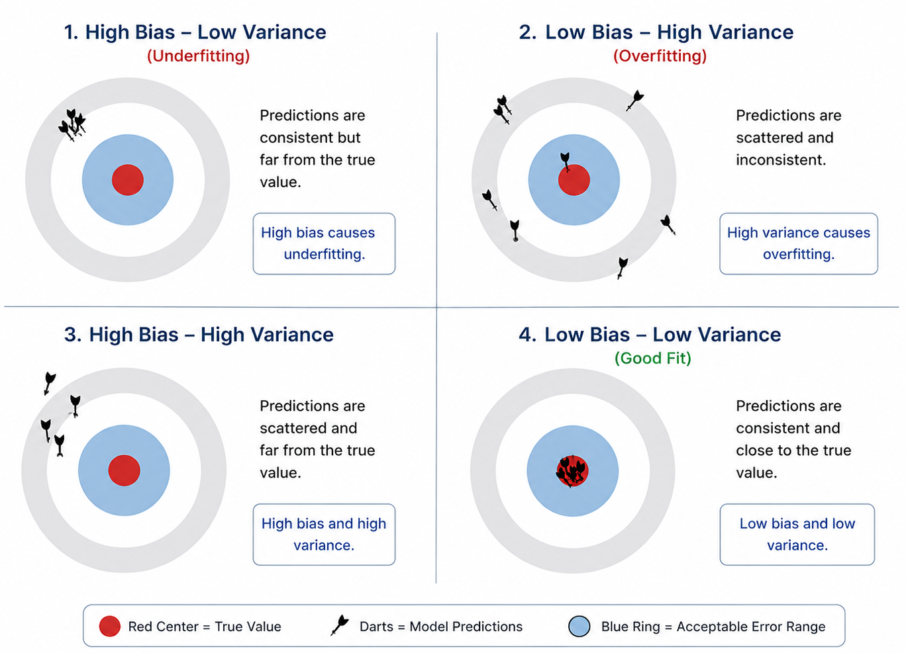
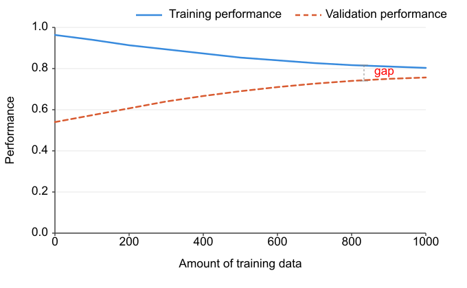
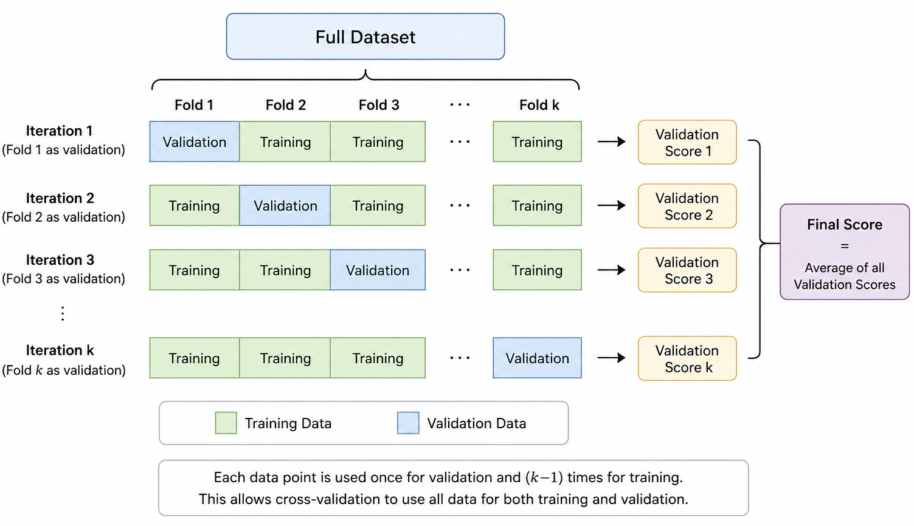

# Machine Learning and Deep Learning Fundamentals

Before examining machine learning applications in molecular and materials science, this section introduces the fundamental concepts 
needed for the topics that follow. It provides a concise review of essential machine learning principles, serving both as a refresher 
for experienced readers and as an accessible starting point for newcomers. These foundations will support the understanding of the more 
advanced methods and applications presented throughout the course.

## Learning Objectives

* Explain the fundamental principles of machine learning
* Differentiate among the main types of learning tasks
* Identify and mitigate overfitting and underfitting
* Apply appropriate validation and model evaluation methods
* Describe the basic structure and function of neural networks
* Understand key strategies for model optimization and hyperparameter tuning

## 1. What Is Machine Learning?

### Definition

Machine learning is a branch of artificial intelligence focused on developing algorithms that learn patterns directly from data. Rather 
than explicitly programming a computer with a fixed set of rules, we provide examples and allow the model to infer the underlying relationships 
on its own (Machine Learning, T. Mitchell, 1997).

### Traditional Programming

```text
Rules + Data -> Output
```

### Machine Learning

```text
Data + Desired Output -> Learned Model
```

### Why Use Machine Learning in Science?

Machine learning has become an important approach in molecular and materials science because it allows researchers 
to analyze large, complex datasets and uncover useful scientific information. By learning patterns directly from data, 
ML can complement conventional theoretical, computational, and experimental methods in several ways:

* **Estimate molecular and material properties** without depending exclusively on costly simulations or experimental measurements
* **Reveal patterns, correlations, and trends** that may be difficult to detect in complex scientific datasets
* **Assist in the discovery of new molecules and materials** by prioritizing promising candidates and supporting hypothesis development
* **Accelerate research workflows** by reducing the time needed for screening, prediction, and data analysis
* **Address high-dimensional scientific problems** that are challenging to solve efficiently with traditional methods

### Main Categories of Machine Learning

#### *Supervised Learning*

Supervised learning trains a model on labeled examples, where each input is paired with a known target 
value or class. The objective is to learn a mapping between inputs and outputs that can be used to make 
predictions for previously unseen data.

Common supervised learning tasks include:

* **Regression:** estimating continuous numerical values, such as binding energies, melting points, or reaction rates
* **Classification:** assigning samples to predefined categories, such as toxic or non-toxic compounds, or active or inactive molecules


??? note "Example"

    ```python
    # Example: Predicting molecular solubility using linear regression 

    import numpy as np
    from sklearn.model_selection import train_test_split
    from sklearn.linear_model import LinearRegression
    from sklearn.metrics import mean_squared_error

    """ 
     Input features (molecular descriptors)
     Columns:
     [molecular_weight, polar_surface_area, logP]
    """ 
    X = np.array([
        [180.1, 45.2, 1.2],
        [250.3, 60.1, 2.5],
        [320.5, 75.0, 3.8],
        [150.2, 30.5, 0.8],
        [275.4, 68.2, 2.9],
        [210.0, 50.0, 1.7]
    ])

    """ Experimental solubility values """
    y = np.array([12.5, 8.1, 3.2, 15.0, 6.4, 10.2])

    """ 
     Split dataset into training and testing sets
    """ 
    X_train, X_test, y_train, y_test = train_test_split(
        X, y, test_size=0.2, random_state=42
    )

    """ 
     Create and train the model
    """ 
    model = LinearRegression()
    model.fit(X_train, y_train)

    """ 
     Evaluate the model
    """ 
    y_pred = model.predict(X_test)

    mse = mean_squared_error(y_test, y_pred)
    print("Mean Squared Error:", mse)

    """ 
     Predict solubility for a new molecule
     Example molecule:
     molecular_weight = 240
     polar_surface_area = 55
     logP = 2.1
    """ 

    new_molecule = np.array([[240.0, 55.0, 2.1]])
    prediction = model.predict(new_molecule)
    print("Predicted solubility:", prediction[0])
    ```

#### *Unsupervised Learning*

Unsupervised learning works with data that do not have predefined labels or target values. Rather than learning f
rom known outcomes, the algorithm examines the dataset to discover underlying patterns, structures, and relationships.

Common unsupervised learning techniques include:

* **Clustering:**  grouping molecules or materials according to similarities in their structural characteristics or measured properties
* **Dimensionality reduction:**  reducing the number of variables in complex datasets to make chemical or materials spaces easier to visualize and interpret
* **Anomaly detection:**  detecting rare or atypical samples that differ substantially from the dominant patterns present in the dataset

As example of a clustering method is K-means. It is an unsupervised learning algorithm that partitions data into (K) clusters by minimizing the 
distance between samples and their cluster centroids. It seeks to minimize:

$$
J=\sum_{k=1}^{K}\sum_{\mathbf{x}_i\in C_k}|\mathbf{x}_i-\boldsymbol{\mu}_k|^2,
$$

where (\boldsymbol{\mu}_k) is the centroid of cluster (C_k).

??? note "Example"

    ```python
    # Example: Clustering molecules by similarity using K-Means

    import numpy as np
    from sklearn.cluster import KMeans
    import matplotlib.pyplot as plt

    """ 
     Example molecular fingerprints
     Each row represents a molecule
     Each column represents a simplified molecular feature
    """ 
    # Molecular features:
    # 0 = aromatic ring
    # 1 = nitrogen atom
    # 2 = hydroxyl group
    # 3 = carbonyl group
    # 4 = halogen atom
    molecular_fingerprints = np.array([
        [1, 0, 1, 0, 1],
        [1, 0, 1, 0, 0],
        [0, 1, 0, 1, 1],
        [0, 1, 0, 1, 0],
        [1, 1, 0, 0, 1],
        [1, 1, 0, 0, 0],
        [0, 0, 1, 1, 1],
        [0, 0, 1, 1, 0]
    ])

    """ 
     Create the K-Means clustering model
    """ 
    kmeans = KMeans(n_clusters=4, random_state=42)

    """ Assign each molecule to a cluster """
    clusters = kmeans.fit_predict(molecular_fingerprints)

    """ 
     Display clustering results
    """ 
    for i, cluster_id in enumerate(clusters):
        print(f"Molecule {i + 1} belongs to Cluster {cluster_id}")

    """ 
     Visualize clusters using the first two features
    """ 
    plt.figure(figsize=(6, 5))

    scatter = plt.scatter(
        molecular_fingerprints[:, 0],
        molecular_fingerprints[:, 1],
        c=clusters,
        s=100
    )

    plt.xlabel("Feature 1")
    plt.ylabel("Feature 2")
    plt.title("Molecular Clustering with K-Means")
    plt.savefig("clustering.png", dpi=300, bbox_inches="tight")
    plt.show()
    ```

#### *Reinforcement Learning*


Reinforcement learning is a machine learning paradigm in which an agent improves its decision-making 
by interacting with an environment. Actions produce rewards or penalties, and the agent learns a policy 
that aims to maximize the expected cumulative reward over time.

In molecular and materials science, reinforcement learning can support applications such as:

* **Molecular design and optimization:** generating or modifying molecules to improve desired properties such as stability, biological activity, or solubility
* **Synthesis route planning:** searching for efficient reaction sequences and selecting promising pathways for producing target compounds
* **Experimental optimization:** choosing informative experiments that can accelerate discovery while reducing laboratory cost, time, and computational resources


## 2. The Machine Learning Workflow


### Defining the Machine Learning Problem

A strong machine learning project starts with a precise and well-defined problem statement. Before choosing a model 
or beginning training, the scientific goal should be clearly specified along with the criteria that will be used 
to judge the quality of the results.

A typical workflow includes:

1. **Define the goal:** identify the property, outcome, or scientific question that the model should predict, categorize, or investigate.
2. **Choose the learning formulation:** determine whether the task is most appropriately treated as regression, classification, clustering, generative modeling, or another machine learning approach.
3. **Specify performance measures:** select the metrics that will be used to evaluate the model and decide whether its performance is sufficient for the intended application.

Example:

> “Build a binary classification model that predicts whether a molecule can cross the blood–brain barrier and achieves an accuracy above 85%.”


### Data Collection and Preparation

Reliable machine learning models depend heavily on the quality of the data used for training and evaluation. 
Well-curated datasets should be accurate, representative, sufficiently diverse, and consistent across samples.

#### *Data Sources*

Scientific data can be collected from a variety of sources, such as:

* **Experimental data**, generated through laboratory measurements, characterization, and testing
* **Computational data**, produced by methods such as Density Functional Theory (DFT) calculations and Molecular Dynamics (MD) simulations
* **Public scientific databases**, including widely used resources such as PubChem, ChEMBL, and the Materials Project


#### *Data Quality Checks*

**pandas** is a popular Python library for organizing, exploring, and transforming structured datasets. 
Its central data structure, the DataFrame, provides a convenient way to work with tabular information. 
In machine learning and scientific workflows, pandas is often used to import data, handle missing entries, 
select or filter observations, calculate summary statistics, and prepare datasets for modeling.

**RDKit** is an open-source cheminformatics toolkit for processing and analyzing molecular information. It 
supports computational representations of molecules, calculation of descriptors and molecular fingerprints, 
visualization of chemical structures, similarity comparisons, and generation of features for machine learning. 
RDKit is widely used in cheminformatics, drug discovery, and other data-driven applications involving chemical and molecular systems.


??? note "Example"

    ```python
    # example: data preparation + feature engineering

    import pandas as pd
    import numpy as np
 
    # 1. Create a small example dataset
    data = pd.DataFrame({
        "molecule_name": [
            "Ethanol",
            "Acetic acid",
            "Benzene",
            "Acetone",
            "Phenol",
            "Ethanol",          # duplicate row
            "Invalid molecule",
            "Large outlier"
        ],
        "smiles": [
            "CCO",
            "CC(=O)O",
            "c1ccccc1",
            "CC(=O)C",
            "c1ccccc1O",
            "CCO",              # duplicate row
            "not_a_smiles",     # invalid molecule
            "CCCCCCCCCCCCCCCC"
        ],
        "property": [
            -0.31,
            -0.17,
            -2.13,
            -0.24,
            -1.46,
            -0.31,              # duplicate value
            np.nan,             # missing value
            50.0                # artificial outlier
        ]
    })

    # Save dataset as CSV 
    data.to_csv("molecular_data.csv", index=False)

    # 2. Load data
    data = pd.read_csv("molecular_data.csv")

    print("Original data:")
    print(data)

    # 3. Check for missing values
    print("\nMissing values:")
    print(data.isnull().sum())

    # 4. Check for duplicates
    print("\nNumber of duplicate rows:")
    print(data.duplicated().sum())

    # Remove duplicate rows 
    data = data.drop_duplicates()

    # 5. Check distributions
    print("\nSummary statistics:")
    print(data.describe())

    # 6. Remove missing values
    data = data.dropna(subset=["smiles", "property"])

    # 7. Remove outliers using the 3-sigma rule
    z_scores = np.abs(
        (data["property"] - data["property"].mean()) / data["property"].std()
    )

    data_clean = data[z_scores < 3].copy()
    print("\nCleaned data:")
    print(data_clean)

    # 8. Feature engineering with RDKit
    from rdkit import Chem
    from rdkit.Chem import Descriptors

    def calculate_features(smiles):
        """
        Convert a molecule represented by a SMILES string
        into numerical molecular descriptors.
        """

        mol = Chem.MolFromSmiles(smiles)

        # Handle invalid molecules
        if mol is None:
            return None

        features = {
            "molecular_weight": Descriptors.MolWt(mol),
            "logP": Descriptors.MolLogP(mol),
            "num_h_donors": Descriptors.NumHDonors(mol),
            "num_h_acceptors": Descriptors.NumHAcceptors(mol),
            "tpsa": Descriptors.TPSA(mol),
            "num_rotatable_bonds": Descriptors.NumRotatableBonds(mol),
            "num_aromatic_rings": Descriptors.NumAromaticRings(mol)
        }

        return features
 
    # 9. Apply feature engineering to each molecule
    feature_rows = []

    for _, row in data_clean.iterrows():
        features = calculate_features(row["smiles"])

        if features is not None:
            features["molecule_name"] = row["molecule_name"]
            features["smiles"] = row["smiles"]
            features["property"] = row["property"]
            feature_rows.append(features)

    features_df = pd.DataFrame(feature_rows)

    # Reorder columns
    features_df = features_df[
        [
            "molecule_name",
            "smiles",
            "molecular_weight",
            "logP",
            "num_h_donors",
            "num_h_acceptors",
            "tpsa",
            "num_rotatable_bonds",
            "num_aromatic_rings",
            "property"
        ]
    ]

    print("\nFinal feature table:")
    print(features_df)

    # 10. Save final processed dataset
    features_df.to_csv("molecular_features.csv", index=False)

    print("\nProcessed dataset saved as molecular_features.csv")
    ```

### Training, Validation, and Test Sets

An essential principle in machine learning is that model performance should be assessed using data 
that were not used during training.

> **Critical principle:** Do not evaluate a model on the same data used to fit it.

When training and evaluation are performed on the same samples, the model may reproduce memorized examples 
rather than learn patterns that generalize to new data. This can lead to overfitting and overly optimistic performance estimates.

To reduce this risk, datasets are commonly separated into three subsets:

#### *Training Set*

The **training set** is used to fit the model parameters and learn patterns from the available data.

#### *Validation Set*

The **validation set** is used during model development to adjust hyperparameters, compare alternative models, and detect overfitting.

#### *Test Set*

The **test set** is reserved for the final assessment of model performance on previously unseen data.

#### *Typical Dataset Split*

| Dataset        | Typical Fraction |
| -------------- | ---------------- |
| Training Set   | 70%              |
| Validation Set | 15%              |
| Test Set       | 15%              |

#### *Conceptual Workflow*

```text
Training Set   -> Fit the model
Validation Set -> Tune and compare models
Test Set       -> Evaluate final performance
```


??? note "Example"

    ```python
    # Basic example: training, validation, and test split 

    import numpy as np
    from sklearn.model_selection import train_test_split

    # 1. Create a small example dataset
    # X = input features
    # y = target values

    X = np.array([
        [1.0, 2.0],
        [2.0, 1.5],
        [3.0, 3.5],
        [4.0, 4.5],
        [5.0, 5.5],
        [6.0, 6.5],
        [7.0, 7.5],
        [8.0, 8.5],
        [9.0, 9.5],
        [10.0, 10.5]
    ])

    y = np.array([1, 1, 2, 2, 3, 3, 4, 4, 5, 5])

    # 2. First split: training set and temporary set
    X_train, X_temp, y_train, y_temp = train_test_split(
        X,
        y,
        test_size=0.30,
        random_state=42
    )

    # 3. Second split: validation set and test set
    X_val, X_test, y_val, y_test = train_test_split(
        X_temp,
        y_temp,
        test_size=0.50,
        random_state=42
    )
 
    # 4. Print the results
    print("Training set:")
    print("X_train:")
    print(X_train)
    print("y_train:")
    print(y_train)

    print("\nValidation set:")
    print("X_val:")
    print(X_val)
    print("y_val:")
    print(y_val)

    print("\nTest set:")
    print("X_test:")
    print(X_test)
    print("y_test:")
    print(y_test)

    # 5. Print the sizes
    print("\nDataset sizes:")
    print("Training set size:", len(X_train))
    print("Validation set size:", len(X_val))
    print("Test set size:", len(X_test))
    ```

### Scaffold-Based Splitting

In molecular machine learning, **scaffold-based splitting** separates molecules according 
to their underlying structural frameworks rather than assigning individual compounds randomly 
to training, validation, and test sets.

A molecular scaffold represents the main structural backbone of a molecule, commonly defined by 
its ring systems and the linkers that connect them after peripheral substituents are removed. 
Molecules sharing the same scaffold often exhibit substantial structural similarity and may also 
display related chemical or biological properties.

This creates a potential problem with random splitting. Molecules based on the same scaffold can 
appear in both the training and test sets, meaning that the model may already have encountered very 
similar structural patterns during training. As a result, test performance can appear better than the 
model's true ability to generalize to unfamiliar regions of chemical space.

Scaffold-based splitting reduces this source of information leakage by assigning molecules with the 
same scaffold to the same subset. Consequently, the test set contains scaffold families that were not 
present during training, providing a more demanding and realistic assessment of structural generalization.

### Conceptual Example

```text
Random Split:
  Train → Ibuprofen   (aromatic scaffold)
  Test  → Ketoprofen  (related aromatic scaffold)

  The training and test compounds contain closely related
  structural frameworks, making the prediction task easier.
```

```text
Scaffold Split:
  Train → Ibuprofen   (aromatic scaffold)
  Test  → Penicillin  (beta-lactam-containing scaffold)

  The test molecule belongs to a structurally different
  scaffold family that was not represented during training.
```

Scaffold-based splitting is commonly used in molecular property prediction and drug discovery when 
the objective is to evaluate whether a model can make reliable predictions for compounds with 
previously unseen structural cores.


??? note "Example"

    ```python
    import numpy as np

    from rdkit import Chem
    from rdkit.Chem.Scaffolds import MurckoScaffold
    from sklearn.model_selection import GroupShuffleSplit

    # 1. Example molecules
    molecules = [
        # Benzene scaffold
        "Cc1ccccc1",        # Toluene
        "Oc1ccccc1",        # Phenol
        "Nc1ccccc1",        # Aniline

        # Pyridine scaffold
        "c1ccncc1",         # Pyridine
        "CCc1ccncc1",       # Ethylpyridine
        "Oc1ccncc1",        # Hydroxypyridine

        # Cyclohexane scaffold
        "C1CCCCC1",         # Cyclohexane
        "CC1CCCCC1",        # Methylcyclohexane
        "OC1CCCCC1",        # Cyclohexanol

        # Thiophene scaffold
        "c1ccsc1",          # Thiophene
        "Cc1ccsc1",         # Methylthiophene
        "Oc1ccsc1"          # Hydroxythiophene
    ]

    # Example target property
    y = np.array([
        1.2, 1.4, 1.1,
        0.8, 0.9, 0.7,
        1.7, 1.6, 1.8,
        0.5, 0.6, 0.4
    ])

    # 2. Generate simple molecular features
    X = []

    for smiles in molecules:

        mol = Chem.MolFromSmiles(smiles)

        features = [
            mol.GetNumAtoms(),
            mol.GetNumBonds(),
            mol.GetRingInfo().NumRings()
        ]

        X.append(features)

    X = np.array(X)

    # 3. Extract Murcko scaffolds
    def get_scaffold(smiles):

        mol = Chem.MolFromSmiles(smiles)

        return MurckoScaffold.MurckoScaffoldSmiles(
            mol=mol
        )


    scaffolds = np.array([
        get_scaffold(smiles)
        for smiles in molecules
    ])


    print("Molecular scaffolds:\n")

    for smiles, scaffold in zip(
        molecules,
        scaffolds
    ):
        print(
            f"{smiles:20s} -> {scaffold}"
        )

    # 4. Scaffold-based train/test split
    splitter = GroupShuffleSplit(
        n_splits=1,
        test_size=0.25,
        random_state=42
    )

    train_idx, test_idx = next(
        splitter.split(
            X,
            y,
            groups=scaffolds
        )
    )

    # 5. Create training and test sets
    X_train = X[train_idx]
    X_test = X[test_idx]

    y_train = y[train_idx]
    y_test = y[test_idx]

    # 6. Display the split
    print("\nTraining set:")

    for i in train_idx:
        print(molecules[i], " scaffold:", scaffolds[i])


    print("\nTest set:")

    for i in test_idx:
        print(molecules[i], " scaffold:", scaffolds[i])

    # 7. Verify scaffold separation
    train_scaffolds = set(
        scaffolds[train_idx]
    )

    test_scaffolds = set(
        scaffolds[test_idx]
    )

    print("\nTraining scaffolds:")
    print(train_scaffolds)

    print("\nTest scaffolds:")
    print(test_scaffolds)

    print("\nShared scaffolds:",
        train_scaffolds.intersection(
            test_scaffolds    )) 
    ```

## 3. Overfitting and Underfitting

### *The Bias-Variance Tradeoff*

**Underfitting (High Bias):**

* The model is not flexible enough to capture the complexity present in the data
* Produces poor results on both the training set and previously unseen data
* Misses important trends, dependencies, and relevant structure
* Often arises when the model is too simple or the available features are not sufficiently informative

**Overfitting (High Variance):**

* The model is overly flexible compared with the amount and diversity of available training data
* Performs extremely well on the training set but generalizes poorly to new samples
* Fits noise and dataset-specific fluctuations instead of learning robust patterns
* Commonly leads to unreliable predictions on unseen data

**Optimal Balance (Sweet Spot):**

* The model has enough complexity to represent the important structure in the data without becoming unnecessarily flexible
* Achieves strong performance on both training and test data
* Learns meaningful relationships while avoiding excessive sensitivity to noise
* Generalizes well to new examples that were not used during training


{: style="width: 600px;"}

??? note "Example"

    ```python
    
    # Underfitting vs Good Fit vs Overfitting
    import numpy as np
    import matplotlib.pyplot as plt

    # reproducibility
    np.random.seed(42)

    # 1. Generate synthetic dataset

    # Input variable 
    X = np.linspace(0, 10, 50)

    # True underlying relationship. Quadratic function + random noise
    y = 0.5 * X**2 - 2 * X + 3 + np.random.normal(0, 4, 50)

    # 2. Train polynomial models
    
    # Underfitting model: Degree 1 polynomial (linear model) 
    underfit_model = np.poly1d( np.polyfit(X, y, 1) )
    
    # Good fit model: Degree 2 polynomial (matches true relationship)
    good_model = np.poly1d( np.polyfit(X, y, 2) )

    # Overfitting model: Very high-degree polynomial
    overfit_model = np.poly1d( np.polyfit(X, y, 15) )

    # 3. Create smooth plotting grid
    X_plot = np.linspace(0, 10, 500)

    # 4. Visualize results
    plt.figure(figsize=(10, 6))

    # Original data points 
    plt.scatter(X, y, alpha=0.7, label="Training Data")

    # Underfitting curve
    plt.plot(
        X_plot,
        underfit_model(X_plot),
        linestyle="--",
        linewidth=2,
        label="Underfitting (Degree 1)"
    )

    # Good fit curve 
    plt.plot(
        X_plot,
        good_model(X_plot),
        linewidth=2,
        label="Good Fit (Degree 2)"
    )

    # Overfitting curve
    plt.plot(
        X_plot,
        overfit_model(X_plot),
        linestyle=":",
        linewidth=2,
        label="Overfitting (Degree 15)"
    )

    # 5. Labels and formatting
    plt.xlabel("Input Feature")
    plt.ylabel("Target Value")

    plt.title("Underfitting vs Good Fit vs Overfitting")

    plt.legend()

    plt.grid(True)
    plt.savefig("underfitting-overfitting.png", dpi=300, bbox_inches="tight")
    plt.show()
    ```


### *Detecting Overfitting*

A common way to detect overfitting is by analyzing **learning curves**, which show model performance on 
the training and validation sets as the amount of training data increases.

Typically, two curves are monitored:

* **Training performance**
* **Validation performance**

{: style="width: 600px;"}

### *Interpreting Learning Curves*

#### Overfitting

Overfitting happens when a model performs extremely well on the training data but noticeably worse on the 
validation data. This creates a clear separation between the two curves and suggests that the model has 
learned training-specific details or noise instead of patterns that generalize well.

#### Underfitting

Underfitting occurs when the model performs poorly on both the training and validation sets. The curves may 
remain close to one another, but both show weak performance, indicating that the model does not have enough capacity to capture the important structure in the data.

#### Good Generalization

A model with good generalization performs well on both the training and validation sets, with only a small 
difference between the two curves. This indicates that the model has learned useful patterns from the training 
data without relying excessively on memorization.

```text
Overfitting:
Training accuracy   -> Very high
Validation accuracy -> Clearly lower

Underfitting:
Training accuracy   -> Low
Validation accuracy -> Low

Good generalization:
Training accuracy   -> High
Validation accuracy -> High and close to training
```

??? note "Example"

    ```python
    # example: Learning curves
    import numpy as np
    import matplotlib.pyplot as plt

    from sklearn.model_selection import learning_curve, KFold
    from sklearn.preprocessing import PolynomialFeatures
    from sklearn.pipeline import make_pipeline
    from sklearn.linear_model import LinearRegression

    # 1. Generate synthetic regression data
    np.random.seed(42)

    X = np.linspace(0, 10, 100).reshape(-1, 1)

    # True relationship is quadratic
    y = (
        0.5 * X[:, 0]**2
        - 2 * X[:, 0]
        + 3
        + np.random.normal(0, 4, 100)
    )

    # 2. Define an intentionally complex model
    model = make_pipeline(
        PolynomialFeatures(degree=10),
        LinearRegression()
    )

    # 3. Define cross-validation
    cv = KFold(
        n_splits=5,
        shuffle=True,
        random_state=42
    )

    # 4. Compute learning curves
    train_sizes, train_scores, val_scores = learning_curve(
        model,
        X,
        y,
        train_sizes=np.linspace(0.1, 1.0, 10),
        cv=cv,
        scoring="neg_mean_squared_error",
        shuffle=True,
        random_state=42
    )

    # 5. Convert negative MSE into positive MSE
    train_errors = -train_scores.mean(axis=1)
    val_errors = -val_scores.mean(axis=1)

    train_std = train_scores.std(axis=1)
    val_std = val_scores.std(axis=1)

    # 6. Plot learning curves
    plt.figure(figsize=(10, 6))

    plt.plot(
        train_sizes,
        train_errors,
        marker="o",
        label="Training Error"
    )

    plt.plot(
        train_sizes,
        val_errors,
        marker="o",
        label="Validation Error"
    )

    plt.fill_between(
        train_sizes,
        train_errors - train_std,
        train_errors + train_std,
        alpha=0.2
    )

    plt.fill_between(
        train_sizes,
        val_errors - val_std,
        val_errors + val_std,
        alpha=0.2
    )

    plt.xlabel("Training Set Size")
    plt.ylabel("Mean Squared Error")
    plt.title("Learning Curves")

    plt.legend()
    plt.grid(True)

    plt.savefig(
        "learning-curves.png",
        dpi=300,
        bbox_inches="tight"
    )

    plt.show()

    # 7. Print numerical results
    print("Training set sizes:")
    print(train_sizes)

    print("\nTraining errors:")
    print(train_errors)

    print("\nValidation errors:")
    print(val_errors)
    ```

### *Preventing Overfitting*

#### 1. Get More Data

The most effective solution when possible:

```python
# Data augmentation for molecules
def augment_molecule(smiles):
    mol = Chem.MolFromSmiles(smiles)
    
    # Generate different SMILES representations
    augmented = []
    for _ in range(5):
        random_smiles = Chem.MolToSmiles(mol, doRandom=True)
        augmented.append(random_smiles)
    
    return augmented
```

#### 2. Regularization
Add penalty for model complexity:

**L1 Regularization (Lasso)**: Encourages sparsity by penalizing the absolute values of 
model parameters, causing some coefficients to become exactly zero and effectively performing feature selection.

$$
L(\mathbf{w}) = \text{Loss}(\mathbf{w}) + \lambda \sum_{i=1}^{n} |w_i|
$$

Where:

* $\text{Loss}(\mathbf{w})$ is the original loss function
* $w_i$ are the model parameters
* $\lambda$ controls the strength of the regularization penalty

```python
from sklearn.linear_model import Lasso

model = Lasso(alpha=0.1)  # alpha controls regularization strength
model.fit(X_train, y_train)
```

**L2 Regularization (Ridge)**: Penalizes large model parameters by adding the squared magnitude of 
the weights to the loss function. This helps reduce model complexity and improves generalization.

$$
L(\mathbf{w}) = \text{Loss}(\mathbf{w}) + \lambda \sum_{i=1}^{n} w_i^2
$$

Where:

* $\text{Loss}(\mathbf{w})$ is the original loss function
* $w_i$ are the model parameters
* $\lambda$ controls the strength of the regularization penalty


```python
from sklearn.linear_model import Ridge

model = Ridge(alpha=1.0)
model.fit(X_train, y_train)
```

**Elastic Net**: Combines both L1 and L2 regularization, encouraging sparsity while also 
penalizing large model parameters.

$$
L(\mathbf{w}) = \text{Loss}(\mathbf{w}) + \lambda_1 \sum_{i=1}^{n} |w_i| + \lambda_2 \sum_{i=1}^{n} w_i^2
$$

Where:

* $\text{Loss}(\mathbf{w})$ is the original loss function
* $w_i$ are the model parameters
* $\lambda_1$ controls the strength of the L1 penalty
* $\lambda_2$ controls the strength of the L2 penalty


```python
from sklearn.linear_model import ElasticNet

model = ElasticNet(alpha=0.1, l1_ratio=0.5)
model.fit(X_train, y_train)
```

#### 3. Cross-Validation

Cross-validation is a widely used technique for evaluating machine learning models more reliably, 
especially when the available dataset is limited. Instead of performing a single train-test split, 
the data is divided into multiple subsets, allowing the model to be trained and validated several 
times on different portions of the dataset. See below for more details on cross-validation.

#### 4. Feature Selection

Feature selection involves choosing the variables that contribute the most useful information to a 
machine learning problem while discarding features that are unnecessary, redundant, or weakly informative. 
Limiting the number of input variables can reduce computational demands, improve interpretability, and 
lower the risk of overfitting. This is particularly relevant in scientific machine learning, where molecular 
and materials datasets often contain large numbers of descriptors that may be strongly correlated 
or provide overlapping information.


??? note "Example"

    ```python 
    # example: Feature selection with SelectKBest

    import pandas as pd

    from sklearn.datasets import make_regression
    from sklearn.model_selection import train_test_split
    from sklearn.feature_selection import SelectKBest, f_regression

    # 1. Generate a synthetic regression dataset
    X, y = make_regression(
        n_samples=100,
        n_features=20,
        n_informative=8,
        noise=10,
        random_state=42
    )

    # 2. Create a DataFrame with feature names
    feature_names = [
        f"feature_{i}"
        for i in range(20)
    ]

    X = pd.DataFrame(
        X,
        columns=feature_names
    )

    # 3. Split the dataset into training and test sets
    X_train, X_test, y_train, y_test = train_test_split(
        X,
        y,
        test_size=0.2,
        random_state=42
    )

    # 4. Select the top 8 features
    # The synthetic dataset was generated with
    # 8 informative features, so we ask SelectKBest
    # to retain 8 features.
    selector = SelectKBest(
        score_func=f_regression,
        k=8
    )

    # Fit the selector only on the training data
    X_train_selected = selector.fit_transform(
        X_train,
        y_train
    )

    # Apply the same feature selection to the test set
    X_test_selected = selector.transform(
        X_test
    )

    # 5. Display feature scores
    feature_scores = pd.DataFrame({
        "Feature": X.columns,
        "F-score": selector.scores_,
        "Selected": selector.get_support()
    })

    feature_scores = feature_scores.sort_values(
        by="F-score",
        ascending=False
    )

    print("Feature scores:\n")
    print(feature_scores)

    # 6. Display selected feature names
    selected_features = X.columns[
        selector.get_support()
    ]

    print("\nSelected features:")
    print(selected_features.tolist())

    # 7. Display dataset shapes
    print("\nOriginal training shape:")
    print(X_train.shape)

    print("\nReduced training shape:")
    print(X_train_selected.shape)

    print("\nOriginal test shape:")
    print(X_test.shape)

    print("\nReduced test shape:")
    print(X_test_selected.shape)
    ```

#### 5. Early Stopping (for Neural Networks)

Early stopping is a regularization strategy that helps prevent overfitting during neural network 
training. Although the training loss often continues to decrease, validation performance may 
eventually stop improving or begin to worsen. Early stopping tracks a validation metric and 
terminates training when no meaningful improvement occurs for a predefined number of epochs. 
This allows the model to preserve better generalization while also avoiding unnecessary computation.

#### 6. Dropout (for Neural Networks)

Dropout is a regularization method designed to improve the generalization of neural networks. 
During training, a proportion of neuron activations is randomly set to zero at each iteration. 
This prevents the network from depending too strongly on particular neurons or pathways and 
encourages more distributed feature representations. During validation and prediction, dropout 
is disabled and the full network is used.

### *Addressing Underfitting*

1. **Increase model capacity:** use a more flexible model, add hidden units, or increase network depth
2. **Reduce regularization:** decrease the strength of penalties such as L1, L2, or dropout
3. **Improve the input features:** introduce more informative variables or use domain knowledge to construct better representations
4. **Train for more iterations:** increase the number of epochs if the model has not yet converged
5. **Review the data pipeline:** verify that preprocessing, labels, scaling, and feature construction are implemented correctly

## 4. Cross-Validation

### *Why Cross-Validation?*

Cross-validation is a model evaluation strategy used to obtain a more dependable estimate of how 
well a model will perform on unseen data. Rather than evaluating the model using only one train-test 
split, the data are divided and reused across several training and evaluation rounds. This reduces 
sensitivity to a particular split, makes efficient use of limited datasets, and provides a better 
indication of the model’s ability to generalize.

### *K-Fold Cross-Validation*

In K-fold cross-validation, the dataset is partitioned into (K) approximately equal subsets called 
folds. The model is trained on (K-1) folds and evaluated on the remaining fold. This procedure is 
repeated (K) times, with each fold used once for validation. The final performance is typically 
reported as the average score across all folds, giving a more stable estimate than a single split.

{: style="width: 600px;"}

??? note "Example"

    ```python
    # example: Cross-validation with scikit-learn

    import numpy as np

    from sklearn.datasets import make_regression
    from sklearn.linear_model import LinearRegression
    from sklearn.model_selection import cross_val_score

    # 1. Generate example regression dataset
    X, y = make_regression(
        n_samples=100,
        n_features=3,
        noise=15,
        random_state=42
    )

    # 2. Define machine learning model
    model = LinearRegression()

    # 3. Perform 5-fold cross-validation
    scores = cross_val_score(
        model,
        X,
        y,
        cv=5,
        scoring="r2"
    )

    # 4. Display results
    print("R² score for each fold:")
    print(scores)

    print("\nAverage cross-validation performance:")
    print(f"Cross-validation R²: {scores.mean():.3f} ± {scores.std():.3f}")
    ```

    The code:

    * generates a synthetic regression dataset,
    * trains a linear regression model,
    * evaluates it using 5-fold cross-validation,
    * and reports the mean and standard deviation of the (R^2) score across all folds.


### *Stratified K-Fold*

Stratified K-fold cross-validation is especially useful for classification tasks with 
unbalanced classes. Each fold is created so that its class proportions are similar to those 
of the complete dataset. This helps ensure that minority and majority classes are represented 
throughout training and validation, producing more consistent and meaningful performance estimates.

### *Leave-One-Out Cross-Validation (LOOCV)*

Leave-One-Out Cross-Validation is a special form of K-fold cross-validation in which a 
single observation is held out at a time. The model is trained on all other samples and 
then evaluated on the excluded one. This procedure is repeated until every observation has 
served as the validation sample once. LOOCV makes extensive use of the available data but 
can be computationally demanding when the dataset is large.

### *Time Series Cross-Validation*

Time series cross-validation is designed for ordered data in which the sequence of observations 
must be preserved. Instead of randomly shuffling samples, the model is trained using earlier 
time points and evaluated on later ones. This prevents information from the future from leaking 
into the training process and provides a more realistic estimate of forecasting performance.

## 5. Model Evaluation Metrics

### *Regression Metrics*

Regression metrics are used to measure how closely a model’s predictions match continuous 
target values. Different metrics highlight different aspects of predictive performance, including 
typical error size, the influence of large deviations, and how much of the target variability is 
captured by the model. Selecting suitable metrics is therefore important for evaluating and 
comparing regression models.

#### Mean Absolute Error (MAE)

Mean Absolute Error (MAE) represents the average absolute difference between predicted and observed 
values. Since the errors are expressed in the same units as the target variable, MAE is straightforward 
to interpret. Compared with squared-error metrics, it is less strongly affected by a small number of 
unusually large prediction errors.

$$
\mathrm{MAE} = \frac{1}{n} \sum_{i=1}^{n} |y_i - \hat{y}_i|
$$

Where:

* $y_i$ are the true values
* $\hat{y}_i$ are the predicted values
* $n$ is the number of samples

```python
from sklearn.metrics import mean_absolute_error

mae = mean_absolute_error(y_true, y_pred)
print(f"MAE: {mae:.3f}")

# Interpretation: Average prediction error in original units
# Lower is better
# Robust to outliers
```

#### Mean Squared Error (MSE) and Root Mean Squared Error (RMSE)

Mean Squared Error (MSE) measures the average squared difference between predictions and true values. Squaring 
the errors penalizes large mistakes more strongly, making MSE sensitive to outliers. Root Mean Squared Error 
(RMSE) is the square root of MSE and expresses the error in the same units as the target variable, making 
interpretation more intuitive.

$$
\mathrm{MSE} = \frac{1}{n} \sum_{i=1}^{n} (y_i - \hat{y}_i)^2
$$

$$
\mathrm{RMSE} = \sqrt{\frac{1}{n} \sum_{i=1}^{n} (y_i - \hat{y}_i)^2}
$$

Where:

* $y_i$ are the true values
* $\hat{y}_i$ are the predicted values
* $n$ is the number of samples

```python
from sklearn.metrics import mean_squared_error

mse = mean_squared_error(y_true, y_pred)
rmse = np.sqrt(mse)
print(f"MSE: {mse:.3f}")
print(f"RMSE: {rmse:.3f}")

# Interpretation: Penalizes large errors more than MAE
# RMSE in same units as target variable
# Lower is better
```

#### R² (Coefficient of Determination)

The ($R^2$) score measures how well a regression model explains the variability of the target data. 
An ($R^2$) value of 1 indicates perfect predictions, while a value close to 0 indicates poor predictive 
performance. Negative values are also possible and suggest that the model performs worse than simply 
predicting the mean of the dataset.

$$
R^2 = 1 - \frac{\sum_{i=1}^{n} (y_i - \hat{y}_i)^2}{\sum_{i=1}^{n} (y_i - \bar{y})^2}
$$

Where:

* $y_i$ are the true values
* $\hat{y}_i$ are the predicted values
* $\bar{y}$ is the mean of the true values


```python
from sklearn.metrics import r2_score

r2 = r2_score(y_true, y_pred)
print(f"R²: {r2:.3f}")

# Interpretation: 
# R² = 1: Perfect predictions
# R² = 0: As good as predicting mean
# R² < 0: Worse than predicting mean
# Range: ($-\infty$, 1]
```

#### Visualization

Visualization is an important part of regression model evaluation because it helps identify trends, 
systematic errors, and outliers that may not be obvious from numerical metrics alone. Common visualizations 
include predicted vs. true value plots, residual plots, and learning curves, which provide insight 
into model accuracy and generalization behavior. Matplotlib is a standard Python package for plotting graphs.

```python
import matplotlib.pyplot as plt

plt.figure(figsize=(8, 8))
plt.scatter(y_true, y_pred, alpha=0.5)
plt.plot([y_true.min(), y_true.max()], 
         [y_true.min(), y_true.max()], 
         'r--', linewidth=2, label='Perfect Prediction')
plt.xlabel('True Values')
plt.ylabel('Predicted Values')
plt.title(f'R² = {r2:.3f}, RMSE = {rmse:.3f}')
plt.legend()
plt.axis('equal')
plt.show()
```

### *Classification Metrics*

Classification metrics are used to evaluate models that predict discrete categories or classes. Different metrics 
emphasize different aspects of model performance, such as overall correctness, the ability to detect positive cases, 
or robustness to class imbalance. Selecting appropriate metrics is especially important in scientific and medical 
applications where false positives and false negatives may have very different consequences.


#### Confusion Matrix

A confusion matrix summarizes the predictions of a classification model by comparing predicted labels with 
the true labels. It provides counts of correctly and incorrectly classified samples and serves as the basis 
for many classification metrics. For binary classification:

|                 | Predicted Positive  | Predicted Negative  |
| --------------- | ------------------- | ------------------- |
| Actual Positive | True Positive (TP)  | False Negative (FN) |
| Actual Negative | False Positive (FP) | True Negative (TN)  |

The confusion matrix helps identify the types of errors made by the model, such as missed positive cases or 
false alarms.

```python
from sklearn.metrics import confusion_matrix, ConfusionMatrixDisplay

cm = confusion_matrix(y_true, y_pred)
disp = ConfusionMatrixDisplay(confusion_matrix=cm, display_labels=['Inactive', 'Active'])
disp.plot()
plt.show()

#                 Predicted
#              Negative  Positive
# Actual  Neg     TN        FP
#         Pos     FN        TP
```

#### Accuracy, Precision, Recall, F1-Score

Accuracy measures the fraction of correctly classified samples:

$$
\mathrm{Accuracy} = \frac{TP + TN}{TP + TN + FP + FN}
$$

Precision measures how many predicted positive cases are actually correct:

$$
\mathrm{Precision} = \frac{TP}{TP + FP}
$$

Recall, also called sensitivity, measures the fraction of actual positive cases
that the model correctly identifies:

$$
\mathrm{Recall} = \frac{TP}{TP + FN}
$$


The F1-score combines precision and recall into a single metric using their
harmonic mean:

$$
F_1 = 2 \cdot \frac{\mathrm{Precision} \cdot \mathrm{Recall}}{\mathrm{Precision} + \mathrm{Recall}}
$$


The F1-score is particularly useful when classes are imbalanced or when both
false positives and false negatives carry significant cost.

```python
from sklearn.metrics import accuracy_score, precision_score, recall_score, f1_score

accuracy = accuracy_score(y_true, y_pred)
precision = precision_score(y_true, y_pred)
recall = recall_score(y_true, y_pred)
f1 = f1_score(y_true, y_pred)

print(f"Accuracy:  {accuracy:.3f}  - (TP + TN) / Total")
print(f"Precision: {precision:.3f} - TP / (TP + FP) - How many predicted positives are correct?")
print(f"Recall:    {recall:.3f}    - TP / (TP + FN) - How many actual positives did we find?")
print(f"F1-Score:  {f1:.3f}       - Harmonic mean of precision and recall")
```

#### ROC Curve and AUC

The Receiver Operating Characteristic (ROC) curve evaluates classification performance across different decision 
thresholds by plotting:

* True Positive Rate (TPR)
* False Positive Rate (FPR)

The True Positive Rate is:

$$
\mathrm{TPR} = \frac{TP}{TP + FN}
$$

The False Positive Rate is:

$$
\mathrm{FPR} = \frac{FP}{FP + TN}
$$

The Area Under the Curve (AUC) summarizes the ROC curve into a single value. An AUC close to 1 indicates excellent 
classification performance, while an AUC near 0.5 suggests random guessing.

??? note "Example"

    ```python
    # example: ROC curve and AUC

    import numpy as np
    import matplotlib.pyplot as plt

    from sklearn.datasets import make_classification
    from sklearn.model_selection import train_test_split
    from sklearn.linear_model import LogisticRegression

    from sklearn.metrics import (
        roc_curve,
        roc_auc_score
    )

    # 1. Generate example classification dataset
    X, y = make_classification(
        n_samples=1000,
        n_features=10,
        n_informative=5,
        n_redundant=2,
        random_state=42
    )

    # 2. Split dataset into training and test sets
    X_train, X_test, y_train, y_test = train_test_split(
        X,
        y,
        test_size=0.2,
        random_state=42
    )

    # 3. Train classification model
    model = LogisticRegression()

    model.fit(X_train, y_train)

    # 4. Get probability predictions

    # Probability of belonging to class 1
    y_prob = model.predict_proba(X_test)[:, 1]

    # 5. Calculate ROC curve and AUC
    fpr, tpr, thresholds = roc_curve(
        y_test,
        y_prob
    )

    auc = roc_auc_score(
        y_test,
        y_prob
    )

    print(f"AUC score: {auc:.3f}")

    # 6. Plot ROC curve
    plt.figure(figsize=(8, 6))

    plt.plot(
        fpr,
        tpr,
        linewidth=2,
        label=f"ROC Curve (AUC = {auc:.3f})"
    )

    # Random classifier reference line
    plt.plot(
        [0, 1],
        [0, 1],
        "k--",
        label="Random Classifier"
    )

    plt.xlabel("False Positive Rate")
    plt.ylabel("True Positive Rate")

    plt.title("Receiver Operating Characteristic (ROC) Curve")

    plt.legend()

    plt.grid(True)
    plt.savefig("roc-curve.png", dpi=300, bbox_inches="tight")
    plt.show()

    # 7. AUC interpretation
    print("\nAUC Interpretation:")
    print("1.0  -> Perfect classifier")
    print("0.5  -> Random guessing")
    print("<0.5 -> Worse than random")
    ```

#### Precision-Recall Curve

The Precision-Recall (PR) curve plots precision against recall for different classification thresholds. 
Unlike ROC curves, PR curves focus specifically on the positive class and are often more informative for 
highly imbalanced datasets where positive examples are rare.

PR curves are widely used in applications such as:

* medical diagnosis,
* fraud detection,
* molecular activity prediction,
* and anomaly detection.

??? note "Example"

    ```python
    # example: Precision-Recall curve

    import numpy as np
    import matplotlib.pyplot as plt

    from sklearn.datasets import make_classification
    from sklearn.model_selection import train_test_split
    from sklearn.linear_model import LogisticRegression

    from sklearn.metrics import (
        precision_recall_curve,
        average_precision_score
    )

    # 1. Generate example classification dataset
    # Imbalanced dataset
    X, y = make_classification(
        n_samples=1000,
        n_features=10,
        n_informative=5,
        n_redundant=2,
        weights=[0.9, 0.1],   # 90% class 0, 10% class 1
        random_state=42
    )

    # 2. Split dataset into training and test sets

    X_train, X_test, y_train, y_test = train_test_split(
        X,
        y,
        test_size=0.2,
        random_state=42
    )

    # 3. Train classification model
    model = LogisticRegression()

    model.fit(X_train, y_train)

    # 4. Get probability predictions
    # Probability of belonging to class 1
    y_prob = model.predict_proba(X_test)[:, 1]

    # 5. Compute Precision-Recall curve
    precision, recall, thresholds = precision_recall_curve(
        y_test,
        y_prob
    )

    # Average Precision (AP)
    ap = average_precision_score(
        y_test,
        y_prob
    )

    print(f"Average Precision (AP): {ap:.3f}")

    # 6. Plot Precision-Recall curve
    plt.figure(figsize=(8, 6))

    plt.plot(
        recall,
        precision,
        linewidth=2,
        label=f"PR Curve (AP = {ap:.3f})"
    )

    plt.xlabel("Recall")
    plt.ylabel("Precision")

    plt.title("Precision-Recall Curve")

    plt.legend()

    plt.grid(True)
    plt.savefig("pr-curve.png", dpi=300, bbox_inches="tight")

    plt.show()

    # 7. Interpretation
    print("\nInterpretation:")
    print("- High precision means few false positives")
    print("- High recall means few false negatives")
    print("- Precision-Recall curves are especially useful")
    print("  for imbalanced datasets")
    ```

### *Choosing the Right Metric*

**For Regression**:
- MAE: Easy to interpret, robust to outliers
- RMSE: Penalizes large errors
- R²: Normalized, easy to compare across datasets

**For Classification**:
- Balanced classes: Accuracy, F1-score
- Imbalanced classes: Precision, Recall, AUC, Average Precision
- Cost-sensitive: Define custom metric based on FP/FN costs

**For Molecular Applications**:
- Drug discovery: Prioritize recall (find all active compounds)
- Toxicity prediction: Prioritize precision (avoid false negatives)
- Property prediction: RMSE or MAE depending on outlier sensitivity


## 6. Hyperparameter Tuning

### *What are Hyperparameters?*

Parameters set before training (not learned from data):
- Learning rate
- Number of layers/neurons
- Regularization strength
- Number of trees in random forest
- Kernel parameters in SVM

### *Grid Search*

Try all combinations in a grid:

```python
from sklearn.model_selection import GridSearchCV
from sklearn.ensemble import RandomForestRegressor

# Define parameter grid
param_grid = {
    'n_estimators': [100, 200, 500],
    'max_depth': [10, 20, 30, None],
    'min_samples_split': [2, 5, 10],
    'min_samples_leaf': [1, 2, 4]
}

# Grid search with cross-validation
grid_search = GridSearchCV(
    RandomForestRegressor(random_state=42),
    param_grid,
    cv=5,
    scoring='r2',
    n_jobs=-1,  # Use all CPUs
    verbose=2
)

grid_search.fit(X_train, y_train)

print(f"Best parameters: {grid_search.best_params_}")
print(f"Best CV score: {grid_search.best_score_:.3f}")

# Use best model
best_model = grid_search.best_estimator_
```

### *Random Search*

Sample random combinations (more efficient):

```python
from sklearn.model_selection import RandomizedSearchCV
from scipy.stats import randint, uniform

# Define parameter distributions
param_distributions = {
    'n_estimators': randint(100, 1000),
    'max_depth': randint(10, 50),
    'min_samples_split': randint(2, 20),
    'min_samples_leaf': randint(1, 10),
    'max_features': uniform(0.1, 0.9)
}

random_search = RandomizedSearchCV(
    RandomForestRegressor(random_state=42),
    param_distributions,
    n_iter=50,  # Number of random combinations to try
    cv=5,
    scoring='r2',
    n_jobs=-1,
    random_state=42,
    verbose=2
)

random_search.fit(X_train, y_train)

print(f"Best parameters: {random_search.best_params_}")
print(f"Best CV score: {random_search.best_score_:.3f}")
```

### *Bayesian Optimization*

Intelligent search using previous results:

```python
from skopt import BayesSearchCV
from skopt.space import Real, Integer

# Define search space
search_spaces = {
    'n_estimators': Integer(100, 1000),
    'max_depth': Integer(10, 50),
    'min_samples_split': Integer(2, 20),
    'min_samples_leaf': Integer(1, 10),
    'max_features': Real(0.1, 1.0)
}

bayes_search = BayesSearchCV(
    RandomForestRegressor(random_state=42),
    search_spaces,
    n_iter=50,
    cv=5,
    scoring='r2',
    n_jobs=-1,
    random_state=42
)

bayes_search.fit(X_train, y_train)

print(f"Best parameters: {bayes_search.best_params_}")
print(f"Best CV score: {bayes_search.best_score_:.3f}")
```

## 7. Neural Networks Basics

Neural networks are machine learning models inspired by the structure of the human brain and are composed of 
interconnected computational units called neurons, or perceptrons. A neural network is typically organized 
into layers, including an input layer, one or more hidden layers, and an output layer. Each neuron processes 
information by applying weights and activation functions, such as ReLU, sigmoid, or tanh, which introduce 
nonlinearity and allow the network to learn complex relationships in the data. During training, the model 
minimizes a loss function that measures prediction error, such as Mean Squared Error (MSE) for regression 
problems or cross-entropy loss for classification tasks. The optimization process is usually performed using 
gradient descent and advanced optimizers like Adam or RMSprop, which iteratively update model parameters to 
improve performance. Training is commonly performed in batches of data rather than using the entire dataset 
at once, improving computational efficiency and stability. In many applications, learning rate scheduling 
is also used to gradually adjust the learning rate during training, helping the model converge more effectively 
and avoid unstable updates.


## 8. Common Pitfalls and Best Practices

### *Data Leakage*

**Problem**: Information from test set influences training

**Common mistakes**:
```python
# WRONG: Standardize before splitting
from sklearn.preprocessing import StandardScaler

scaler = StandardScaler()
X_scaled = scaler.fit_transform(X)  # Uses info from entire dataset!
X_train, X_test, y_train, y_test = train_test_split(X_scaled, y)

# CORRECT: Fit on training, transform both
X_train, X_test, y_train, y_test = train_test_split(X, y)

scaler = StandardScaler()
X_train_scaled = scaler.fit_transform(X_train)  # Fit only on training
X_test_scaled = scaler.transform(X_test)  # Transform using training stats
```

```python
# WRONG: Feature selection on entire dataset
selector = SelectKBest(k=10)
X_selected = selector.fit_transform(X, y)  # Leakage!
X_train, X_test = train_test_split(X_selected)

# CORRECT: Feature selection in each CV fold
from sklearn.pipeline import Pipeline

pipeline = Pipeline([
    ('scaler', StandardScaler()),
    ('selector', SelectKBest(k=10)),
    ('model', RandomForestRegressor())
])

scores = cross_val_score(pipeline, X, y, cv=5)
```

### *Not Using Validation Set*

**Problem**: Tuning hyperparameters on test set

```python
# WRONG: Tune on test set
best_accuracy = 0
best_params = None

for params in parameter_grid:
    model.set_params(**params)
    model.fit(X_train, y_train)
    accuracy = model.score(X_test, y_test)  # Leakage!
    
    if accuracy > best_accuracy:
        best_accuracy = accuracy
        best_params = params

# CORRECT: Use separate validation set or cross-validation
X_train, X_temp, y_train, y_temp = train_test_split(X, y, test_size=0.3)
X_val, X_test, y_val, y_test = train_test_split(X_temp, y_temp, test_size=0.5)

best_accuracy = 0
best_params = None

for params in parameter_grid:
    model.set_params(**params)
    model.fit(X_train, y_train)
    accuracy = model.score(X_val, y_val)  # Tune on validation
    
    if accuracy > best_accuracy:
        best_accuracy = accuracy
        best_params = params

# Final evaluation on test set
model.set_params(**best_params)
model.fit(X_train, y_train)
test_accuracy = model.score(X_test, y_test)
```

### *Ignoring Class Imbalance*

**Problem**: Poor performance on minority class

**Solutions**:
```python
# 1. Class weights
from sklearn.utils.class_weight import compute_class_weight

class_weights = compute_class_weight('balanced', classes=np.unique(y_train), y=y_train)
class_weight_dict = dict(enumerate(class_weights))

model = RandomForestClassifier(class_weight=class_weight_dict)

# 2. Resampling
from imblearn.over_sampling import SMOTE
from imblearn.under_sampling import RandomUnderSampler

# Oversample minority class
smote = SMOTE(random_state=42)
X_resampled, y_resampled = smote.fit_resample(X_train, y_train)

# Undersample majority class
undersampler = RandomUnderSampler(random_state=42)
X_resampled, y_resampled = undersampler.fit_resample(X_train, y_train)

# 3. Use appropriate metrics
# Don't use accuracy! Use precision, recall, F1, or AUC
from sklearn.metrics import classification_report

y_pred = model.predict(X_test)
print(classification_report(y_test, y_pred))
```

### *Not Checking for Errors*

```python
# Always validate your preprocessing
def validate_data(X, y):
    """Comprehensive data validation"""
    
    # Check for NaN
    assert not np.isnan(X).any(), "Features contain NaN values"
    assert not np.isnan(y).any(), "Targets contain NaN values"
    
    # Check for infinite values
    assert not np.isinf(X).any(), "Features contain infinite values"
    
    # Check shapes
    assert X.shape[0] == y.shape[0], "X and y have different number of samples"
    
    # Check for constant features
    constant_features = (X.std(axis=0) == 0).sum()
    if constant_features > 0:
        print(f"Warning: {constant_features} constant features detected")
    
    # Check target distribution
    print(f"Target distribution: mean={y.mean():.3f}, std={y.std():.3f}")
    print(f"Target range: [{y.min():.3f}, {y.max():.3f}]")
    
    return True

validate_data(X_train, y_train)
```

### *Forgetting to Set Random Seeds*

```python
# For reproducibility, set all random seeds
import random
import numpy as np
import torch

def set_seed(seed=42):
    random.seed(seed)
    np.random.seed(seed)
    torch.manual_seed(seed)
    torch.cuda.manual_seed_all(seed)
    torch.backends.cudnn.deterministic = True
    torch.backends.cudnn.benchmark = False

set_seed(42)
```

## 9. Key Takeaways

### *Essential Concepts*

1. **Always split your data** before any preprocessing
2. **Use cross-validation** for reliable performance estimates
3. **Watch for overfitting**: Monitor both training and validation performance
4. **Choose appropriate metrics** based on your problem
5. **Tune hyperparameters** systematically
6. **Validate your data**: Check for errors, outliers, and leakage
7. **Set random seeds** for reproducibility
8. **Document everything**: Parameters, preprocessing steps, results

### *Machine Learning Workflow Summary*

```
1. Define Problem → 2. Collect Data → 3. Explore Data → 
4. Preprocess → 5. Split Data → 6. Train Models → 
7. Cross-Validate → 8. Tune Hyperparameters → 
9. Evaluate on Test Set → 10. Deploy/Iterate
```

### *Red Flags*

- Training accuracy >> Test accuracy → Overfitting
- Both accuracies low → Underfitting
- Test accuracy > Training accuracy → Data leakage
- Inconsistent CV scores → Data problems or small dataset
- Perfect scores → Check for data leakage!


## 10. Additional Resources

### Books
- "Hands-On Machine Learning with Scikit-Learn, Keras, and TensorFlow" - Aurélien Géron
- "Pattern Recognition and Machine Learning" - Christopher Bishop
- "Deep Learning" - Goodfellow, Bengio, and Courville

### Documentation
- Scikit-learn: https://scikit-learn.org/
- PyTorch: https://pytorch.org/
- TensorFlow: https://tensorflow.org/

### Practice Platforms
- Kaggle: https://kaggle.com/
- Google Colab: https://colab.research.google.com/
- Papers with Code: https://paperswithcode.com/
